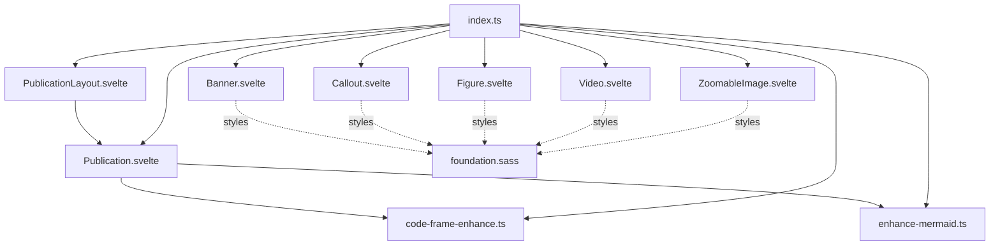
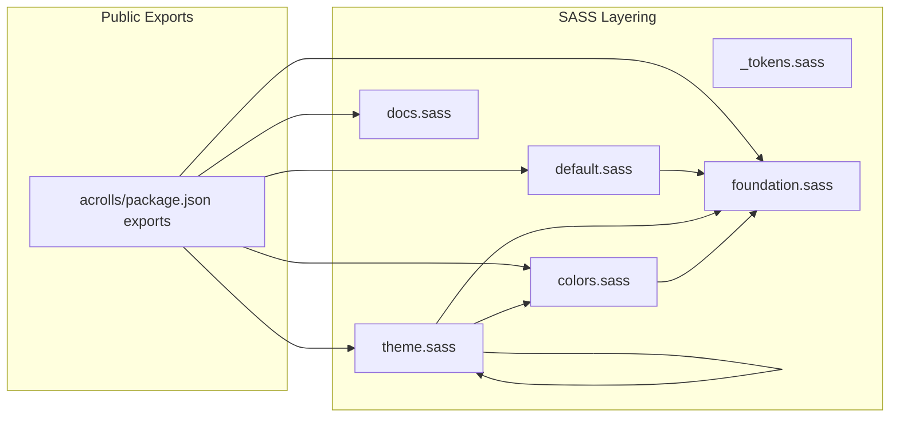
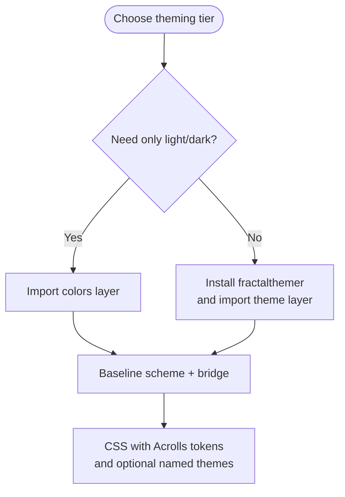
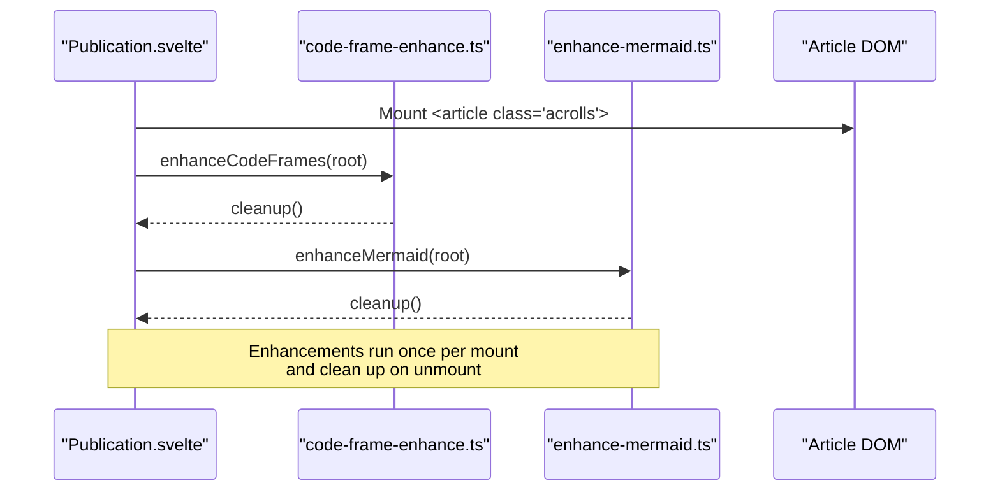

# Article Components & Styling System — Implemented

<cite>
**Referenced Files in This Document**
- [packages/svelte/src/lib/index.ts](file://packages/svelte/src/lib/index.ts)
- [packages/svelte/src/lib/Publication.svelte](file://packages/svelte/src/lib/Publication.svelte)
- [packages/svelte/src/lib/PublicationLayout.svelte](file://packages/svelte/src/lib/PublicationLayout.svelte)
- [packages/svelte/src/lib/Banner.svelte](file://packages/svelte/src/lib/Banner.svelte)
- [packages/svelte/src/lib/Callout.svelte](file://packages/svelte/src/lib/Callout.svelte)
- [packages/svelte/src/lib/Figure.svelte](file://packages/svelte/src/lib/Figure.svelte)
- [packages/svelte/src/lib/Video.svelte](file://packages/svelte/src/lib/Video.svelte)
- [packages/svelte/src/lib/ZoomableImage.svelte](file://packages/svelte/src/lib/ZoomableImage.svelte)
- [packages/svelte/src/lib/code-frame-enhance.ts](file://packages/svelte/src/lib/code-frame-enhance.ts)
- [packages/svelte/src/lib/enhance-mermaid.ts](file://packages/svelte/src/lib/enhance-mermaid.ts)
- [packages/styles/src/foundation.sass](file://packages/styles/src/foundation.sass)
- [packages/styles/src/default.sass](file://packages/styles/src/default.sass)
- [packages/styles/src/colors.sass](file://packages/styles/src/colors.sass)
- [packages/styles/src/theme.sass](file://packages/styles/src/theme.sass)
- [packages/styles/src/docs.sass](file://packages/styles/src/docs.sass)
- [packages/styles/src/_tokens.sass](file://packages/styles/src/_tokens.sass)
- [packages/acrolls/package.json](file://packages/acrolls/package.json)
</cite>

## Component Surface

The reader-facing component surface is implemented as Svelte 5 components under `packages/svelte/src/lib`, re-exported through a single barrel so consumers can import them from the public package. The surface includes article composition, content blocks, and client-side enhancers for code frames and Mermaid diagrams.

**Diagram sources**
- [packages/svelte/src/lib/index.ts:1-9](file://packages/svelte/src/lib/index.ts#L1-L9)
- [packages/svelte/src/lib/Publication.svelte:1-42](file://packages/svelte/src/lib/Publication.svelte#L1-L42)
- [packages/svelte/src/lib/PublicationLayout.svelte:1-65](file://packages/svelte/src/lib/PublicationLayout.svelte#L1-L65)
- [packages/svelte/src/lib/Banner.svelte:1-58](file://packages/svelte/src/lib/Banner.svelte#L1-L58)
- [packages/svelte/src/lib/Callout.svelte:1-28](file://packages/svelte/src/lib/Callout.svelte#L1-L28)
- [packages/svelte/src/lib/Figure.svelte:1-19](file://packages/svelte/src/lib/Figure.svelte#L1-L19)
- [packages/svelte/src/lib/Video.svelte:1-24](file://packages/svelte/src/lib/Video.svelte#L1-L24)
- [packages/svelte/src/lib/ZoomableImage.svelte:1-43](file://packages/svelte/src/lib/ZoomableImage.svelte#L1-L43)
- [packages/svelte/src/lib/code-frame-enhance.ts:1-61](file://packages/svelte/src/lib/code-frame-enhance.ts#L1-L61)
- [packages/svelte/src/lib/enhance-mermaid.ts:1-50](file://packages/svelte/src/lib/enhance-mermaid.ts#L1-L50)
- [packages/styles/src/foundation.sass:1-272](file://packages/styles/src/foundation.sass#L1-L272)

### Publication

`Publication` is the root article wrapper. It accepts an optional theme prop (`light`, `dark`, or `auto`), forwards arbitrary attributes to the `<article>`, and mounts two progressive enhancements on first render: code-frame action buttons and Mermaid diagram rendering. Both enhancements return cleanup functions that are invoked when the component unmounts.

Key behaviors:
- Sets `data-theme` only when the theme is explicitly light or dark; otherwise it lets the host control color scheme.
- Attaches class `acrolls` plus any user-provided class.
- Runs `enhanceCodeFrames` and `enhanceMermaid` scoped to its DOM subtree.

**Section sources**
- [packages/svelte/src/lib/Publication.svelte:1-42](file://packages/svelte/src/lib/Publication.svelte#L1-L42)

### PublicationLayout

`PublicationLayout` is intended as a default mdsvex layout. It renders a banner header using frontmatter-derived props (`title`, `description`/`brief`, `eyebrow`/`series`/`project`, `reading`, image metadata) and delegates the rest of the content to `Publication`.

Key behaviors:
- Derives description from `description` or `brief`.
- Derives eyebrow text from `eyebrow`, `series`, or `project`.
- Renders an `acrolls-banner` header with optional media and meta.
- Passes all remaining props through to `Publication`.

**Section sources**
- [packages/svelte/src/lib/PublicationLayout.svelte:1-65](file://packages/svelte/src/lib/PublicationLayout.svelte#L1-L65)

### Banner

`Banner` renders a flexible header block with eyebrow, title, description, metadata, optional image, and extra slot content. It supports an accent CSS custom property override and image positioning via a data attribute.

Accessibility notes:
- Uses semantic `<header>` and heading elements.
- Image alt text is required by callers; the component passes through provided alt values.

**Section sources**
- [packages/svelte/src/lib/Banner.svelte:1-58](file://packages/svelte/src/lib/Banner.svelte#L1-L58)

### Callout

`Callout` renders an aside-style note with a variant system. Variants include note, insight, warning, success, and error. Invalid variants fall back to `note`.

Accessibility notes:
- Uses `<aside>` with `role="note"`.
- Variant is exposed as a data attribute for styling.

**Section sources**
- [packages/svelte/src/lib/Callout.svelte:1-28](file://packages/svelte/src/lib/Callout.svelte#L1-L28)

### Figure

`Figure` wraps arbitrary content (typically images or videos) with an optional caption and wide mode. Wide mode exposes a data attribute used by foundation styles to adjust maximum width.

**Section sources**
- [packages/svelte/src/lib/Figure.svelte:1-19](file://packages/svelte/src/lib/Figure.svelte#L1-L19)

### Video

`Video` renders a responsive video element inside a figure. It infers MIME type based on file extension and supports poster, caption, and wide mode.

**Section sources**
- [packages/svelte/src/lib/Video.svelte:1-24](file://packages/svelte/src/lib/Video.svelte#L1-L24)

### ZoomableImage

`ZoomableImage` provides optional zoom-to-dialog behavior for images. When enabled, clicking the image opens a native `<dialog>` overlay; when disabled or when the source URL contains a nozoom fragment, it renders a plain image.

Accessibility notes:
- Uses a native dialog with a close form button.
- Supports opt-out via a fragment marker in the source URL.
- Preserves alt text in both trigger and dialog.

**Section sources**
- [packages/svelte/src/lib/ZoomableImage.svelte:1-43](file://packages/svelte/src/lib/ZoomableImage.svelte#L1-L43)

### Code Frame Enhancer

`enhanceCodeFrames` progressively enhances compile-time code frames by injecting Copy and Wrap buttons into a designated actions slot. It toggles wrapping via a data attribute and uses the Clipboard API where available.

Behavior highlights:
- Targets `.acrolls-code-frame` nodes with an empty `[data-acrolls-code-actions]` slot.
- Adds aria labels for screen readers.
- Returns a cleanup function that removes listeners and restores the slot.

**Section sources**
- [packages/svelte/src/lib/code-frame-enhance.ts:1-61](file://packages/svelte/src/lib/code-frame-enhance.ts#L1-L61)

### Mermaid Client Enhancer

`enhanceMermaid` lazily imports Mermaid and renders diagrams marked with a specific data attribute. Each node must contain a fallback source and a canvas container; successful rendering hides the fallback and reveals the canvas.

Behavior highlights:
- Uses strict security mode and disables automatic start-on-load.
- Generates unique IDs per rendered diagram.
- Gracefully degrades if Mermaid fails to load or render.
- Returns a cancellation-aware cleanup function.

**Section sources**
- [packages/svelte/src/lib/enhance-mermaid.ts:1-50](file://packages/svelte/src/lib/enhance-mermaid.ts#L1-L50)

### Public Export Surface

All reader-facing components and enhancers are exported from a single index file, which is what consumers import through the public package entrypoints.

**Section sources**
- [packages/svelte/src/lib/index.ts:1-9](file://packages/svelte/src/lib/index.ts#L1-L9)

## Style Entrypoints & Layers

Acrolls ships a layered SASS/CSS styling system aligned with CUBE CSS principles. Consumers can import either precompiled CSS or SASS modules. The public package exposes both forms through stable export paths.

**Diagram sources**
- [packages/acrolls/package.json:14-57](file://packages/acrolls/package.json#L14-L57)
- [packages/styles/src/default.sass:1-74](file://packages/styles/src/default.sass#L1-L74)
- [packages/styles/src/theme.sass:1-31](file://packages/styles/src/theme.sass#L1-L31)
- [packages/styles/src/colors.sass:1-13](file://packages/styles/src/colors.sass#L1-L13)
- [packages/styles/src/foundation.sass:1-272](file://packages/styles/src/foundation.sass#L1-L272)
- [packages/styles/src/docs.sass:1-430](file://packages/styles/src/docs.sass#L1-L430)
- [packages/styles/src/_tokens.sass:1-10](file://packages/styles/src/_tokens.sass#L1-L10)

### Foundation Layer

`foundation.sass` defines the base Acrolls design tokens, typography scale, spacing, code frames, tables, figures, banners, callouts, videos, mermaid containers, zoom dialogs, selection colors, and print rules. It sets up CSS custom properties that other layers refine.

Key responsibilities:
- Establishes the `.acrolls` scope and resets box sizing.
- Defines code frame structure, line highlighting, diff backgrounds, and wrap toggle behavior.
- Styles callout variants with left border accents.
- Provides responsive and print-friendly behavior.

**Section sources**
- [packages/styles/src/foundation.sass:1-272](file://packages/styles/src/foundation.sass#L1-L272)

### Default Layer

`default.sass` builds on foundation to provide a readable default prose style. It sets content width, gutter, radius, body size, leading, paragraph and section spacing, heading sizes, list and blockquote styles, and banner typography.

**Section sources**
- [packages/styles/src/default.sass:1-74](file://packages/styles/src/default.sass#L1-L74)

### Colors Layer

`colors.sass` is a lean, self-contained light/dark color surface that does not require fractalthemer. It composes a baseline scheme and a bridge layer that maps Acrolls surfaces to familiar names.

**Section sources**
- [packages/styles/src/colors.sass:1-13](file://packages/styles/src/colors.sass#L1-L13)

### Theme Layer

`theme.sass` provides the full fractalthemer experience. It emits the same baseline scheme and bridge, then forwards curated themes, aura backgrounds, and theme-picker styles from the fractalthemer package. Named theme classes are emitted after the baseline so they win at equal specificity.

**Section sources**
- [packages/styles/src/theme.sass:1-31](file://packages/styles/src/theme.sass#L1-L31)

### Docs Layer

`docs.sass` styles the docs shell, sidebar, table of contents, breadcrumbs, pager, accordion/tree navigation, search UI, and mobile menu behavior. It introduces doc-specific variables and responsive breakpoints.

**Section sources**
- [packages/styles/src/docs.sass:1-430](file://packages/styles/src/docs.sass#L1-L430)

### Tokens Map

`_tokens.sass` offers an optional SASS token map that hosts compiling SASS can use to map Acrolls tokens onto their own design tokens or `:root` variables.

**Section sources**
- [packages/styles/src/_tokens.sass:1-10](file://packages/styles/src/_tokens.sass#L1-L10)

### Public Entry Points

The public package exposes both compiled CSS and SASS entry points for foundation, default, colors, theme, docs, and tokens. Consumers should import through these stable paths rather than internal module locations.

**Section sources**
- [packages/acrolls/package.json:14-57](file://packages/acrolls/package.json#L14-L57)

## Theming Kit

Acrolls supports two theming tiers:

- Lean tier: `colors.sass` provides light/dark theming without external dependencies.
- Full tier: `theme.sass` integrates fractalthemer for named themes, aura backgrounds, and theme picker styling.

Fractalthemer is declared as an optional peer dependency of the public package. Consumers who only need light/dark can use the colors layer; those who want the theme builder should install fractalthemer and switch to the theme layer.

[No sources needed since this diagram shows conceptual workflow, not actual code structure]

**Section sources**
- [packages/acrolls/package.json:107-114](file://packages/acrolls/package.json#L107-L114)
- [packages/styles/src/colors.sass:1-13](file://packages/styles/src/colors.sass#L1-L13)
- [packages/styles/src/theme.sass:1-31](file://packages/styles/src/theme.sass#L1-L31)

## Accessibility & Behavior Guarantees In Code

This section summarizes accessibility-related behaviors present in the implemented components and enhancers.

- Semantic structure:
  - `Publication` renders an `<article>` with the `acrolls` class.
  - `Banner` uses `<header>` and headings.
  - `Callout` uses `<aside role="note">`.
  - `Figure` and `Video` use `<figure>` and `<figcaption>` where appropriate.
  - `ZoomableImage` uses a native `<dialog>` for zoom overlays.

- Keyboard and focus:
  - Code frame buttons have explicit `aria-label` attributes.
  - Focus-visible styles are defined for links, headings, and interactive elements in foundation styles.
  - Print styles hide non-essential controls like code frame action buttons and heading anchors.

- Media and zoom:
  - Images accept alt text; zoom dialog preserves alt text.
  - Zoom can be disabled globally per image via a fragment marker in the source URL.

- Progressive enhancement:
  - Code frame actions are injected only when the target slot exists and is empty.
  - Mermaid rendering is lazy and optional; failures keep the fallback visible.
  - Cleanup functions ensure event listeners and state changes are removed on unmount.

**Diagram sources**
- [packages/svelte/src/lib/Publication.svelte:23-31](file://packages/svelte/src/lib/Publication.svelte#L23-L31)
- [packages/svelte/src/lib/code-frame-enhance.ts:5-59](file://packages/svelte/src/lib/code-frame-enhance.ts#L5-L59)
- [packages/svelte/src/lib/enhance-mermaid.ts:4-48](file://packages/svelte/src/lib/enhance-mermaid.ts#L4-L48)

**Section sources**
- [packages/svelte/src/lib/Publication.svelte:1-42](file://packages/svelte/src/lib/Publication.svelte#L1-L42)
- [packages/svelte/src/lib/Banner.svelte:1-58](file://packages/svelte/src/lib/Banner.svelte#L1-L58)
- [packages/svelte/src/lib/Callout.svelte:1-28](file://packages/svelte/src/lib/Callout.svelte#L1-L28)
- [packages/svelte/src/lib/Figure.svelte:1-19](file://packages/svelte/src/lib/Figure.svelte#L1-L19)
- [packages/svelte/src/lib/Video.svelte:1-24](file://packages/svelte/src/lib/Video.svelte#L1-L24)
- [packages/svelte/src/lib/ZoomableImage.svelte:1-43](file://packages/svelte/src/lib/ZoomableImage.svelte#L1-L43)
- [packages/svelte/src/lib/code-frame-enhance.ts:1-61](file://packages/svelte/src/lib/code-frame-enhance.ts#L1-L61)
- [packages/svelte/src/lib/enhance-mermaid.ts:1-50](file://packages/svelte/src/lib/enhance-mermaid.ts#L1-L50)
- [packages/styles/src/foundation.sass:258-272](file://packages/styles/src/foundation.sass#L258-L272)

## Styling-Rule Audit Status

Based on the current implementation:

- CUBE CSS discipline:
  - Foundation, default, colors, theme, and docs are separated into distinct SASS modules.
  - Components use consistent `acrolls-*` class naming conventions.
  - Doc shell styles are isolated under a dedicated docs layer.

- Tokenization:
  - Foundation declares CSS custom properties for colors, typography, spacing, and surfaces.
  - An optional SASS token map is provided for hosts that compile SASS.

- Theme strategy:
  - Lean light/dark is available without external dependencies.
  - Full fractalthemer integration is optional and layered on top of the same baseline.

- No Tailwind:
  - The styling direction uses custom CSS and indented SASS, not Tailwind.

- Inline styles:
  - Components set CSS custom properties via inline style bindings where necessary (for example, banner accent). This is a narrow, intentional pattern rather than a general rule.

- Side effects:
  - CSS entry points are registered as side effects so bundlers can include them automatically.

**Section sources**
- [packages/styles/src/foundation.sass:1-272](file://packages/styles/src/foundation.sass#L1-L272)
- [packages/styles/src/default.sass:1-74](file://packages/styles/src/default.sass#L1-L74)
- [packages/styles/src/colors.sass:1-13](file://packages/styles/src/colors.sass#L1-L13)
- [packages/styles/src/theme.sass:1-31](file://packages/styles/src/theme.sass#L1-L31)
- [packages/styles/src/docs.sass:1-430](file://packages/styles/src/docs.sass#L1-L430)
- [packages/styles/src/_tokens.sass:1-10](file://packages/styles/src/_tokens.sass#L1-L10)
- [packages/acrolls/package.json:66-68](file://packages/acrolls/package.json#L66-L68)
- [packages/svelte/src/lib/Banner.svelte:30-34](file://packages/svelte/src/lib/Banner.svelte#L30-L34)