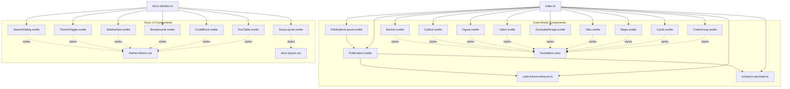
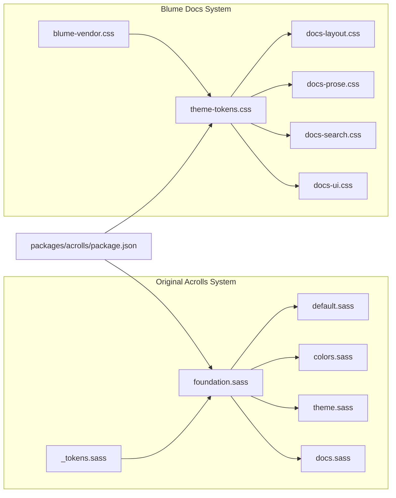
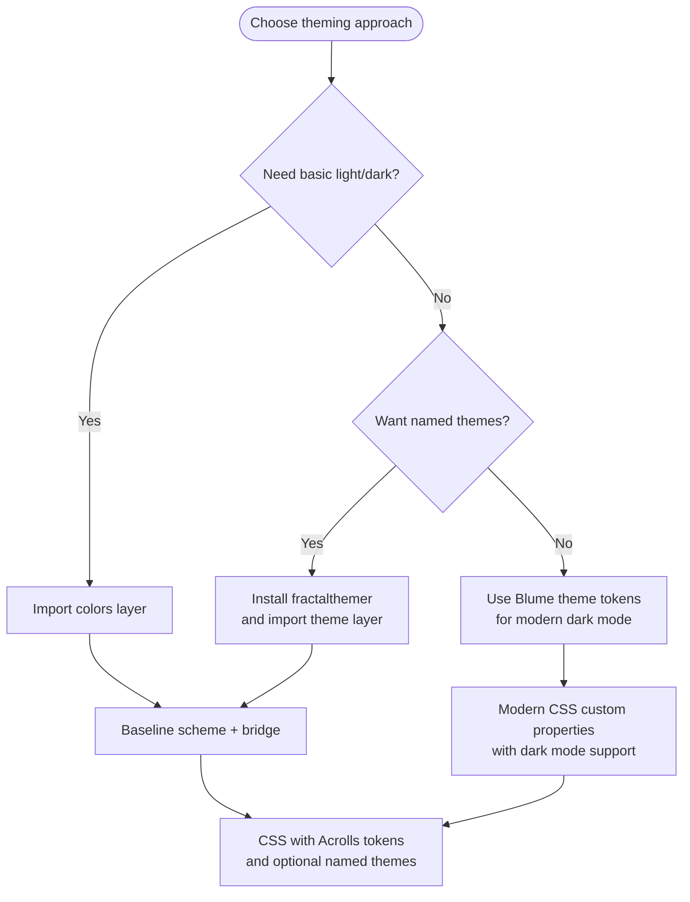
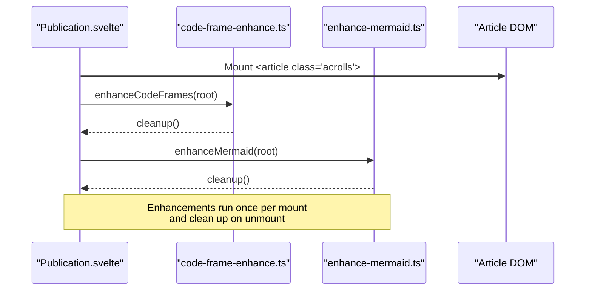

# Article Components & Styling System — Implemented

<cite>
**Referenced Files in This Document**
- [packages/svelte/src/lib/index.ts](file://packages/svelte/src/lib/index.ts)
- [packages/svelte/src/lib/Publication.svelte](file://packages/svelte/src/lib/Publication.svelte)
- [packages/svelte/src/lib/PublicationLayout.svelte](file://packages/svelte/src/lib/PublicationLayout.svelte)
- [packages/svelte/src/lib/Banner.svelte](file://packages/svelte/src/lib/Banner.svelte)
- [packages/svelte/src/lib/Callout.svelte](file://packages/svelte/src/lib/Callout.svelte)
- [packages/svelte/src/lib/Figure.svelte](file://packages/svelte/src/lib/Figure.svelte)
- [packages/svelte/src/lib/Video.svelte](file://packages/svelte/src/lib/Video.svelte)
- [packages/svelte/src/lib/ZoomableImage.svelte](file://packages/svelte/src/lib/ZoomableImage.svelte)
- [packages/svelte/src/lib/code-frame-enhance.ts](file://packages/svelte/src/lib/code-frame-enhance.ts)
- [packages/svelte/src/lib/enhance-mermaid.ts](file://packages/svelte/src/lib/enhance-mermaid.ts)
- [packages/svelte/src/lib/Tabs.svelte](file://packages/svelte/src/lib/Tabs.svelte)
- [packages/svelte/src/lib/Steps.svelte](file://packages/svelte/src/lib/Steps.svelte)
- [packages/svelte/src/lib/Cards.svelte](file://packages/svelte/src/lib/Cards.svelte)
- [packages/svelte/src/lib/CodeGroup.svelte](file://packages/svelte/src/lib/CodeGroup.svelte)
- [docs-ui/index.ts](file://docs-ui/index.ts)
- [docs-ui/lib/SearchDialog.svelte](file://docs-ui/lib/SearchDialog.svelte)
- [docs-ui/lib/ThemeToggle.svelte](file://docs-ui/lib/ThemeToggle.svelte)
- [docs-ui/lib/SidebarNav.svelte](file://docs-ui/lib/SidebarNav.svelte)
- [docs-ui/lib/Breadcrumb.svelte](file://docs-ui/lib/Breadcrumb.svelte)
- [docs-ui/lib/Callout.svelte](file://docs-ui/lib/Callout.svelte)
- [docs-ui/lib/CodeBlock.svelte](file://docs-ui/lib/CodeBlock.svelte)
- [docs-ui/lib/DocTable.svelte](file://docs-ui/lib/DocTable.svelte)
- [docs-ui/styles/theme-tokens.css](file://docs-ui/styles/theme-tokens.css)
- [docs-ui/styles/docs-layout.css](file://docs-ui/styles/docs-layout.css)
- [packages/styles/src/foundation.sass](file://packages/styles/src/foundation.sass)
- [packages/styles/src/default.sass](file://packages/styles/src/default.sass)
- [packages/styles/src/colors.sass](file://packages/styles/src/colors.sass)
- [packages/styles/src/theme.sass](file://packages/styles/src/theme.sass)
- [packages/styles/src/docs.sass](file://packages/styles/src/docs.sass)
- [packages/styles/src/_tokens.sass](file://packages/styles/src/_tokens.sass)
- [packages/acrolls/package.json](file://packages/acrolls/package.json)
</cite>

## Update Summary
**Changes Made**
- Added comprehensive docs-ui package with 17 new UI components (SearchDialog, ThemeToggle, SidebarNav, Breadcrumb, Callout, CodeBlock, DocTable, etc.)
- Enhanced existing packages/svelte components with Tabs, Steps, Cards, and CodeGroup functionality
- Expanded styling system with dark mode support through theme-tokens.css
- Added responsive layout improvements across the docs shell and navigation components
- Integrated Blume docs UI framework with Svelte components

## Component Surface

The reader-facing component surface has significantly expanded with two distinct layers: the core article components under `packages/svelte/src/lib` and the comprehensive docs UI components under `docs-ui/lib`. The core layer provides article composition primitives while the docs UI layer offers complete documentation site building blocks.

**Diagram sources**
- [packages/svelte/src/lib/index.ts:1-9](file://packages/svelte/src/lib/index.ts#L1-L9)
- [docs-ui/index.ts:12-28](file://docs-ui/index.ts#L12-L28)
- [packages/svelte/src/lib/Publication.svelte:1-42](file://packages/svelte/src/lib/Publication.svelte#L1-L42)
- [packages/svelte/src/lib/Tabs.svelte:1-121](file://packages/svelte/src/lib/Tabs.svelte#L1-L121)
- [docs-ui/lib/SearchDialog.svelte:1-150](file://docs-ui/lib/SearchDialog.svelte#L1-L150)

### Core Publication Components

`Publication` remains the root article wrapper with enhanced progressive enhancements for code frames and Mermaid diagrams. It accepts an optional theme prop (`light`, `dark`, or `auto`), forwards arbitrary attributes to the `<article>`, and mounts client-side enhancements on first render.

Key behaviors:
- Sets `data-theme` only when the theme is explicitly light or dark; otherwise it lets the host control color scheme.
- Attaches class `acrolls` plus any user-provided class.
- Runs `enhanceCodeFrames` and `enhanceMermaid` scoped to its DOM subtree.

**Section sources**
- [packages/svelte/src/lib/Publication.svelte:1-42](file://packages/svelte/src/lib/Publication.svelte#L1-L42)

### Enhanced Interactive Components

**Updated** Added comprehensive interactive components for content organization and presentation.

#### Tabs Component
`Tabs` provides accessible tabbed interfaces following WAI-ARIA APG guidelines. It supports keyboard navigation (arrow keys, Home, End), roving tabindex, and SSR-safe rendering with stable IDs.

Key features:
- Accessible tablist with proper ARIA roles and attributes
- Keyboard navigation with arrow key support
- SSR-safe implementation with server-rendered HTML
- Support for both default and code variants
- Context-based state management for child Tab components

**Section sources**
- [packages/svelte/src/lib/Tabs.svelte:1-121](file://packages/svelte/src/lib/Tabs.svelte#L1-L121)

#### Steps Component
`Steps` renders ordered step sequences using CSS counters for numbering. It provides clean, print-friendly step presentations that work well for tutorials and procedural content.

Key features:
- CSS counter-based numbering (no JavaScript required)
- SSR-safe implementation
- Clean print output
- Semantic `<ol>` structure

**Section sources**
- [packages/svelte/src/lib/Steps.svelte:1-17](file://packages/svelte/src/lib/Steps.svelte#L1-L17)

#### Cards Component
`Cards` creates responsive card grids with configurable column layouts. It automatically collapses to single columns on narrow viewports and supports 1-4 column configurations.

Key features:
- Responsive grid layout
- Configurable column counts (1-4)
- Automatic mobile collapse
- CSS Grid-based implementation

**Section sources**
- [packages/svelte/src/lib/Cards.svelte:1-17](file://packages/svelte/src/lib/Cards.svelte#L1-L17)

#### CodeGroup Component
`CodeGroup` wraps multiple code samples as tabs with compact code-group chrome. It's a thin wrapper over `Tabs` with variant="code" for presenting alternative implementations.

Key features:
- Built on Tabs with code-specific styling
- Compact code-group appearance
- Shared context with Tab children
- Ideal for showing multiple language implementations

**Section sources**
- [packages/svelte/src/lib/CodeGroup.svelte:1-25](file://packages/svelte/src/lib/CodeGroup.svelte#L1-L25)

### Docs UI Components

**New** The docs-ui package provides comprehensive documentation site components built on the Blume design system.

#### SearchDialog Component
`SearchDialog` implements a full-featured search interface with keyboard shortcuts (⌘K), popular items, locale support, and AI integration hooks. It uses native dialog elements and custom element islands for compatibility.

Key features:
- Native `<dialog>` implementation
- Keyboard shortcuts (⌘K to open)
- Popular search items configuration
- Multi-language support
- AI search integration points
- Custom element island architecture

**Section sources**
- [docs-ui/lib/SearchDialog.svelte:1-150](file://docs-ui/lib/SearchDialog.svelte#L1-L150)

#### ThemeToggle Component
`ThemeToggle` provides theme switching functionality integrated with the Blume theme system. It works seamlessly with the dark mode support in theme-tokens.css.

Key features:
- Integration with Blume theme tokens
- Dark mode support
- Smooth theme transitions
- Persistent theme preference

**Section sources**
- [docs-ui/lib/ThemeToggle.svelte](file://docs-ui/lib/ThemeToggle.svelte)

#### SidebarNav Component
`SidebarNav` implements responsive navigation with mobile drawer behavior. It includes nested navigation support, active state management, and mobile-first responsive design.

Key features:
- Mobile drawer navigation
- Nested section support
- Active state highlighting
- Responsive breakpoints
- Touch-friendly interactions

**Section sources**
- [docs-ui/lib/SidebarNav.svelte](file://docs-ui/lib/SidebarNav.svelte)

#### Additional UI Components
The docs-ui package also includes:
- **Breadcrumb**: Navigation breadcrumbs with proper semantic markup
- **CodeBlock**: Syntax-highlighted code display with copy functionality
- **DocTable**: Styled table component for documentation tables
- **DocsLayout**: Complete documentation page layout
- **LanguageSwitcher**: Multi-language navigation support
- **PageActions**: Page-level action buttons
- **Pagination**: Document pagination controls
- **TableOfContents**: Auto-generated table of contents
- **MobileToc**: Mobile-optimized table of contents

**Section sources**
- [docs-ui/index.ts:12-28](file://docs-ui/index.ts#L12-L28)

## Style Entrypoints & Layers

Acrolls now ships with dual styling systems: the original SASS/CSS foundation system and the new Blume-based docs UI system with comprehensive dark mode support.

**Diagram sources**
- [packages/styles/src/foundation.sass:1-272](file://packages/styles/src/foundation.sass#L1-L272)
- [docs-ui/styles/theme-tokens.css:1-101](file://docs-ui/styles/theme-tokens.css#L1-L101)
- [docs-ui/styles/docs-layout.css:1-200](file://docs-ui/styles/docs-layout.css#L1-L200)

### Foundation Layer

`foundation.sass` defines the base Acrolls design tokens, typography scale, spacing, code frames, tables, figures, banners, callouts, videos, mermaid containers, zoom dialogs, selection colors, and print rules. It sets up CSS custom properties that other layers refine.

Key responsibilities:
- Establishes the `.acrolls` scope and resets box sizing.
- Defines code frame structure, line highlighting, diff backgrounds, and wrap toggle behavior.
- Styles callout variants with left border accents.
- Provides responsive and print-friendly behavior.

**Section sources**
- [packages/styles/src/foundation.sass:1-272](file://packages/styles/src/foundation.sass#L1-L272)

### Default Layer

`default.sass` builds on foundation to provide a readable default prose style. It sets content width, gutter, radius, body size, leading, paragraph and section spacing, heading sizes, list and blockquote styles, and banner typography.

**Section sources**
- [packages/styles/src/default.sass:1-74](file://packages/styles/src/default.sass#L1-L74)

### Colors Layer

`colors.sass` is a lean, self-contained light/dark color surface that does not require fractalthemer. It composes a baseline scheme and a bridge layer that maps Acrolls surfaces to familiar names.

**Section sources**
- [packages/styles/src/colors.sass:1-13](file://packages/styles/src/colors.sass#L1-L13)

### Theme Layer

`theme.sass` provides the full fractalthemer experience. It emits the same baseline scheme and bridge, then forwards curated themes, aura backgrounds, and theme-picker styles from the fractalthemer package. Named theme classes are emitted after the baseline so they win at equal specificity.

**Section sources**
- [packages/styles/src/theme.sass:1-31](file://packages/styles/src/theme.sass#L1-L31)

### Docs Layer

`docs.sass` styles the docs shell, sidebar, table of contents, breadcrumbs, pager, accordion/tree navigation, search UI, and mobile menu behavior. It introduces doc-specific variables and responsive breakpoints.

**Section sources**
- [packages/styles/src/docs.sass:1-430](file://packages/styles/src/docs.sass#L1-L430)

### Blume Theme Tokens

**New** The Blume theme system provides comprehensive dark mode support through CSS custom properties. It defines a complete token system for backgrounds, foregrounds, borders, accents, and code highlighting with automatic dark mode detection.

Key features:
- Complete dark mode support via `data-theme="dark"` attribute
- OKLCH color space for better perceptual uniformity
- Comprehensive code highlighting tokens
- Shiki and Twoslash integration
- Responsive design tokens

**Section sources**
- [docs-ui/styles/theme-tokens.css:1-101](file://docs-ui/styles/theme-tokens.css#L1-L101)

### Blume Layout System

**New** The Blume layout system provides responsive documentation layouts with mobile-first design principles. It includes sticky headers, responsive sidebars, and adaptive content areas.

Key features:
- Mobile-first responsive grid system
- Sticky header with backdrop blur
- Responsive sidebar with mobile drawer
- Adaptive content widths
- Touch-friendly navigation

**Section sources**
- [docs-ui/styles/docs-layout.css:1-200](file://docs-ui/styles/docs-layout.css#L1-L200)

## Theming Kit

Acrolls now supports three theming tiers:

- **Lean tier**: `colors.sass` provides light/dark theming without external dependencies.
- **Full tier**: `theme.sass` integrates fractalthemer for named themes, aura backgrounds, and theme picker styling.
- **Blume tier**: New `theme-tokens.css` provides comprehensive dark mode support with modern CSS custom properties.

Fractalthemer is declared as an optional peer dependency of the public package. Consumers who only need light/dark can use the colors layer; those who want the theme builder should install fractalthemer and switch to the theme layer. The Blume system offers a modern alternative with extensive dark mode support.

[No sources needed since this diagram shows conceptual workflow, not actual code structure]

**Section sources**
- [packages/acrolls/package.json:107-114](file://packages/acrolls/package.json#L107-L114)
- [packages/styles/src/colors.sass:1-13](file://packages/styles/src/colors.sass#L1-L13)
- [packages/styles/src/theme.sass:1-31](file://packages/styles/src/theme.sass#L1-L31)
- [docs-ui/styles/theme-tokens.css:53-78](file://docs-ui/styles/theme-tokens.css#L53-L78)

## Accessibility & Behavior Guarantees In Code

This section summarizes accessibility-related behaviors present in the implemented components and enhancers, including the new interactive components.

- **Semantic structure**:
  - `Publication` renders an `<article>` with the `acrolls` class.
  - `Banner` uses `<header>` and headings.
  - `Callout` uses `<aside role="note">`.
  - `Figure` and `Video` use `<figure>` and `<figcaption>` where appropriate.
  - `ZoomableImage` uses a native `<dialog>` for zoom overlays.
  - `Tabs` implements WAI-ARIA tablist pattern with proper roles.
  - `SearchDialog` uses native `<dialog>` with proper ARIA attributes.

- **Keyboard and focus**:
  - Code frame buttons have explicit `aria-label` attributes.
  - Focus-visible styles are defined for links, headings, and interactive elements in foundation styles.
  - Print styles hide non-essential controls like code frame action buttons and heading anchors.
  - `Tabs` supports arrow key navigation, Home/End keys, and roving tabindex.
  - `SearchDialog` supports ⌘K shortcut and Escape to close.

- **Media and zoom**:
  - Images accept alt text; zoom dialog preserves alt text.
  - Zoom can be disabled globally per image via a fragment marker in the source URL.

- **Progressive enhancement**:
  - Code frame actions are injected only when the target slot exists and is empty.
  - Mermaid rendering is lazy and optional; failures keep the fallback visible.
  - Cleanup functions ensure event listeners and state changes are removed on unmount.
  - `Tabs` and `Steps` are SSR-safe with no runtime dependencies.

**Diagram sources**
- [packages/svelte/src/lib/Publication.svelte:23-31](file://packages/svelte/src/lib/Publication.svelte#L23-L31)
- [packages/svelte/src/lib/code-frame-enhance.ts:5-59](file://packages/svelte/src/lib/code-frame-enhance.ts#L5-L59)
- [packages/svelte/src/lib/enhance-mermaid.ts:4-48](file://packages/svelte/src/lib/enhance-mermaid.ts#L4-L48)

**Section sources**
- [packages/svelte/src/lib/Publication.svelte:1-42](file://packages/svelte/src/lib/Publication.svelte#L1-L42)
- [packages/svelte/src/lib/Banner.svelte:1-58](file://packages/svelte/src/lib/Banner.svelte#L1-L58)
- [packages/svelte/src/lib/Callout.svelte:1-28](file://packages/svelte/src/lib/Callout.svelte#L1-L28)
- [packages/svelte/src/lib/Figure.svelte:1-19](file://packages/svelte/src/lib/Figure.svelte#L1-L19)
- [packages/svelte/src/lib/Video.svelte:1-24](file://packages/svelte/src/lib/Video.svelte#L1-L24)
- [packages/svelte/src/lib/ZoomableImage.svelte:1-43](file://packages/svelte/src/lib/ZoomableImage.svelte#L1-L43)
- [packages/svelte/src/lib/Tabs.svelte:6-10](file://packages/svelte/src/lib/Tabs.svelte#L6-L10)
- [docs-ui/lib/SearchDialog.svelte:46-51](file://docs-ui/lib/SearchDialog.svelte#L46-L51)
- [packages/svelte/src/lib/code-frame-enhance.ts:1-61](file://packages/svelte/src/lib/code-frame-enhance.ts#L1-L61)
- [packages/svelte/src/lib/enhance-mermaid.ts:1-50](file://packages/svelte/src/lib/enhance-mermaid.ts#L1-L50)
- [packages/styles/src/foundation.sass:258-272](file://packages/styles/src/foundation.sass#L258-L272)

## Styling-Rule Audit Status

Based on the current implementation:

- **CUBE CSS discipline**:
  - Foundation, default, colors, theme, and docs are separated into distinct SASS modules.
  - Components use consistent `acrolls-*` class naming conventions.
  - Doc shell styles are isolated under a dedicated docs layer.
  - Blume system follows similar separation with theme tokens, layout, and prose styles.

- **Tokenization**:
  - Foundation declares CSS custom properties for colors, typography, spacing, and surfaces.
  - An optional SASS token map is provided for hosts that compile SASS.
  - Blume system uses comprehensive CSS custom properties with OKLCH color space.

- **Theme strategy**:
  - Lean light/dark is available without external dependencies.
  - Full fractalthemer integration is optional and layered on top of the same baseline.
  - Modern Blume system provides comprehensive dark mode support with CSS custom properties.

- **No Tailwind**:
  - The styling direction uses custom CSS and indented SASS, not Tailwind.
  - Blume system uses plain CSS with data attributes for component targeting.

- **Inline styles**:
  - Components set CSS custom properties via inline style bindings where necessary (for example, banner accent). This is a narrow, intentional pattern rather than a general rule.

- **Side effects**:
  - CSS entry points are registered as side effects so bundlers can include them automatically.

**Section sources**
- [packages/styles/src/foundation.sass:1-272](file://packages/styles/src/foundation.sass#L1-L272)
- [packages/styles/src/default.sass:1-74](file://packages/styles/src/default.sass#L1-L74)
- [packages/styles/src/colors.sass:1-13](file://packages/styles/src/colors.sass#L1-L13)
- [packages/styles/src/theme.sass:1-31](file://packages/styles/src/theme.sass#L1-L31)
- [packages/styles/src/docs.sass:1-430](file://packages/styles/src/docs.sass#L1-L430)
- [packages/styles/src/_tokens.sass:1-10](file://packages/styles/src/_tokens.sass#L1-L10)
- [packages/acrolls/package.json:66-68](file://packages/acrolls/package.json#L66-L68)
- [packages/svelte/src/lib/Banner.svelte:30-34](file://packages/svelte/src/lib/Banner.svelte#L30-L34)
- [docs-ui/styles/theme-tokens.css:1-101](file://docs-ui/styles/theme-tokens.css#L1-L101)
- [docs-ui/styles/docs-layout.css:1-200](file://docs-ui/styles/docs-layout.css#L1-L200)