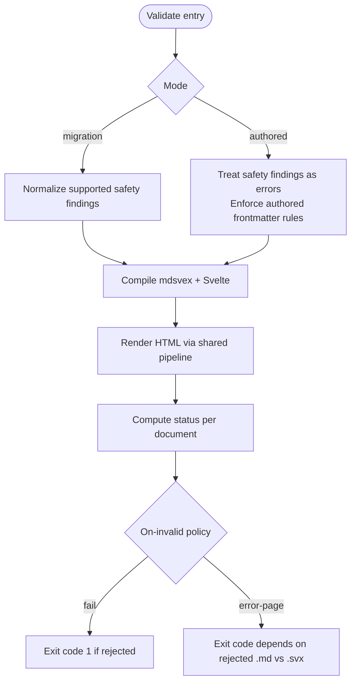
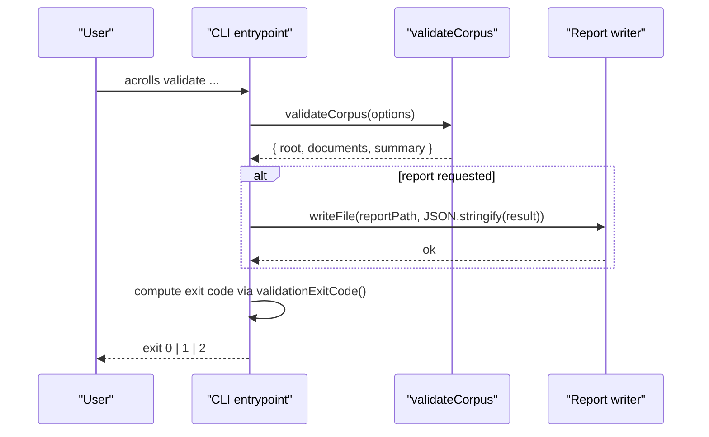
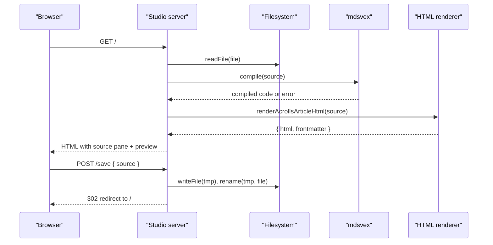
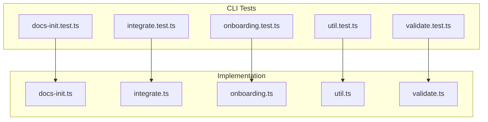

# CLI, Studio & Corpus Preflight — Implemented

<cite>
**Referenced Files in This Document**
- [index.ts](file://packages/cli/src/index.ts)
- [onboarding.ts](file://packages/cli/src/onboarding.ts)
- [integrate.ts](file://packages/cli/src/integrate.ts)
- [validate.ts](file://packages/cli/src/validate.ts)
- [studio.ts](file://packages/cli/src/studio.ts)
- [docs-init.ts](file://packages/cli/src/docs-init.ts)
- [starter.ts](file://packages/cli/src/starter.ts)
- [util.ts](file://packages/cli/src/util.ts)
- [cli.md](file://docs/cli.md)
- [docs-init.test.ts](file://packages/cli/src/docs-init.test.ts)
- [integrate.test.ts](file://packages/cli/src/integrate.test.ts)
- [onboarding.test.ts](file://packages/cli/src/onboarding.test.ts)
- [util.test.ts](file://packages/cli/src/util.test.ts)
- [validate.test.ts](file://packages/cli/src/validate.test.ts)
</cite>

## Commands Shipped
- `acrolls` (status): prints host detection and configuration hints; no filesystem changes.
- `acrolls init [--content-dir <path>] [--dry-run]`: creates an empty content launchpad directory; supports dry-run.
- `acrolls docs init [--docs-dir <path>] [--dry-run]`: seeds the docs corpus with a starter `index.md`; never overwrites existing files; writes only content.
- `acrolls integrate [--dry-run] [--mode foundation|default] [--style css|sass] [--yes]`: inspects a SvelteKit host and applies a reviewed plan when `--yes` is provided; refuses to mutate an existing Vite config; backs up edits under `.acrolls/backup/<timestamp>/`.
- `acrolls onboard [--docs-dir <path>] [--base-href <path>] [--mode foundation|default] [--style css|sass] [--check] [--non-interactive|--interactive] [--json]`: generates a versioned onboarding plan with checkpoints for install, preprocessor, styles, content, source, docs layout, document page, routes, preflight, local check, and deploy; interactive mode steps through pending checkpoints; `--check` rescans completed steps; `--json` emits a stable plan schema.
- `acrolls validate <file.md|file.svx|directory> [--strict] [--mode authored|migration] [--on-invalid fail|error-page] [--report <file>]`: compiles Markdown/mdsvex, runs Svelte compilation, renders HTML via the shared pipeline, enforces authored frontmatter rules, and reports diagnostics per document plus a corpus summary.
- `acrolls studio <file.md|file.svx> [--port <n>] [--no-open] [--mode foundation|default]`: starts a localhost-only server that previews the selected file as a Publication article, allows saving back to disk atomically, and exposes an API preview endpoint.

All commands are dispatched from the CLI entrypoint and exit with the stable 0/1/2 contract described below.

**Section sources**
- [index.ts:19-34](file://packages/cli/src/index.ts#L19-L34)
- [index.ts:36-99](file://packages/cli/src/index.ts#L36-L99)
- [index.ts:118-165](file://packages/cli/src/index.ts#L118-L165)
- [docs-init.ts:7-37](file://packages/cli/src/docs-init.ts#L7-L37)
- [onboarding.ts:28-54](file://packages/cli/src/onboarding.ts#L28-L54)
- [onboarding.ts:371-441](file://packages/cli/src/onboarding.ts#L371-L441)
- [integrate.ts:146-287](file://packages/cli/src/integrate.ts#L146-L287)
- [validate.ts:48-88](file://packages/cli/src/validate.ts#L48-L88)
- [studio.ts:81-321](file://packages/cli/src/studio.ts#L81-L321)
- [cli.md:32-66](file://docs/cli.md#L32-L66)

## Modes & Policies
- Onboarding modes: `foundation` and `default`, controlling which Acrolls style preset snippets are shown and applied by `onboard` and `integrate`.
- Validate modes:
  - `migration`: treats supported safety findings as normalizations; non-`.md` executable failures remain rejected.
  - `authored`: treats source-safety findings as errors and enforces authored frontmatter rules (YAML frontmatter required, non-empty string title for non-index pages, leading H1 mismatch warning, index title ignored).
- Validation error policy:
  - `fail`: any rejected document fails the command according to the exit-code contract.
  - `error-page`: migration policy that renders a safe diagnostic page for rejected `.md` documents; invalid `.svx` remains fail-fast and still counts as rejected.
- Strict mode: `--strict` promotes safety findings to errors regardless of mode.
- Host detection: `detectHost` classifies hosts as `sveltekit`, `svelte`, or `node`, and records presence of `@sveltejs/kit`, `svelte`, `mdsvex`/`acrolls`, Vite/Svelte config, and layout location.
- Integration policy: `integrate` is the single reviewed mutation path; it defaults to dry-run, requires explicit `--yes` to write, refuses non-SvelteKit hosts, and avoids rewriting arbitrary Vite plugin arrays.

**Diagram sources**
- [validate.ts:48-88](file://packages/cli/src/validate.ts#L48-L88)
- [validate.ts:103-156](file://packages/cli/src/validate.ts#L103-L156)
- [validate.ts:158-216](file://packages/cli/src/validate.ts#L158-L216)

**Section sources**
- [onboarding.ts:371-389](file://packages/cli/src/onboarding.ts#L371-L389)
- [integrate.ts:146-194](file://packages/cli/src/integrate.ts#L146-L194)
- [integrate.ts:6-49](file://packages/cli/src/integrate.ts#L6-L49)
- [validate.ts:48-88](file://packages/cli/src/validate.ts#L48-L88)
- [validate.ts:103-156](file://packages/cli/src/validate.ts#L103-L156)
- [validate.ts:158-216](file://packages/cli/src/validate.ts#L158-L216)
- [cli.md:141-208](file://docs/cli.md#L141-L208)

## Output Contracts (human / --json / exit codes)
- Human output:
  - Status prints host kind and configuration hints.
  - Onboarding prints step-by-step guidance with file paths, commands, code snippets, cautions, and verification checks; interactive mode prompts per checkpoint.
  - Integrate prints a plan and lists applied actions; backups are written under `.acrolls/backup/<timestamp>/`.
  - Validate prints per-document diagnostics with severity, file, line/column, diagnostic code, message, and optional remediation, followed by a corpus summary line showing discovered, ready, normalized, and rejected counts.
  - Studio prints the bound URL and editing target.
- JSON contracts:
  - `onboard --json` emits a versioned plan object containing `version`, `root`, `host`, `docsDir`, `baseHref`, `mode`, `style`, and `steps` where each step has `id`, `title`, optional `file`, `action`, optional `command`, optional `code`, optional `caution`, `verify`, and `completed`.
  - `validate --report <file>` writes a serializable corpus result containing `root`, `documents`, and `summary` with `discovered`, `ready`, `normalized`, `rejected`; each document includes `file`, `status`, and `diagnostics`.
- Exit codes (stable contract):
  - `0`: success; validation may still print warnings.
  - `1`: host, filesystem, compile, or validation failure.
  - `2`: unknown command, missing argument, or invalid flag value.

**Diagram sources**
- [index.ts:52-99](file://packages/cli/src/index.ts#L52-L99)
- [validate.ts:48-88](file://packages/cli/src/validate.ts#L48-L88)

**Section sources**
- [index.ts:19-34](file://packages/cli/src/index.ts#L19-L34)
- [index.ts:52-99](file://packages/cli/src/index.ts#L52-L99)
- [index.ts:118-165](file://packages/cli/src/index.ts#L118-L165)
- [onboarding.ts:397-411](file://packages/cli/src/onboarding.ts#L397-L411)
- [validate.ts:48-88](file://packages/cli/src/validate.ts#L48-L88)
- [cli.md:203-208](file://docs/cli.md#L203-L208)
- [cli.md:315-329](file://docs/cli.md#L315-L329)

## Studio Preview
- Purpose: a local, source-authoritative editor and Publication HTML preview for a single Markdown or SVX file.
- Server behavior:
  - Binds to `127.0.0.1` only.
  - GET `/` serves a split-pane UI with editable source and rendered publication preview.
  - POST `/save` performs an atomic write using a temporary file plus rename, then redirects to `/`.
  - GET `/api/preview` returns `{ html, frontmatter }` based on the current source.
- Rendering:
  - Compiles the file through mdsvex with Acrolls options.
  - Renders HTML via the shared `renderAcrollsArticleHtml` pipeline.
  - Loads CSS presets inline: foundation alone for `--mode foundation`, or foundation plus default without the internal `@import` for `--mode default`.
- UX features:
  - Code-frame wrap/copy buttons injected into the preview.
  - Mermaid diagrams enhanced client-side from a CDN module.
  - Keyboard shortcut to submit save (`⌘/Ctrl+S`).
  - Auto-increments port if the preferred port is busy; opens the browser unless `--no-open` is passed.
- Safety:
  - SVX `<script>` blocks are stripped from the HTML preview.
  - Errors during mdsvex compilation or HTML rendering are surfaced in the UI without crashing the server.

**Diagram sources**
- [studio.ts:81-321](file://packages/cli/src/studio.ts#L81-L321)

**Section sources**
- [studio.ts:81-114](file://packages/cli/src/studio.ts#L81-L114)
- [studio.ts:116-238](file://packages/cli/src/studio.ts#L116-L238)
- [studio.ts:240-321](file://packages/cli/src/studio.ts#L240-L321)
- [cli.md:211-232](file://docs/cli.md#L211-L232)

## Test Coverage Present
- `docs-init.test.ts`: verifies creation of the starter `index.md`, honoring `--docs-dir`, dry-run not writing anything, idempotency (never overwriting existing `index.md`), and pins the shared starter constant used by both `docs init` and onboarding.
- `integrate.test.ts`: asserts host detection for Vite-based SvelteKit, refusal to mutate existing Vite configs, refusal on non-SvelteKit hosts, creation of a minimal Vite config without choosing an adapter, and adding the Sass entrypoint to a generated layout when requested.
- `onboarding.test.ts`: validates host-aware checkpoint generation, exact route and import paths for nested base hrefs, step ordering, completion predicates for legacy and migrated source shapes, rendered cautions and deployment checks, interactive step rendering, and preserved root base href behavior.
- `util.test.ts`: confirms argument parsing preserves the command after boolean flags and handles value flags correctly.
- `validate.test.ts`: aggregates valid/normalized/rejected documents across fixtures, enforces authored mode semantics, reports authored frontmatter issues and links to rejected documents, prevents migration `error-page` from passing rejected executable SVX files, and preserves zero-based compiler columns in human diagnostics.

**Diagram sources**
- [docs-init.test.ts:1-69](file://packages/cli/src/docs-init.test.ts#L1-L69)
- [integrate.test.ts:1-102](file://packages/cli/src/integrate.test.ts#L1-L102)
- [onboarding.test.ts:1-211](file://packages/cli/src/onboarding.test.ts#L1-L211)
- [util.test.ts:1-16](file://packages/cli/src/util.test.ts#L1-L16)
- [validate.test.ts:1-95](file://packages/cli/src/validate.test.ts#L1-L95)

**Section sources**
- [docs-init.test.ts:31-67](file://packages/cli/src/docs-init.test.ts#L31-L67)
- [integrate.test.ts:22-100](file://packages/cli/src/integrate.test.ts#L22-L100)
- [onboarding.test.ts:15-186](file://packages/cli/src/onboarding.test.ts#L15-L186)
- [util.test.ts:4-15](file://packages/cli/src/util.test.ts#L4-L15)
- [validate.test.ts:10-93](file://packages/cli/src/validate.test.ts#L10-L93)