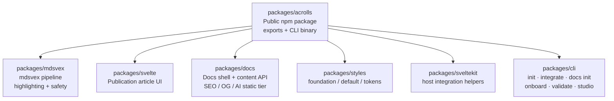

# Capability Inventory: What Is Already Built

<cite>
**Referenced Files in This Document**
- [README.md](file://README.md)
- [package.json](file://package.json)
- [pnpm-workspace.yaml](file://pnpm-workspace.yaml)
- [packages/acrolls/package.json](file://packages/acrolls/package.json)
- [packages/docs/src/lib/index.ts](file://packages/docs/src/lib/index.ts)
- [packages/svelte/src/lib/index.ts](file://packages/svelte/src/lib/index.ts)
- [packages/mdsvex/src/index.ts](file://packages/mdsvex/src/index.ts)
- [packages/cli/src/index.ts](file://packages/cli/src/index.ts)
</cite>

## Shipped-Capability Matrix

| Capability area | Implemented in code at | Evidence (source + test + example route) | Remaining gate |
|---|---|---|---|
| Public npm package surface (`acrolls/*` exports, CLI binary, bundled subpackages) | `packages/acrolls/package.json` | Source: export map and bin; Test: root `verify:packed-consumer` script; Example: README install/onboard flow | Owner evaluation of packed consumer contract stability |
| mdsvex pipeline (GFM, headings, anchors, tables, Shiki highlighter, mermaid guard, source safety, diagnostics, metadata/`__acrollsDocument` injection) | `packages/mdsvex/src/index.ts` (+ rehype/remark plugins in same package) | Source: `createAcrollsMdsvexOptions`, preprocessor, AST binding analysis; Test: `*.test.ts` files under `packages/mdsvex/src`; Example: host integration via `acrolls/mdsvex` per docs | Owner evaluation of default policies (`onInvalidDocument`, authored H1 handling) |
| Publication article components (Publication, Banner, Callout, Figure, Video, ZoomableImage, PublicationLayout, code-frame enhancer, Mermaid enhancer) | `packages/svelte/src/lib/index.ts` | Source: component re-exports; Test: none found in this directory; Example: content authoring pages using `.md`/`.svx` with fences | Owner evaluation of component usage patterns in host routes |
| Docs shell (DocsShell, DocsSidebar, DocsNavTree, DocsBreadcrumbs, DocsPager, DocsToc, DocsPageHeader, DocsAccordion, DocsSearch, DocsSeo, CopyPageMarkdown) | `packages/docs/src/lib/index.ts` | Source: Svelte component re-exports; Test: `DocsToc.ssr.test.ts`; Example: `/docs` catch-all routes in `examples/kit-consumer` | Owner evaluation of search bundle wiring and SEO policy |
| Content collection API (Standard Schema validation, `content({ loader, config, schema })`, blessed genre fields, loader composition, naming conventions, `hidden` vs `filter`) | `packages/docs/src/lib/collection.ts`, `fields.ts`, `merge.ts`, `naming.ts` | Source: `content`, `mergeLoaders`/`mergeRaw`, `acrollsFields`, `numbered`/`dated`/`passthroughNaming`; Test: `collection.test.ts`, `fields.test.ts`, `merge.test.ts`, `naming.engine.test.ts`; Example: generated docs tree in example host | Owner evaluation of remote/CMS loader seam ownership |
| Navigation utilities (flatten, active item/section/trail, pager, breadcrumbs, open-state storage, slug/id helpers) | `packages/docs/src/lib/nav.ts`, `storage.ts`, `toc.ts` | Source: navigation functions; Test: `nav.test.ts`; Example: sidebar/TOC/pager in example docs routes | Owner evaluation of persistence key strategy |
| SEO helpers (buildDocsSeo, docsSitemap, docsRobots, DocsSeo component) | `packages/docs/src/lib/seo.ts` | Source: SEO functions and component; Test: none found in this directory; Example: `/sitemap.xml`, `/robots.txt` server routes in example host | Owner evaluation of site-wide SEO policy |
| OG image cards (satori-node based card generator, path helpers, entry discovery) | `packages/docs/src/lib/og.ts` | Source: `acrollsOgCard`, `docsOgImagePath`, `docsOgEntries`, `docsOgSlug`; Test: none found in this directory; Example: `/og/[slug]` server route in example host | Owner evaluation of image generation performance and caching |
| Agent static tier (llms.txt, llms-full.txt, page markdown, frontmatter opt-out) | `packages/docs/src/lib/ai.ts` | Source: `docsLlmsTxt`, `docsLlmsFullTxt`, `docsPageMarkdown`, `isAiExcluded`; Test: none found in this directory; Example: `/llms.txt`, `/llms-full.txt` server routes in example host | Owner evaluation of agent consumption model |
| Styles surface (foundation.css/default.css/theme.css/colors.css, SASS tokens, docs styles) | `packages/acrolls/styles/*` | Source: CSS/SASS files exposed via `acrolls/styles/*`; Test: none found in this directory; Example: host imports per `styles.md` | Owner evaluation of Tailwind exclusion and custom CSS direction |
| CLI tooling (init, integrate, docs init, onboard, validate, studio; exit codes 0/1/2) | `packages/cli/src/index.ts` (+ `integrate.ts`, `onboarding.ts`, `validate.ts`, `studio.ts`, `docs-init.ts`) | Source: command routing and help text; Test: `*.test.ts` files under `packages/cli/src`; Example: README install/onboard commands | Owner evaluation of migration vs authored mode defaults |
| Monorepo orchestration and dev scripts | `package.json`, `pnpm-workspace.yaml` | Source: workspace packages, build/test/dev/release scripts; Example: `dev:docs`, `verify:packed-consumer` | Owner evaluation of Node/SvelteKit version constraints |

**Section sources**
- [README.md:39-50](file://README.md#L39-L50)
- [package.json:9-22](file://package.json#L9-L22)
- [pnpm-workspace.yaml:1-4](file://pnpm-workspace.yaml#L1-L4)
- [packages/acrolls/package.json:11-57](file://packages/acrolls/package.json#L11-L57)
- [packages/mdsvex/src/index.ts:86-172](file://packages/mdsvex/src/index.ts#L86-L172)
- [packages/svelte/src/lib/index.ts:1-10](file://packages/svelte/src/lib/index.ts#L1-L10)
- [packages/docs/src/lib/index.ts:11-112](file://packages/docs/src/lib/index.ts#L11-L112)
- [packages/cli/src/index.ts:19-33](file://packages/cli/src/index.ts#L19-L33)

## Evidence Model (how a claim in this wiki is backed)

Every capability row above is anchored to three evidence types:

- **Source**: the exact file(s) that implement the feature. For Acrolls, this means the `packages/*/src` implementation or the public `packages/acrolls/package.json` export map.
- **Test**: unit tests under `packages/*/src/*.test.ts` that exercise the behavior. When no test exists for a specific module, the row notes “none found in this directory” rather than implying coverage.
- **Example route**: the SvelteKit server/page routes under `examples/kit-consumer` that wire the capability into a runnable host (for example `/llms.txt`, `/llms-full.txt`, `/sitemap.xml`, `/robots.txt`, `/og/[slug]`, and the docs catch-all routes).

The project’s own guidance applies: claims are framed as “implemented in code at <path>” or “present but not yet exercised by <gate>”. Completion status is owned by the project author; this inventory does not declare features verified beyond what the repository shows.

[No sources needed since this section explains methodology without analyzing specific files]

## What This Inventory Does Not Claim

- No i18n/locale routing, doc versioning/switcher, RSS feed, OpenAPI/GraphQL reference generator, MCP server, Ask-AI, analytics, PDF/EPUB export, includes/transclusion, or tabs/steps/cards/code-group content components are claimed. These are absent from the repo and belong to competitor positioning only.
- The docs-shell search uses Pagefind loaded by the host; Acrolls ships no Pagefind dependency and emits markers like `data-pagefind-body`/`data-pagefind-ignore`.
- The published `acrolls` package is alpha quality; APIs may change before 1.0.
- Host-owned responsibilities remain outside scope: routing, auth, deployment, SEO policy, content location, global navigation, and theme-toggle persistence.

[No sources needed since this section summarizes boundaries without analyzing specific files]

## Where the Code Lives (package -> responsibility)

**Diagram sources**
- [packages/acrolls/package.json:11-57](file://packages/acrolls/package.json#L11-L57)
- [packages/mdsvex/src/index.ts:86-172](file://packages/mdsvex/src/index.ts#L86-L172)
- [packages/svelte/src/lib/index.ts:1-10](file://packages/svelte/src/lib/index.ts#L1-L10)
- [packages/docs/src/lib/index.ts:11-112](file://packages/docs/src/lib/index.ts#L11-L112)
- [packages/cli/src/index.ts:19-33](file://packages/cli/src/index.ts#L19-L33)

**Section sources**
- [packages/acrolls/package.json:11-57](file://packages/acrolls/package.json#L11-L57)
- [packages/mdsvex/src/index.ts:86-172](file://packages/mdsvex/src/index.ts#L86-L172)
- [packages/svelte/src/lib/index.ts:1-10](file://packages/svelte/src/lib/index.ts#L1-L10)
- [packages/docs/src/lib/index.ts:11-112](file://packages/docs/src/lib/index.ts#L11-L112)
- [packages/cli/src/index.ts:19-33](file://packages/cli/src/index.ts#L19-L33)