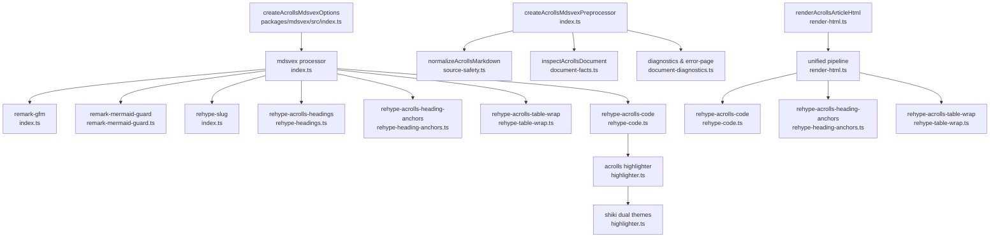
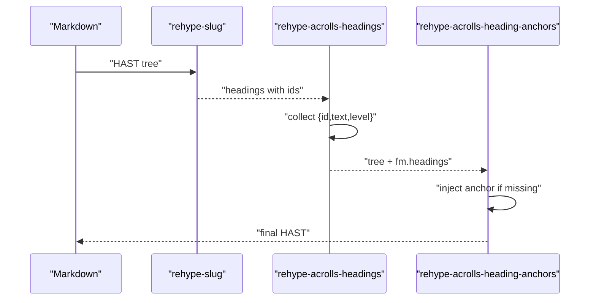
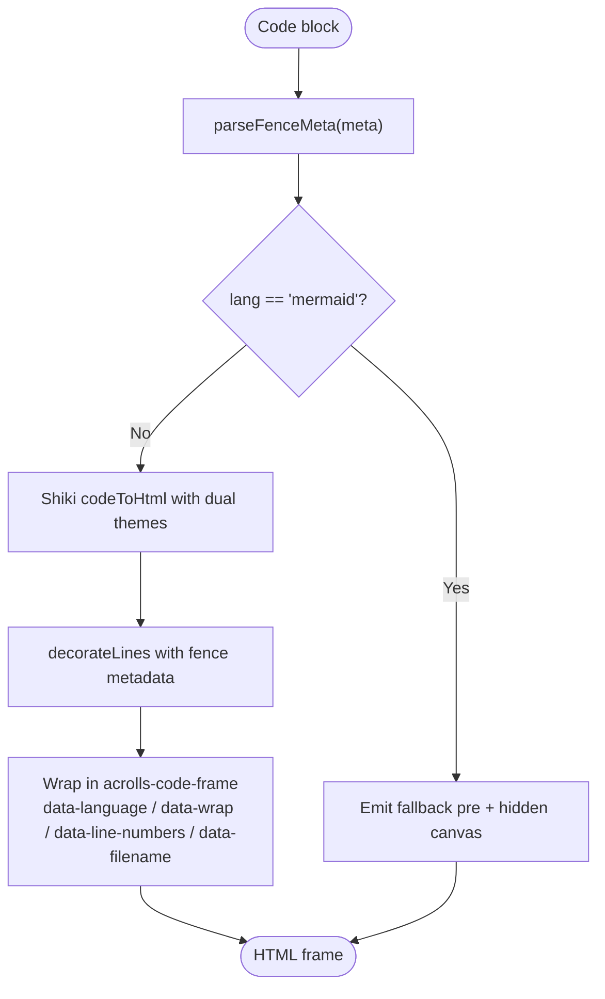
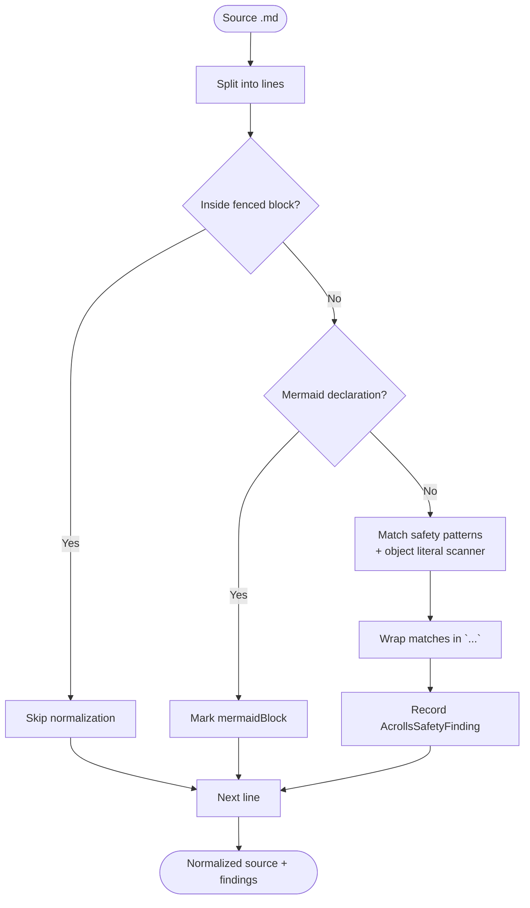

# Compilation Pipeline — Implemented

<cite>
**Referenced Files in This Document**
- [index.ts](file://packages/mdsvex/src/index.ts)
- [frontmatter.ts](file://packages/mdsvex/src/frontmatter.ts)
- [highlighter.ts](file://packages/mdsvex/src/highlighter.ts)
- [code-meta.ts](file://packages/mdsvex/src/code-meta.ts)
- [remark-code-meta.ts](file://packages/mdsvex/src/remark-code-meta.ts)
- [rehype-headings.ts](file://packages/mdsvex/src/rehype-headings.ts)
- [rehype-heading-anchors.ts](file://packages/mdsvex/src/rehype-heading-anchors.ts)
- [rehype-table-wrap.ts](file://packages/mdsvex/src/rehype-table-wrap.ts)
- [rehype-code.ts](file://packages/mdsvex/src/rehype-code.ts)
- [remark-mermaid-guard.ts](file://packages/mdsvex/src/remark-mermaid-guard.ts)
- [render-html.ts](file://packages/mdsvex/src/render-html.ts)
- [document-facts.ts](file://packages/mdsvex/src/document-facts.ts)
- [document-diagnostics.ts](file://packages/mdsvex/src/document-diagnostics.ts)
- [source-safety.ts](file://packages/mdsvex/src/source-safety.ts)
</cite>

## Capability
This document inventories the mdsvex compile layer shipped under packages/mdsvex/src. It covers:
- GFM parsing and pipeline wiring
- Frontmatter handling for Studio banners and validate metadata
- Heading slugs, collected headings, and accessible anchors
- Semantic table wrapping for scrollable tables
- Shiki dual-theme code frames with fence metadata (filename, line numbers, wrap, highlight/focus/diff ranges)
- Mermaid guard that recovers unfenced diagrams into fenced blocks
- HTML rendering parity between SvelteKit compilation and the standalone Studio/validate HTML renderer
- Source-safety diagnostics that normalize dangerous Markdown prose without touching .svx files

## Implementing Source
The compile layer is orchestrated by a single options factory and a preprocessor that runs before mdsvex parses Markdown. The pipeline composes remark plugins (GFM, mermaid guard), rehype plugins (slug, headings collection, anchors, table wrap), and a custom Shiki-based highlighter. A separate HTML renderer reuses the same rehype chain to produce publication-grade HTML for Studio and CLI validation.

**Diagram sources**
- [index.ts:86-172](file://packages/mdsvex/src/index.ts#L86-L172)
- [remark-mermaid-guard.ts:28-44](file://packages/mdsvex/src/remark-mermaid-guard.ts#L28-L44)
- [rehype-headings.ts:37-63](file://packages/mdsvex/src/rehype-headings.ts#L37-L63)
- [rehype-heading-anchors.ts:9-46](file://packages/mdsvex/src/rehype-heading-anchors.ts#L9-L46)
- [rehype-table-wrap.ts:8-34](file://packages/mdsvex/src/rehype-table-wrap.ts#L8-L34)
- [rehype-code.ts:9-57](file://packages/mdsvex/src/rehype-code.ts#L9-L57)
- [highlighter.ts:103-202](file://packages/mdsvex/src/highlighter.ts#L103-L202)
- [source-safety.ts:180-218](file://packages/mdsvex/src/source-safety.ts#L180-L218)
- [document-facts.ts:17-25](file://packages/mdsvex/src/document-facts.ts#L17-L25)
- [document-diagnostics.ts:33-65](file://packages/mdsvex/src/document-diagnostics.ts#L33-L65)
- [render-html.ts:25-52](file://packages/mdsvex/src/render-html.ts#L25-L52)

### GFM
- Enabled via remark-gfm in the mdsvex options factory.
- Also used in the standalone HTML renderer so Studio/validate output matches compiled documents.

**Section sources**
- [index.ts:103-109](file://packages/mdsvex/src/index.ts#L103-L109)
- [render-html.ts:35-45](file://packages/mdsvex/src/render-html.ts#L35-L45)

### Frontmatter Handling
- Minimal YAML-like parser extracts key/value pairs from fenced frontmatter for Studio banners and validate metadata.
- Banner HTML generator reads title, description/brief, eyebrow/series/project, reading/metadata, image/imageAlt and renders an accessible banner header.

**Section sources**
- [frontmatter.ts:7-29](file://packages/mdsvex/src/frontmatter.ts#L7-L29)
- [frontmatter.ts:31-55](file://packages/mdsvex/src/frontmatter.ts#L31-L55)

### Heading Slugs, Collected Headings, and Anchors
- rehype-slug assigns stable ids to headings.
- rehype-acrolls-headings collects id/text/level into file.data.fm.headings for server-rendered TOC; respects min/max level defaults.
- rehype-acrolls-heading-anchors injects an accessible anchor link per heading using aria-label and avoids duplicate injection.

**Diagram sources**
- [index.ts:94-109](file://packages/mdsvex/src/index.ts#L94-L109)
- [rehype-headings.ts:37-63](file://packages/mdsvex/src/rehype-headings.ts#L37-L63)
- [rehype-heading-anchors.ts:9-46](file://packages/mdsvex/src/rehype-heading-anchors.ts#L9-L46)

**Section sources**
- [index.ts:94-109](file://packages/mdsvex/src/index.ts#L94-L109)
- [rehype-headings.ts:37-63](file://packages/mdsvex/src/rehype-headings.ts#L37-L63)
- [rehype-heading-anchors.ts:9-46](file://packages/mdsvex/src/rehype-heading-anchors.ts#L9-L46)

### Semantic Table Wrapping
- Any bare table is wrapped in a keyboard-focusable div with role region and aria label, enabling safe horizontal scrolling without accessibility regressions.

**Section sources**
- [rehype-table-wrap.ts:8-34](file://packages/mdsvex/src/rehype-table-wrap.ts#L8-L34)

### Shiki Dual-Theme Code Frames and Fence Metadata
- createAcrollsHighlighter initializes Shiki with github-light/github-dark themes and a curated language list.
- parseFenceMeta supports filename, lineNumbers, wrap, highlight, focus, add, remove, and preserves raw meta.
- decorateLines annotates spans with data-line, data-highlighted, data-focused, data-diff attributes based on fence metadata.
- Output is wrapped in acrolls-code-frame with data attributes reflecting fence options; filenames render a header with actions container.
- Mermaid fences are guarded: they are not highlighted but emitted as a fallback pre with hidden canvas.

**Diagram sources**
- [highlighter.ts:103-202](file://packages/mdsvex/src/highlighter.ts#L103-L202)
- [code-meta.ts:38-70](file://packages/mdsvex/src/code-meta.ts#L38-L70)

**Section sources**
- [highlighter.ts:1-202](file://packages/mdsvex/src/highlighter.ts#L1-202)
- [code-meta.ts:1-71](file://packages/mdsvex/src/code-meta.ts#L1-L71)
- [rehype-code.ts:9-57](file://packages/mdsvex/src/rehype-code.ts#L9-L57)

### Fence Metadata Propagation
- remark-acrolls-code-meta copies fenced-code meta onto hast hProperties so rehype-acrolls-code can read it during HTML transformation.

**Section sources**
- [remark-code-meta.ts:7-22](file://packages/mdsvex/src/remark-code-meta.ts#L7-L22)
- [rehype-code.ts:34-41](file://packages/mdsvex/src/rehype-code.ts#L34-L41)

### Mermaid Guard
- remark-acrolls-mermaid-guard detects paragraphs whose first line begins with known Mermaid declarations and converts them into fenced code nodes with lang mermaid.
- This prevents Svelte’s parser from choking on arrows/braces in prose and lets the highlighter emit a safe fallback.

**Section sources**
- [remark-mermaid-guard.ts:28-44](file://packages/mdsvex/src/remark-mermaid-guard.ts#L28-L44)
- [highlighter.ts:112-117](file://packages/mdsvex/src/highlighter.ts#L112-L117)

### HTML Rendering Parity for Studio/Validate
- renderAcrollsArticleHtml builds a unified pipeline mirroring the mdsvex rehype chain: GFM, slug, anchors, table wrap, code highlighting, stringify.
- It strips Svelte script blocks and html bindings from .svx bodies so the preview remains safe while still showing content.
- Produces article HTML plus body-only HTML and frontmatter for Studio banners and validate metadata.

**Section sources**
- [render-html.ts:25-52](file://packages/mdsvex/src/render-html.ts#L25-L52)
- [frontmatter.ts:7-29](file://packages/mdsvex/src/frontmatter.ts#L7-L29)

### Source-Safety Diagnostics
- normalizeAcrollsMarkdown scans only .md prose lines outside fenced blocks and outside Mermaid blocks.
- It wraps dangerous constructs (Svelte special tags, component-shaped tags, generic type syntax, short object literals) in inline code to prevent misinterpretation by Svelte.
- Each normalization emits a finding with kind, line/column, text, and message.
- The preprocessor forwards findings through safetyFindingDiagnostic and can convert compile errors into a stable diagnostic or an error-page module when configured.

**Diagram sources**
- [source-safety.ts:180-218](file://packages/mdsvex/src/source-safety.ts#L180-L218)
- [source-safety.ts:78-108](file://packages/mdsvex/src/source-safety.ts#L78-L108)
- [source-safety.ts:115-156](file://packages/mdsvex/src/source-safety.ts#L115-L156)

**Section sources**
- [source-safety.ts:1-219](file://packages/mdsvex/src/source-safety.ts#L1-L219)
- [document-diagnostics.ts:17-45](file://packages/mdsvex/src/document-diagnostics.ts#L17-L45)
- [index.ts:121-172](file://packages/mdsvex/src/index.ts#L121-L172)

### Preprocessor Orchestration and Module Exports
- createAcrollsMdsvexPreprocessor runs inspectAcrollsDocument and suppressInitialMarkdownH1 when docs mode requires it, normalizes Markdown, forwards diagnostics, invokes mdsvex markup, ensures metadata and __acrollsDocument exports, and validates generated Svelte code.
- On invalid documents, it either throws a typed diagnostic error or returns a safe error-page module depending on onInvalidDocument policy.

**Section sources**
- [index.ts:121-172](file://packages/mdsvex/src/index.ts#L121-L172)
- [document-diagnostics.ts:33-65](file://packages/mdsvex/src/document-diagnostics.ts#L33-L65)
- [document-facts.ts:17-33](file://packages/mdsvex/src/document-facts.ts#L17-L33)

## Test Coverage Present
- Code metadata parsing and range list handling are exercised by tests under packages/mdsvex/src/code-meta.test.ts.
- Remark mermaid guard behavior is covered by remark-mermaid-guard.test.ts.
- Rehype headings behavior is validated by rehype-headings.test.ts.
- Source-safety normalization is verified by source-safety.test.ts.
- Index-level integration of mdsvex options and preprocessor is tested by index.test.ts.

**Section sources**
- [code-meta.test.ts](file://packages/mdsvex/src/code-meta.test.ts)
- [remark-mermaid-guard.test.ts](file://packages/mdsvex/src/remark-mermaid-guard.test.ts)
- [rehype-headings.test.ts](file://packages/mdsvex/src/rehype-headings.test.ts)
- [source-safety.test.ts](file://packages/mdsvex/src/source-safety.test.ts)
- [index.test.ts](file://packages/mdsvex/src/index.test.ts)

## Known Limits / Open Gates
- The highlighter ships a fixed set of Shiki languages; unsupported languages fall back to plaintext unless strict mode is enabled.
- Object-literal detection limits wrapped spans to a maximum length to avoid over-wrapping prose.
- Frontmatter parsing is intentionally minimal (key: value lines); complex YAML structures are not supported by splitFrontmatter.
- The mermaid guard targets common unfenced declarations; unusual or malformed diagrams may still require explicit fences.
- HTML renderer strips Svelte script blocks and html bindings for safe preview; executable .svx behavior is host territory and not executed during preview.
- Docs mode leading H1 suppression is opt-in via options.docs.leadingH1; preserve mode leaves the first H1 untouched.

[No sources needed since this section summarizes constraints without analyzing specific files]