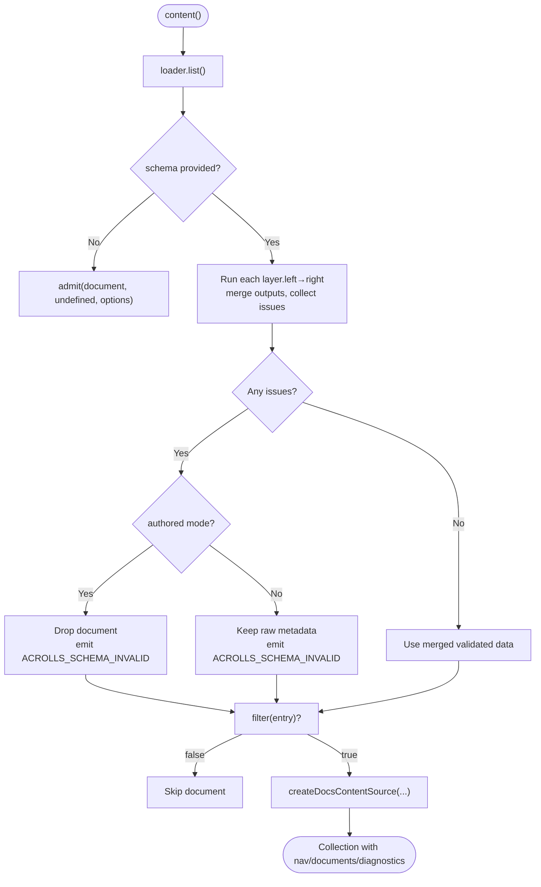
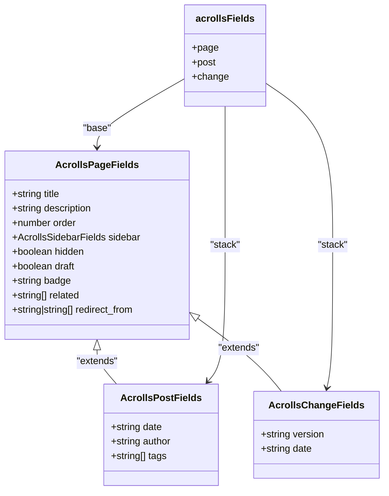
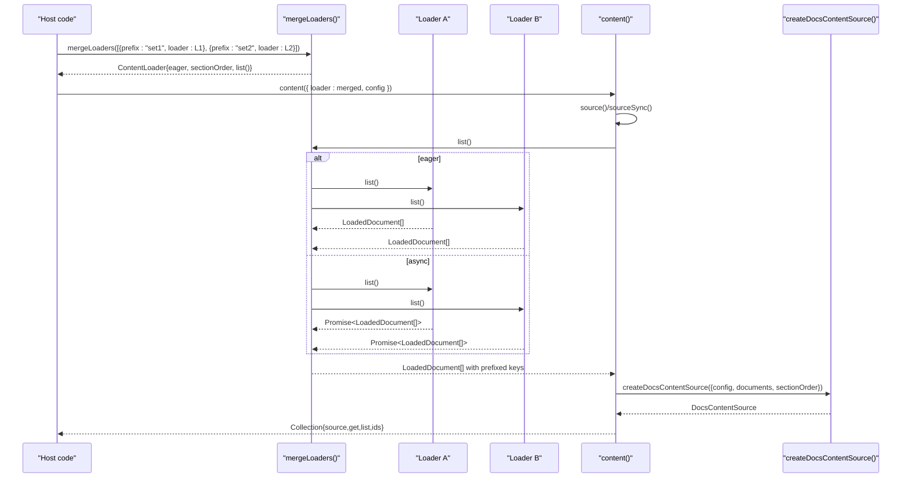
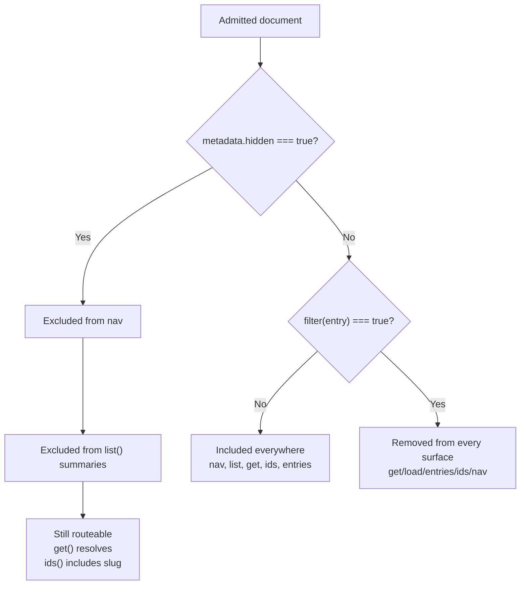
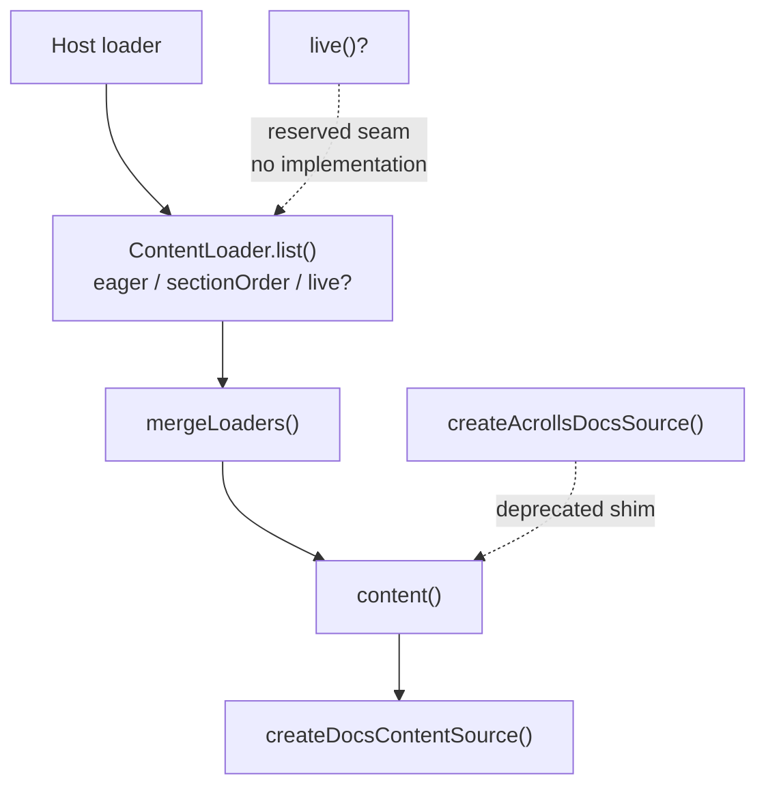

# Content Source & Collection API — Implemented

<cite>
**Referenced Files in This Document**
- [collection.ts](file://packages/docs/src/lib/collection.ts)
- [fields.ts](file://packages/docs/src/lib/fields.ts)
- [merge.ts](file://packages/docs/src/lib/merge.ts)
- [content.ts](file://packages/docs/src/lib/content.ts)
- [naming.ts](file://packages/docs/src/lib/naming.ts)
- [types.ts](file://packages/docs/src/lib/types.ts)
- [index.ts](file://packages/sveltekit/src/index.ts)
- [content.ts](file://packages/sveltekit/src/content.ts)
</cite>

## Public API

A host declares its corpus through the collection API exported from `acrolls/docs` (and re-exported via `acrolls/content`). The surface is a small, synchronous-first function plus a few helpers:

- `content({ loader, config, schema?, filter? })` returns a `Collection<TDocument, TSchema>` with:
  - `source()`: async pipeline that resolves loaders, validates frontmatter, applies filters, and builds the engine.
  - `sourceSync()`: synchronous variant; throws unless the loader declares `eager: true`.
  - `get(id)`: lookup by slug, key, key-without-extension, or href; returns an `Entry` carrying `id`, `key`, `data`, `meta`, `body`, `href`, `hidden`.
  - `list(options?)`: wire-safe summaries of every non-hidden document in engine order; supports a `map` projection.
  - `ids()`: every document slug, including hidden ones, because hidden pages remain routeable.

The pipeline is strictly load → validate → filter → engine. Validation uses Standard Schema v1 declared structurally so Acrolls adds no validation library to its dependency tree; hosts bring Valibot, Zod, Arktype, or any other vendor. A single schema or an array of schemas can be layered left→right; outputs merge so later layers override earlier fields, and issues are collected across all layers before admission.

Validation results flow into `admit`, which:
- Emits a diagnostic with code `ACROLLS_SCHEMA_INVALID` when validation fails.
- In authored mode (`config.convention.mode === 'authored'`) drops the invalid document but keeps raw metadata for migration mode.
- Applies the optional `filter(entry)` predicate keyed on source `key` (not slug), receiving `{ key, data, meta }`; filtered documents are removed from every surface, including direct lookups.
- Pushes admitted inputs into the engine as `DocsContentInput`.

**Diagram sources**
- [collection.ts:171-221](file://packages/docs/src/lib/collection.ts#L171-L221)
- [collection.ts:227-342](file://packages/docs/src/lib/collection.ts#L227-L342)
- [content.ts:256-332](file://packages/docs/src/lib/content.ts#L256-L332)

**Section sources**
- [collection.ts:12-157](file://packages/docs/src/lib/collection.ts#L12-L157)
- [collection.ts:171-221](file://packages/docs/src/lib/collection.ts#L171-L221)
- [collection.ts:227-342](file://packages/docs/src/lib/collection.ts#L227-L342)
- [content.ts:256-332](file://packages/docs/src/lib/content.ts#L256-L332)

## Genre Schemas

Acrolls ships hand-written, dependency-free Standard Schema validators for the frontmatter fields every docs surface reads. They are designed as passthroughs: they validate and normalize only the fields they own and spread unrecognized keys through untouched so SEO/search/AI keys survive.

Blessed genre stacks:
- `acrollsFields.page`: universal base requiring a non-empty `title`; normalizes `description` (also accepts legacy `brief`), `order`, `sidebar.{order,label}`, boolean `hidden` and `draft`, string `badge`, string-or-array `related`, and string-or-array `redirect_from`.
- `acrollsFields.post`: `[page, postOnly]` adding required `date`, optional `author`, and string-or-array `tags`.
- `acrollsFields.change`: `[page, changeOnly]` adding required `version` and `date`.

Layering rule: `content({ schema: acrollsFields.post })` is treated as `[page, postOnly]`; `content()` merges layers left→right, so a host can append custom schemas after the blessed stack. Each layer’s output is merged into one normalized record, and all layers’ issues are reported together rather than short-circuiting at the first error.

**Diagram sources**
- [fields.ts:20-49](file://packages/docs/src/lib/fields.ts#L20-L49)
- [fields.ts:85-175](file://packages/docs/src/lib/fields.ts#L85-L175)

**Section sources**
- [fields.ts:1-175](file://packages/docs/src/lib/fields.ts#L1-L175)

## Loader Seam & Composition

The pluggable seam between a document store and the Acrolls nav/route engine is the `ContentLoader<TDocument>` type. A loader exposes:
- `list()`: returns `LoadedDocument<TDocument>[]` or a promise of it.
- `eager`: `true` when `list()` is synchronous, enabling `sourceSync()`.
- `sectionOrder?`: per-section ordering hints keyed by source prefix; `mergeLoaders` records each prefixed source’s declaration index so merged sections render in the order the host listed them. Explicit `folders[].order` and naming-convention orders still win.
- `live?()`: reserved seam for future live/incremental sources; declared but not yet consumed by Acrolls.

`mergeLoaders` composes multiple loaders into one, prefixing each set’s keys so every source becomes a first-level section in the resulting hierarchy. It detects duplicate keys across sources and throws a named `DocsContentError`. The merged loader is `eager` only when every source is eager; otherwise `list()` returns a promise that resolves all sources concurrently.

`mergeRaw` mirrors the same prefixing strategy for raw Markdown maps used by the AI static tier (llms.txt, per-page markdown, copy-as-markdown), keeping raw keys aligned with merged document keys.

**Diagram sources**
- [merge.ts:17-99](file://packages/docs/src/lib/merge.ts#L17-L99)
- [collection.ts:171-221](file://packages/docs/src/lib/collection.ts#L171-L221)
- [content.ts:256-332](file://packages/docs/src/lib/content.ts#L256-L332)

**Section sources**
- [collection.ts:42-73](file://packages/docs/src/lib/collection.ts#L42-L73)
- [merge.ts:1-122](file://packages/docs/src/lib/merge.ts#L1-L122)

## Publication Semantics (hidden vs filter)

Acrolls distinguishes two ways to exclude content, with different reach:

- `hidden` (frontmatter field): marks a page unlisted in navigation and excluded from `list()` summaries, but the page remains routeable and prerendered. `ids()` includes hidden slugs, and `get('...')` still resolves them.
- `filter` (collection option): removes a document from every surface, including direct URL access, `get()`, `load()`, `entries()`, nav, and `ids()`. The predicate receives the source `key` (not slug) because the engine is the sole route authority before filtering runs.

The behavior is verified by tests that assert hidden pages appear in `ids()` and resolve via `get()`, while filtered drafts do not.

**Diagram sources**
- [collection.ts:147-157](file://packages/docs/src/lib/collection.ts#L147-L157)
- [collection.ts:206-219](file://packages/docs/src/lib/collection.ts#L206-L219)
- [content.ts:663-668](file://packages/docs/src/lib/content.ts#L663-L668)

**Section sources**
- [collection.ts:147-157](file://packages/docs/src/lib/collection.ts#L147-L157)
- [collection.ts:206-219](file://packages/docs/src/lib/collection.ts#L206-L219)
- [content.ts:663-668](file://packages/docs/src/lib/content.ts#L663-L668)

## Not Implemented (remote sources, live())

Remote or CMS-backed loaders are intentionally out of scope for Acrolls to implement. The repository provides the seam but no built-in remote loader:

- `ContentLoader.live?()` is declared as a reserved seam for future live/incremental sources, with explicit comments stating there is no implementation and nothing in Acrolls consumes it yet.
- No package under `packages/` contains a remote, network, or database-backed `ContentLoader`; composition is expected to be host-owned work using the same `ContentLoader` interface.
- The deprecated helper `createAcrollsDocsSource` (re-exported from both `packages/sveltekit/src/index.ts` and `packages/sveltekit/src/content.ts`) remains supported for backward compatibility. It wraps the old three-glob shape over the modern `content()` pipeline and is marked `@deprecated` in favor of `content({ loader: markdownGlob(...), config })`.

**Diagram sources**
- [collection.ts:54-73](file://packages/docs/src/lib/collection.ts#L54-L73)
- [index.ts:150-173](file://packages/sveltekit/src/index.ts#L150-L173)
- [content.ts:126-147](file://packages/sveltekit/src/content.ts#L126-L147)

**Section sources**
- [collection.ts:54-73](file://packages/docs/src/lib/collection.ts#L54-L73)
- [index.ts:150-173](file://packages/sveltekit/src/index.ts#L150-L173)
- [content.ts:126-147](file://packages/sveltekit/src/content.ts#L126-L147)