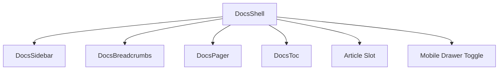
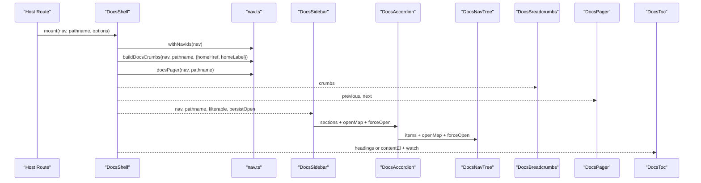
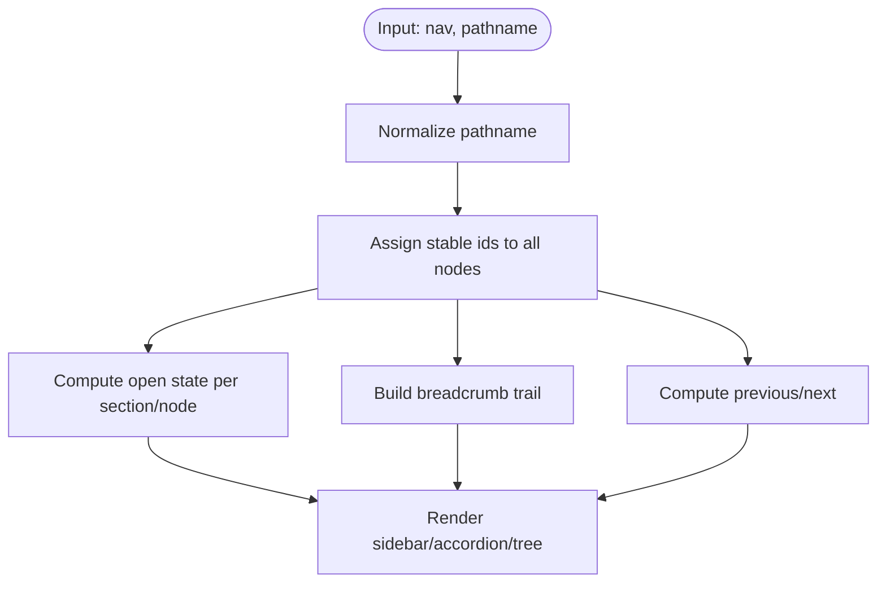
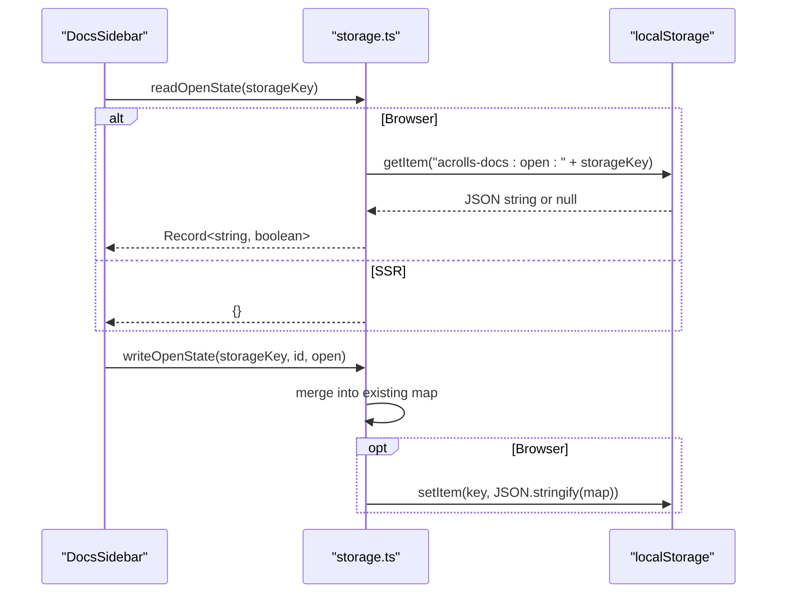

# Docs Shell & Navigation — Implemented

<cite>
**Referenced Files in This Document**
- [DocsShell.svelte](file://packages/docs/src/lib/DocsShell.svelte)
- [DocsSidebar.svelte](file://packages/docs/src/lib/DocsSidebar.svelte)
- [DocsAccordion.svelte](file://packages/docs/src/lib/DocsAccordion.svelte)
- [DocsNavTree.svelte](file://packages/docs/src/lib/DocsNavTree.svelte)
- [DocsBreadcrumbs.svelte](file://packages/docs/src/lib/DocsBreadcrumbs.svelte)
- [DocsPager.svelte](file://packages/docs/src/lib/DocsPager.svelte)
- [DocsToc.svelte](file://packages/docs/src/lib/DocsToc.svelte)
- [DocsPageHeader.svelte](file://packages/docs/src/lib/DocsPageHeader.svelte)
- [nav.ts](file://packages/docs/src/lib/nav.ts)
- [toc.ts](file://packages/docs/src/lib/toc.ts)
- [storage.ts](file://packages/docs/src/lib/storage.ts)
- [nav-path.ts](file://packages/docs/src/lib/nav-path.ts)
- [types.ts](file://packages/docs/src/lib/types.ts)
- [browser.ts](file://packages/docs/src/lib/browser.ts)
</cite>

## Shell Compositions
- The shell composes a sidebar-only docs layout with a top header area, scrollable article body, optional right-rail table of contents, and an optional pager footer. It owns the mobile drawer toggle and marks the article for Pagefind indexing via data attributes.
- Props surface configuration for: navigation tree, current pathname, breadcrumbs override, home link, filterable sidebar, pager visibility, TOC visibility and heading range, full-bleed mode, open-state persistence, menu label, searchability, plus slot-based header and children content.
- The shell derives stable IDs for nav nodes, resolves breadcrumbs from the nav when not provided, computes previous/next pager links, and mounts the article element reference used by the TOC scanner.

**Diagram sources**
- [DocsShell.svelte:10-36](file://packages/docs/src/lib/DocsShell.svelte#L10-L36)
- [DocsShell.svelte:58-73](file://packages/docs/src/lib/DocsShell.svelte#L58-L73)
- [DocsShell.svelte:76-145](file://packages/docs/src/lib/DocsShell.svelte#L76-L145)

**Section sources**
- [DocsShell.svelte:10-36](file://packages/docs/src/lib/DocsShell.svelte#L10-L36)
- [DocsShell.svelte:58-73](file://packages/docs/src/lib/DocsShell.svelte#L58-L73)
- [DocsShell.svelte:76-145](file://packages/docs/src/lib/DocsShell.svelte#L76-L145)

## Navigation Behaviors Present in Code
- Sidebar composition: renders brand/title/subtitle, optional search filter, and a list of sections rendered as accordions. Filtering expands matching groups and hides non-matching items.
- Accordion behavior: each section is a native `
` whose open state is driven by user toggles, storage, or path-aware defaults. Active section detection highlights the current page and opens the containing group.
- Nav tree: recursive nested lists render leaf links and group summaries; active branch highlighting and open-state inheritance propagate to descendants.
- Breadcrumbs: built from the nav trail above the current page, including Home, docs base, section, and intermediate groups; last segment is the current page.
- Pager: computed from the flattened ordered nav leaves; shows previous/next links when available.
- Table of contents: supports compile-time headings (server-rendered) or DOM scanning fallback; tracks active heading on scroll; respects min/max heading levels.
- Mobile drawer: a button toggles a backdrop-driven overlay that contains the sidebar; closing resets on route change.

**Diagram sources**
- [DocsShell.svelte:58-73](file://packages/docs/src/lib/DocsShell.svelte#L58-L73)
- [DocsShell.svelte:101-142](file://packages/docs/src/lib/DocsShell.svelte#L101-L142)
- [DocsSidebar.svelte:26-90](file://packages/docs/src/lib/DocsSidebar.svelte#L26-L90)
- [DocsAccordion.svelte:17-33](file://packages/docs/src/lib/DocsAccordion.svelte#L17-L33)
- [DocsNavTree.svelte:20-34](file://packages/docs/src/lib/DocsNavTree.svelte#L20-L34)
- [nav.ts:13-26](file://packages/docs/src/lib/nav.ts#L13-L26)
- [nav.ts:130-144](file://packages/docs/src/lib/nav.ts#L130-L144)
- [nav.ts:146-177](file://packages/docs/src/lib/nav.ts#L146-L177)
- [DocsToc.svelte:35-84](file://packages/docs/src/lib/DocsToc.svelte#L35-L84)

**Section sources**
- [DocsSidebar.svelte:18-90](file://packages/docs/src/lib/DocsSidebar.svelte#L18-L90)
- [DocsAccordion.svelte:7-33](file://packages/docs/src/lib/DocsAccordion.svelte#L7-L33)
- [DocsNavTree.svelte:7-34](file://packages/docs/src/lib/DocsNavTree.svelte#L7-L34)
- [DocsBreadcrumbs.svelte:4-31](file://packages/docs/src/lib/DocsBreadcrumbs.svelte#L4-L31)
- [DocsPager.svelte:4-30](file://packages/docs/src/lib/DocsPager.svelte#L4-L30)
- [DocsToc.svelte:6-84](file://packages/docs/src/lib/DocsToc.svelte#L6-L84)
- [nav.ts:47-92](file://packages/docs/src/lib/nav.ts#L47-L92)
- [nav.ts:130-177](file://packages/docs/src/lib/nav.ts#L130-L177)

## Pure Helpers & Determinism
- Stable node identity: `withNavIds` walks the nav tree and assigns deterministic IDs to every section and node using `stableId`, deduplicating collisions with a suffix counter. This ensures consistent Reactivity keys and localStorage mapping across re-renders and host-provided IDs.
- Path normalization: `normalizePath` strips query strings and fragments, trims trailing slashes, and canonicalizes paths before comparison throughout the shell (active detection, breadcrumb building, pager computation).
- Slugification: `slugify` produces bounded, URL-safe identifiers derived from titles for storage keys and auto-generated IDs.
- TOC scanning: `scanHeadings` collects headings within a configured level range, generates stable IDs when missing, and returns structured items consumed by the TOC component.
- Pager and breadcrumbs: `docsPager` flattens the nav into leaf pages and returns adjacent links; `buildDocsCrumbs` builds a readable trail from Home through section to the current page, deduplicating labels.
- Open-state helpers: `sectionShouldOpen` and `nodeShouldOpen` compute default open states based on `defaultOpen`, active path containment, and forced-open sets.

**Diagram sources**
- [nav.ts:13-26](file://packages/docs/src/lib/nav.ts#L13-L26)
- [nav.ts:71-92](file://packages/docs/src/lib/nav.ts#L71-L92)
- [nav.ts:130-177](file://packages/docs/src/lib/nav.ts#L130-L177)
- [nav.ts:191-211](file://packages/docs/src/lib/nav.ts#L191-L211)
- [nav-path.ts:1-37](file://packages/docs/src/lib/nav-path.ts#L1-L37)
- [toc.ts:16-47](file://packages/docs/src/lib/toc.ts#L16-L47)

**Section sources**
- [nav.ts:13-26](file://packages/docs/src/lib/nav.ts#L13-L26)
- [nav.ts:71-92](file://packages/docs/src/lib/nav.ts#L71-L92)
- [nav.ts:130-177](file://packages/docs/src/lib/nav.ts#L130-L177)
- [nav.ts:191-211](file://packages/docs/src/lib/nav.ts#L191-L211)
- [nav-path.ts:1-37](file://packages/docs/src/lib/nav-path.ts#L1-L37)
- [toc.ts:16-47](file://packages/docs/src/lib/toc.ts#L16-L47)

## Persistence
- Open-state persistence: accordion sections and nested groups can persist their open/closed state in `localStorage` under a namespaced key derived from the nav title (or explicit `storageKey`). The sidebar reads initial state on mount and re-reads when the storage key changes (e.g., switching between multiple nav surfaces). Writes are guarded against SSR and storage errors.
- Storage API: `readOpenState` parses and validates stored JSON, `writeOpenState` merges a single id’s boolean into the map and persists it, and `clearOpenState` removes the namespace. All operations short-circuit gracefully outside the browser.
- Key derivation: `navStorageKey` uses `slugify(nav.title)` unless overridden, ensuring unique namespaces per docs surface.

**Diagram sources**
- [DocsSidebar.svelte:26-45](file://packages/docs/src/lib/DocsSidebar.svelte#L26-L45)
- [DocsSidebar.svelte:84-90](file://packages/docs/src/lib/DocsSidebar.svelte#L84-L90)
- [storage.ts:6-46](file://packages/docs/src/lib/storage.ts#L6-L46)
- [nav.ts:213-215](file://packages/docs/src/lib/nav.ts#L213-L215)
- [browser.ts:1-3](file://packages/docs/src/lib/browser.ts#L1-L3)

**Section sources**
- [DocsSidebar.svelte:26-45](file://packages/docs/src/lib/DocsSidebar.svelte#L26-L45)
- [DocsSidebar.svelte:84-90](file://packages/docs/src/lib/DocsSidebar.svelte#L84-L90)
- [storage.ts:6-46](file://packages/docs/src/lib/storage.ts#L6-L46)
- [nav.ts:213-215](file://packages/docs/src/lib/nav.ts#L213-L215)
- [browser.ts:1-3](file://packages/docs/src/lib/browser.ts#L1-L3)

## Browser Acceptance Status
- DocsShell: fully implemented; composes sidebar, breadcrumbs, pager, TOC, mobile drawer, and article wrapper with searchability flags.
- Sidebar-only composition: implemented; the shell’s primary layout is a left sidebar with main content and optional right-rail TOC.
- Accordion nav tree: implemented; sections and nested groups use native `
` with path-aware defaults and optional forced open during filtering.
- Breadcrumbs: implemented; derived from nav trail with Home, base, section, and intermediate nodes.
- Pager: implemented; computed from flattened nav leaves with previous/next links.
- TOC: implemented; supports compile-time headings and DOM scan fallback with active heading tracking on scroll.
- Page header: implemented as a standalone component for title/description rendering.
- Mobile drawer: implemented; accessible toggle with backdrop and route-change reset.
- localStorage open-state persistence: implemented; namespaced per nav, SSR-safe, error-tolerant.
- Pure nav helpers with deterministic node identity: implemented; stable IDs, path normalization, slugification, breadcrumb/pager/open-state utilities.

**Section sources**
- [DocsShell.svelte:10-145](file://packages/docs/src/lib/DocsShell.svelte#L10-L145)
- [DocsSidebar.svelte:18-121](file://packages/docs/src/lib/DocsSidebar.svelte#L18-L121)
- [DocsAccordion.svelte:7-64](file://packages/docs/src/lib/DocsAccordion.svelte#L7-L64)
- [DocsNavTree.svelte:7-92](file://packages/docs/src/lib/DocsNavTree.svelte#L7-L92)
- [DocsBreadcrumbs.svelte:4-31](file://packages/docs/src/lib/DocsBreadcrumbs.svelte#L4-L31)
- [DocsPager.svelte:4-30](file://packages/docs/src/lib/DocsPager.svelte#L4-L30)
- [DocsToc.svelte:6-102](file://packages/docs/src/lib/DocsToc.svelte#L6-L102)
- [DocsPageHeader.svelte:1-17](file://packages/docs/src/lib/DocsPageHeader.svelte#L1-L17)
- [nav.ts:13-26](file://packages/docs/src/lib/nav.ts#L13-L26)
- [nav.ts:130-177](file://packages/docs/src/lib/nav.ts#L130-L177)
- [nav.ts:191-211](file://packages/docs/src/lib/nav.ts#L191-L211)
- [nav-path.ts:1-37](file://packages/docs/src/lib/nav-path.ts#L1-L37)
- [toc.ts:16-47](file://packages/docs/src/lib/toc.ts#L16-L47)
- [storage.ts:6-46](file://packages/docs/src/lib/storage.ts#L6-L46)
- [types.ts:1-72](file://packages/docs/src/lib/types.ts#L1-L72)
- [browser.ts:1-3](file://packages/docs/src/lib/browser.ts#L1-L3)