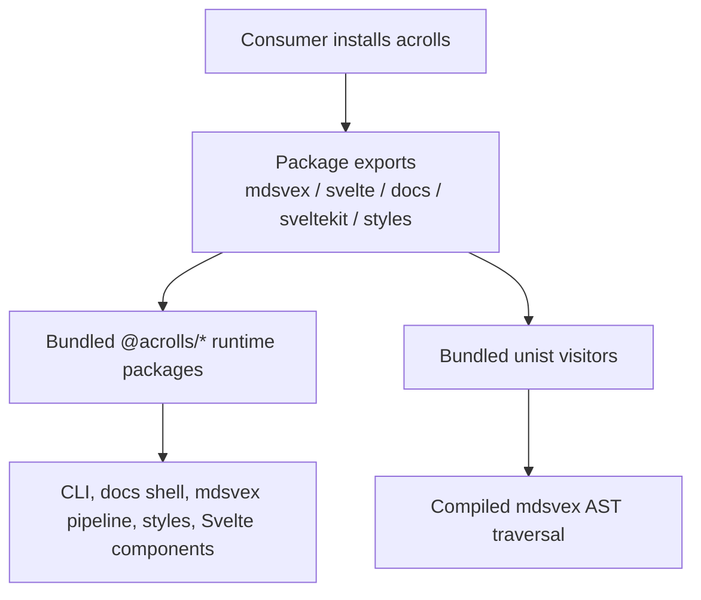
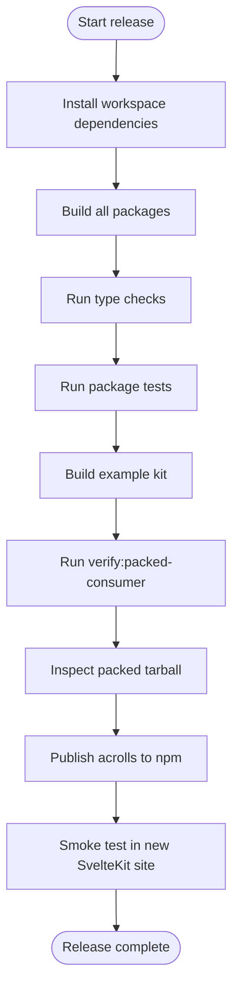
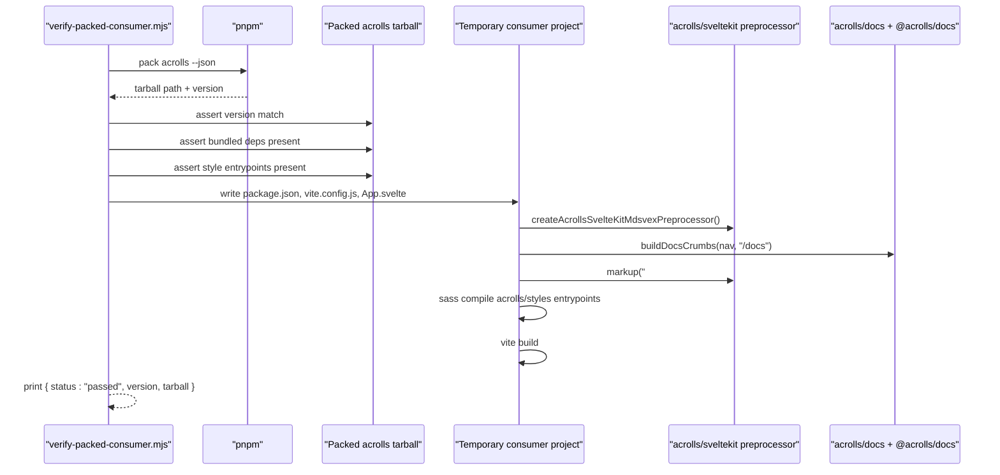
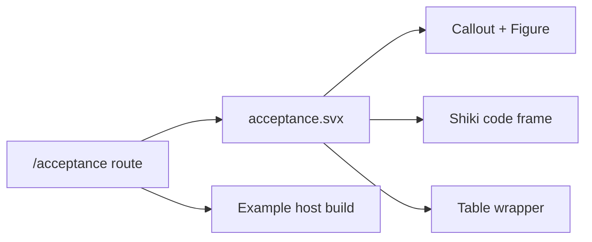
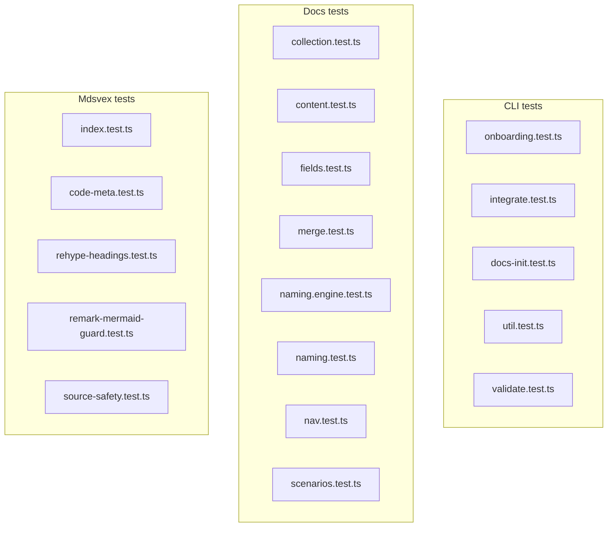

# Package Surface, Release & Evidence Harness

<cite>
**Referenced Files in This Document**
- [packages/acrolls/package.json](file://packages/acrolls/package.json)
- [docs/release.md](file://docs/release.md)
- [scripts/verify-packed-consumer.mjs](file://scripts/verify-packed-consumer.mjs)
- [package.json](file://package.json)
- [examples/kit-consumer/src/routes/acceptance/+page.svelte](file://examples/kit-consumer/src/routes/acceptance/+page.svelte)
- [examples/kit-consumer/src/content/acceptance.svx](file://examples/kit-consumer/src/content/acceptance.svx)
- [packages/cli/src/onboarding.test.ts](file://packages/cli/src/onboarding.test.ts)
- [packages/cli/src/integrate.test.ts](file://packages/cli/src/integrate.test.ts)
- [packages/cli/src/docs-init.test.ts](file://packages/cli/src/docs-init.test.ts)
- [packages/cli/src/util.test.ts](file://packages/cli/src/util.test.ts)
- [packages/cli/src/validate.test.ts](file://packages/cli/src/validate.test.ts)
- [packages/docs/src/collection.test.ts](file://packages/docs/src/collection.test.ts)
- [packages/docs/src/content.test.ts](file://packages/docs/src/content.test.ts)
- [packages/docs/src/fields.test.ts](file://packages/docs/src/fields.test.ts)
- [packages/docs/src/merge.test.ts](file://packages/docs/src/merge.test.ts)
- [packages/docs/src/naming.engine.test.ts](file://packages/docs/src/naming.engine.test.ts)
- [packages/docs/src/naming.test.ts](file://packages/docs/src/naming.test.ts)
- [packages/docs/src/nav.test.ts](file://packages/docs/src/nav.test.ts)
- [packages/docs/src/scenarios.test.ts](file://packages/docs/src/scenarios.test.ts)
- [packages/mdsvex/src/index.test.ts](file://packages/mdsvex/src/index.test.ts)
- [packages/mdsvex/src/code-meta.test.ts](file://packages/mdsvex/src/code-meta.test.ts)
- [packages/mdsvex/src/rehype-headings.test.ts](file://packages/mdsvex/src/rehype-headings.test.ts)
- [packages/mdsvex/src/remark-mermaid-guard.test.ts](file://packages/mdsvex/src/remark-mermaid-guard.test.ts)
- [packages/mdsvex/src/source-safety.test.ts](file://packages/mdsvex/src/source-safety.test.ts)
</cite>

## Public Entrypoints

The public distribution surface is declared by the `acrolls` npm package. Consumers install only this package and import through its documented entrypoints; scoped `@acrolls/*` packages are internal implementation units and are not direct consumer dependencies.

- Package identity and version: name `acrolls`, version `0.1.4`.
- CLI binary exposed as `acrolls` via a bin mapping.
- Export map defines these public entrypoints:
  - `./mdsvex` — mdsvex preprocessor helpers for consumers.
  - `./svelte` — Svelte publication components (e.g., Callout, Figure).
  - `./docs` — docs-shell and navigation utilities.
  - `./docs/content` — content collection helpers.
  - `./content` — generic content utilities.
  - `./sveltekit` — SvelteKit integration helpers (preprocessor, docs source).
  - Styles: CSS and SASS entrypoints under `./styles/*` and `./docs/styles.*`.

These exports are what the verification harness imports at runtime to prove the published tarball works without workspace or file: references.

**Section sources**
- [packages/acrolls/package.json:1-68](file://packages/acrolls/package.json#L1-L68)

## Packaging & Bundling

The `acrolls` package bundles its private workspace packages and a small set of unist visitor utilities so consumers never need to depend on them directly.

- Bundled dependencies list includes:
  - `@acrolls/cli`, `@acrolls/docs`, `@acrolls/mdsvex`, `@acrolls/styles`, `@acrolls/svelte`, `@acrolls/sveltekit`
  - `unist-util-is`, `unist-util-visit`, `unist-util-visit-parents`
- Published files include `bin`, `exports`, `styles`, plus README and LICENSE.
- Side effects declare CSS style entrypoints so bundlers can treat them as side-effectful assets.
- Peer dependencies require Svelte 5 and optionally fractalthemer; Node engine is pinned to >=20.19.0.

**Diagram sources**
- [packages/acrolls/package.json:72-106](file://packages/acrolls/package.json#L72-L106)

**Section sources**
- [packages/acrolls/package.json:59-118](file://packages/acrolls/package.json#L59-L118)

## Release Procedure as Documented

The repository documents a release contract that centers on publishing one public package (`acrolls`) whose tarball contains all internal runtime packages. The procedure emphasizes building before type-checking because workspace exports point at generated artifacts, then verifying the packed consumer end-to-end.

Key steps from the documented release guide:

1. Install and build the workspace so generated dist files exist.
2. Run checks and tests across packages.
3. Build the example kit used during verification.
4. Run the packed-consumer verification script.
5. Inspect the pack artifact produced by the release pack command.
6. Confirm npm identity and publish the public package once.
7. Test the registry package in an unrelated site by installing only `acrolls`, running the CLI onboard flow, validating docs, checking types, building, and exercising routes.

**Diagram sources**
- [docs/release.md:22-85](file://docs/release.md#L22-L85)

**Section sources**
- [docs/release.md:10-85](file://docs/release.md#L10-L85)
- [package.json:9-22](file://package.json#L9-L22)

## Verification Harness

The packed-consumer verification script is the gate that proves the published `acrolls` package works in isolation. It runs inside a temporary directory, packs the workspace `acrolls` package, creates a minimal consumer project, and exercises both the mdsvex preprocessor and docs source through the public entrypoints.

What the script validates:

- Packs the `acrolls` package with pnpm and reads JSON metadata.
- Confirms the tarball exists and its version matches `packages/acrolls/package.json`.
- Asserts bundled dependencies are present in the tarball: `unist-util-is`, `unist-util-visit`, `unist-util-visit-parents`.
- Asserts public style entrypoints are present: foundation/default/docs CSS and SASS variants plus tokens.
- Creates a fresh consumer project that depends only on the local tarball and Vite/Svelte.
- Writes a Vite config that uses the public `acrolls/sveltekit` preprocessor.
- Imports `buildDocsCrumbs` from `acrolls/docs` and renders breadcrumbs.
- Probes `acrolls/sveltekit` to load the bundled `@acrolls/docs` nav module and verifies breadcrumb labels.
- Calls `createAcrollsDocsSource` and asserts normalization of an index document slug.
- Runs the public mdsvex preprocessor and asserts compiled output contains expected metadata.
- Compiles SASS using public `acrolls/styles` entrypoints.
- Builds the consumer with Vite.

**Diagram sources**
- [scripts/verify-packed-consumer.mjs:43-83](file://scripts/verify-packed-consumer.mjs#L43-L83)
- [scripts/verify-packed-consumer.mjs:85-179](file://scripts/verify-packed-consumer.mjs#L85-L179)
- [scripts/verify-packed-consumer.mjs:181-234](file://scripts/verify-packed-consumer.mjs#L181-L234)

**Section sources**
- [scripts/verify-packed-consumer.mjs:1-248](file://scripts/verify-packed-consumer.mjs#L1-L248)
- [package.json:17-20](file://package.json#L17-L20)

## Sample Content & Playset

The example host demonstrates how Acrolls renders a full article surface through a dedicated acceptance route. The route imports a `.svx` fixture that combines Markdown, code highlighting, tables, callouts, and figures in one request.

- Route: `examples/kit-consumer/src/routes/acceptance/+page.svelte`
- Fixture: `examples/kit-consumer/src/content/acceptance.svx`
- Fixture behavior:
  - Imports `Callout` and `Figure` from `acrolls/svelte`.
  - Includes a TypeScript code block to exercise Shiki highlighting.
  - Includes a table to exercise responsive table wrapping.
  - Renders a semantic callout and a captioned figure.
  - Provides a single smoke endpoint that hosts can hit after dev/build to validate rendering.

**Diagram sources**
- [examples/kit-consumer/src/routes/acceptance/+page.svelte:1-10](file://examples/kit-consumer/src/routes/acceptance/+page.svelte#L1-L10)
- [examples/kit-consumer/src/content/acceptance.svx:1-48](file://examples/kit-consumer/src/content/acceptance.svx#L1-L48)

**Section sources**
- [examples/kit-consumer/src/routes/acceptance/+page.svelte:1-10](file://examples/kit-consumer/src/routes/acceptance/+page.svelte#L1-L10)
- [examples/kit-consumer/src/content/acceptance.svx:1-48](file://examples/kit-consumer/src/content/acceptance.svx#L1-L48)

## Per-Package Test Files

Each package ships unit tests that cover its core logic. These files are discovered by the workspace test runner and provide evidence that the implementation behaves as intended.

- CLI package tests:
  - Onboarding flow: `packages/cli/src/onboarding.test.ts`
  - Integration flow: `packages/cli/src/integrate.test.ts`
  - Docs init flow: `packages/cli/src/docs-init.test.ts`
  - Utilities: `packages/cli/src/util.test.ts`
  - Validation: `packages/cli/src/validate.test.ts`
- Docs package tests:
  - Collection API: `packages/docs/src/collection.test.ts`
  - Content handling: `packages/docs/src/content.test.ts`
  - Field schemas: `packages/docs/src/fields.test.ts`
  - Loader merging: `packages/docs/src/merge.test.ts`
  - Naming engine: `packages/docs/src/naming.engine.test.ts`
  - Naming conventions: `packages/docs/src/naming.test.ts`
  - Navigation: `packages/docs/src/nav.test.ts`
  - Scenarios: `packages/docs/src/scenarios.test.ts`
- Mdsvex package tests:
  - Main pipeline: `packages/mdsvex/src/index.test.ts`
  - Code metadata: `packages/mdsvex/src/code-meta.test.ts`
  - Rehype headings: `packages/mdsvex/src/rehype-headings.test.ts`
  - Mermaid guard: `packages/mdsvex/src/remark-mermaid-guard.test.ts`
  - Source safety: `packages/mdsvex/src/source-safety.test.ts`

**Diagram sources**
- [packages/cli/src/onboarding.test.ts:1-200](file://packages/cli/src/onboarding.test.ts#L1-L200)
- [packages/cli/src/integrate.test.ts:1-200](file://packages/cli/src/integrate.test.ts#L1-L200)
- [packages/cli/src/docs-init.test.ts:1-200](file://packages/cli/src/docs-init.test.ts#L1-L200)
- [packages/cli/src/util.test.ts:1-200](file://packages/cli/src/util.test.ts#L1-L200)
- [packages/cli/src/validate.test.ts:1-200](file://packages/cli/src/validate.test.ts#L1-L200)
- [packages/docs/src/collection.test.ts:1-200](file://packages/docs/src/collection.test.ts#L1-L200)
- [packages/docs/src/content.test.ts:1-200](file://packages/docs/src/content.test.ts#L1-L200)
- [packages/docs/src/fields.test.ts:1-200](file://packages/docs/src/fields.test.ts#L1-L200)
- [packages/docs/src/merge.test.ts:1-200](file://packages/docs/src/merge.test.ts#L1-L200)
- [packages/docs/src/naming.engine.test.ts:1-200](file://packages/docs/src/naming.engine.test.ts#L1-L200)
- [packages/docs/src/naming.test.ts:1-200](file://packages/docs/src/naming.test.ts#L1-L200)
- [packages/docs/src/nav.test.ts:1-200](file://packages/docs/src/nav.test.ts#L1-L200)
- [packages/docs/src/scenarios.test.ts:1-200](file://packages/docs/src/scenarios.test.ts#L1-L200)
- [packages/mdsvex/src/index.test.ts:1-200](file://packages/mdsvex/src/index.test.ts#L1-L200)
- [packages/mdsvex/src/code-meta.test.ts:1-200](file://packages/mdsvex/src/code-meta.test.ts#L1-L200)
- [packages/mdsvex/src/rehype-headings.test.ts:1-200](file://packages/mdsvex/src/rehype-headings.test.ts#L1-L200)
- [packages/mdsvex/src/remark-mermaid-guard.test.ts:1-200](file://packages/mdsvex/src/remark-mermaid-guard.test.ts#L1-L200)
- [packages/mdsvex/src/source-safety.test.ts:1-200](file://packages/mdsvex/src/source-safety.test.ts#L1-L200)

**Section sources**
- [packages/cli/src/onboarding.test.ts:1-200](file://packages/cli/src/onboarding.test.ts#L1-L200)
- [packages/cli/src/integrate.test.ts:1-200](file://packages/cli/src/integrate.test.ts#L1-L200)
- [packages/cli/src/docs-init.test.ts:1-200](file://packages/cli/src/docs-init.test.ts#L1-L200)
- [packages/cli/src/util.test.ts:1-200](file://packages/cli/src/util.test.ts#L1-L200)
- [packages/cli/src/validate.test.ts:1-200](file://packages/cli/src/validate.test.ts#L1-L200)
- [packages/docs/src/collection.test.ts:1-200](file://packages/docs/src/collection.test.ts#L1-L200)
- [packages/docs/src/content.test.ts:1-200](file://packages/docs/src/content.test.ts#L1-L200)
- [packages/docs/src/fields.test.ts:1-200](file://packages/docs/src/fields.test.ts#L1-L200)
- [packages/docs/src/merge.test.ts:1-200](file://packages/docs/src/merge.test.ts#L1-L200)
- [packages/docs/src/naming.engine.test.ts:1-200](file://packages/docs/src/naming.engine.test.ts#L1-L200)
- [packages/docs/src/naming.test.ts:1-200](file://packages/docs/src/naming.test.ts#L1-L200)
- [packages/docs/src/nav.test.ts:1-200](file://packages/docs/src/nav.test.ts#L1-L200)
- [packages/docs/src/scenarios.test.ts:1-200](file://packages/docs/src/scenarios.test.ts#L1-L200)
- [packages/mdsvex/src/index.test.ts:1-200](file://packages/mdsvex/src/index.test.ts#L1-L200)
- [packages/mdsvex/src/code-meta.test.ts:1-200](file://packages/mdsvex/src/code-meta.test.ts#L1-L200)
- [packages/mdsvex/src/rehype-headings.test.ts:1-200](file://packages/mdsvex/src/rehype-headings.test.ts#L1-L200)
- [packages/mdsvex/src/remark-mermaid-guard.test.ts:1-200](file://packages/mdsvex/src/remark-mermaid-guard.test.ts#L1-L200)
- [packages/mdsvex/src/source-safety.test.ts:1-200](file://packages/mdsvex/src/source-safety.test.ts#L1-L200)