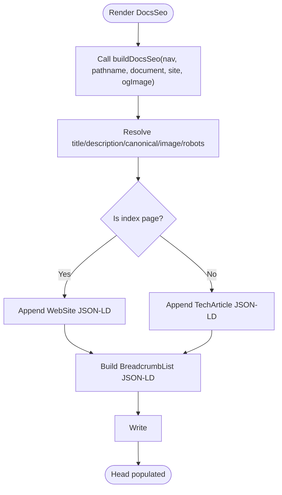
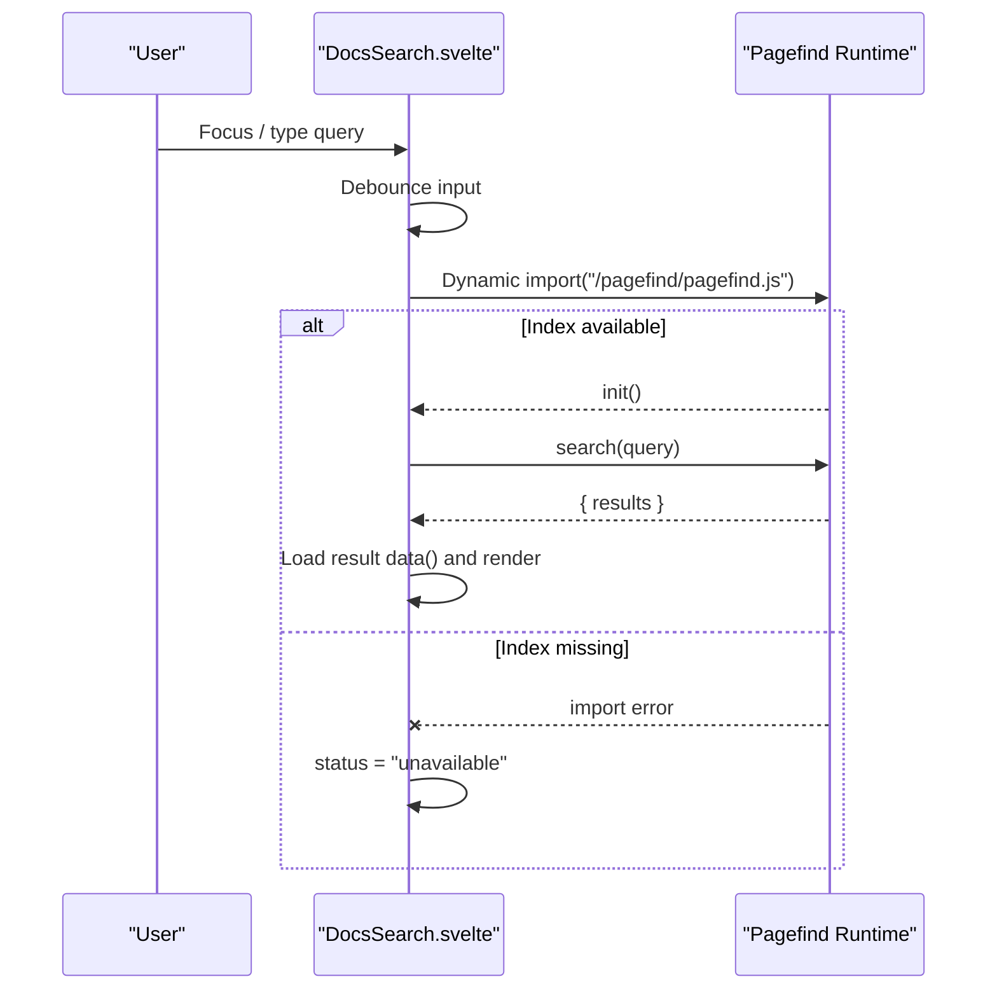
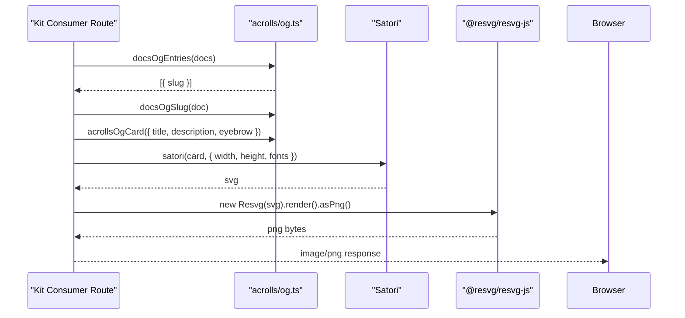
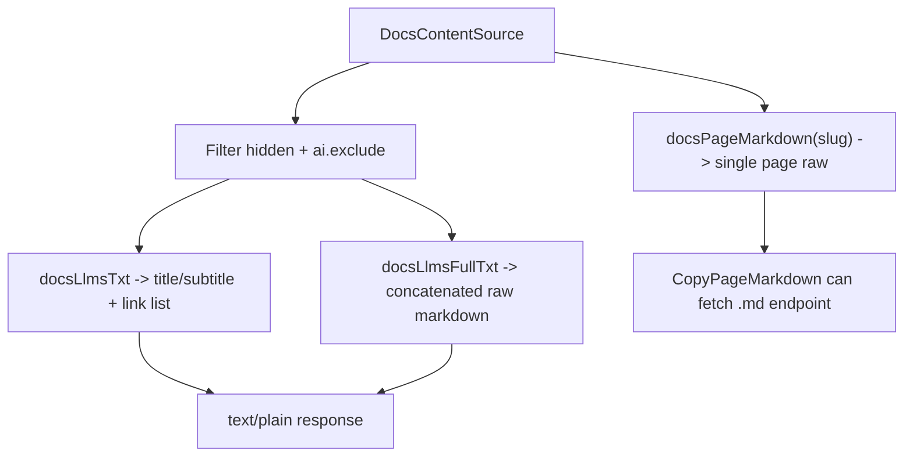
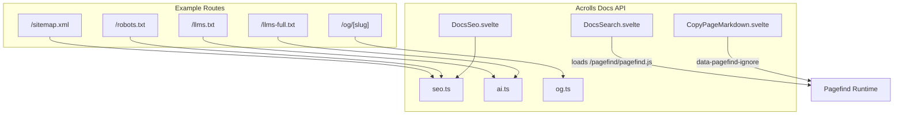

# SEO, Search, OG & Agent Surface — Implemented

<cite>
**Referenced Files in This Document**
- [seo.ts](file://packages/docs/src/lib/seo.ts)
- [DocsSeo.svelte](file://packages/docs/src/lib/DocsSeo.svelte)
- [og.ts](file://packages/docs/src/lib/og.ts)
- [DocsSearch.svelte](file://packages/docs/src/lib/DocsSearch.svelte)
- [CopyPageMarkdown.svelte](file://packages/docs/src/lib/CopyPageMarkdown.svelte)
- [ai.ts](file://packages/docs/src/lib/ai.ts)
- [+server.ts (llms.txt)](file://examples/kit-consumer/src/routes/llms.txt/+server.ts)
- [+server.ts (llms-full.txt)](file://examples/kit-consumer/src/routes/llms-full.txt/+server.ts)
- [+server.ts (sitemap.xml)](file://examples/kit-consumer/src/routes/sitemap.xml/+server.ts)
- [+server.ts (robots.txt)](file://examples/kit-consumer/src/routes/robots.txt/+server.ts)
- [+server.ts (og/[slug])](file://examples/kit-consumer/src/routes/og/[slug]/+server.ts)
- [package.json (acrolls exports)](file://packages/acrolls/package.json)
</cite>

## Table of Contents
- SEO & Metadata
- Search (Pagefind Integration Model)
- Open Graph Images
- Agent-Facing Surface
- Example-Host Wiring
- Explicit Absences (MCP, Ask-AI, RSS, analytics, export)

## SEO & Metadata
Acrolls ships a framework-neutral SEO builder plus a Svelte component that renders the result into `<svelte:head>`. The builder resolves per-page and site-level metadata, canonical URLs, robots directives, Open Graph and Twitter meta tags, and JSON-LD for `WebSite`, `TechArticle`, and `BreadcrumbList`. It also generates sitemap XML and robots.txt from the content source.

Key behaviors:
- Title precedence: per-page frontmatter title → document title → navigation title.
- Description precedence: per-page description → document description → site fallback.
- Canonical URL is either per-page or derived from navigation base href.
- Robots directive is set to `noindex, nofollow` when per-page `seo.noindex` is true.
- Image precedence: per-page image → auto-generated OG image path → site default; always resolved as absolute when a site origin exists.
- Index pages emit `og:type=website`; non-index pages emit `og:type=article`.
- JSON-LD includes a `WebSite` on index pages and a `TechArticle` with optional date fields on article pages, plus a `BreadcrumbList` built from the generated breadcrumb chain.
- Sitemap generation skips hidden documents and pages marked `noindex`, and supports extra URLs.
- Robots.txt defaults to allow all, optionally disallow paths, and links to the sitemap when a site origin is configured.

The `DocsSeo` Svelte component consumes `buildDocsSeo` and writes `<title>`, `<meta>` tags, `<link rel="canonical">`, `<meta name="robots">`, OG/Twitter properties, and JSON-LD `<script type="application/ld+json">` blocks into the page head. It escapes embedded angle brackets inside JSON-LD to avoid breaking script boundaries.

**Diagram sources**
- [DocsSeo.svelte:1-45](file://packages/docs/src/lib/DocsSeo.svelte#L1-L45)
- [seo.ts:72-146](file://packages/docs/src/lib/seo.ts#L72-L146)

Sitemap and robots helpers are designed to be called from prerendered endpoints so the output is static at build time.

**Section sources**
- [seo.ts:9-19](file://packages/docs/src/lib/seo.ts#L9-L19)
- [seo.ts:21-49](file://packages/docs/src/lib/seo.ts#L21-L49)
- [seo.ts:72-146](file://packages/docs/src/lib/seo.ts#L72-L146)
- [seo.ts:154-189](file://packages/docs/src/lib/seo.ts#L154-L189)
- [DocsSeo.svelte:1-45](file://packages/docs/src/lib/DocsSeo.svelte#L1-L45)

## Search (Pagefind Integration Model)
Acrolls provides a client-side search component that integrates with Pagefind without owning the Pagefind dependency. The component dynamically imports the runtime emitted by the host’s post-build step (default `/pagefind/pagefind.js`) and degrades gracefully when the index is absent.

How it works:
- On focus or first input, the component attempts to load the Pagefind module via dynamic import.
- If loading fails, status becomes unavailable and the UI shows a note instructing users to run the production build.
- Input is debounced; queries trigger `search(query)` and display up to a configurable number of results.
- Results include URL, highlighted excerpt HTML, and optional title metadata.
- The component marks itself with `data-status` for styling and uses accessible labels for the search input.

Integration markers:
- The docs shell marks the article body with `data-pagefind-body` and scopes sidebar, header, pager, and TOC with `data-pagefind-ignore` so only article content is indexed.
- The copy button also carries `data-pagefind-ignore` to prevent copying artifacts from being indexed.

**Diagram sources**
- [DocsSearch.svelte:1-109](file://packages/docs/src/lib/DocsSearch.svelte#L1-L109)

**Section sources**
- [DocsSearch.svelte:1-109](file://packages/docs/src/lib/DocsSearch.svelte#L1-L109)
- [CopyPageMarkdown.svelte:37-46](file://packages/docs/src/lib/CopyPageMarkdown.svelte#L37-L46)

## Open Graph Images
Acrolls defines an OG card generator that produces a Satori-compatible element tree. The host installs `satori` and `@resvg/resvg-js` and renders the card to PNG in a prerendered endpoint. Acrolls owns the design; the host owns font loading and rendering.

Card generation:
- `acrollsOgCard(options)` returns a plain object tree representing a 1200×630 layout with eyebrow, title, description, brand chip, and wordmark.
- Colors and typography are configurable via options; defaults use a dark background, light foreground, and accent color.

Slug and path utilities:
- `docsOgSlug(docOrSlug, options)` flattens nested slugs by replacing `/` with `--` to avoid file-vs-directory conflicts in a single `[slug]` route.
- `docsOgImagePath(docOrSlug, options)` builds a root-relative path like `/og/guides--installation.png`.
- `docsOgEntries(source, options)` enumerates one entry per document for prerendering.

Example host wiring:
- The example prerenders every slug via `entries: () => docsOgEntries(docs)`.
- The GET handler finds the matching document using `docsOgSlug`, builds the card, loads Inter fonts, renders SVG via Satori, converts to PNG via Resvg, and returns it with immutable cache headers.

**Diagram sources**
- [og.ts:42-118](file://packages/docs/src/lib/og.ts#L42-L118)
- [og.ts:129-158](file://packages/docs/src/lib/og.ts#L129-L158)
- [+server.ts (og/[slug])](file://examples/kit-consumer/src/routes/og/[slug]/+server.ts#L1-L48)

**Section sources**
- [og.ts:1-159](file://packages/docs/src/lib/og.ts#L1-L159)
- [+server.ts (og/[slug])](file://examples/kit-consumer/src/routes/og/[slug]/+server.ts#L1-L48)

## Agent-Facing Surface
Acrolls exposes a static-tier agent surface that turns the content tree into machine-readable Markdown assets. These are intended for LLM ingestion and do not include server-side chat or MCP features.

Surface components:
- `docsLlmsTxt(source, options)` emits a compact index with site title, subtitle, and a bulleted list of links with titles and descriptions. Hidden documents and those with `ai.exclude: true` are omitted.
- `docsLlmsFullTxt(source, raw, options)` concatenates full raw Markdown for each included document, separated by rules and prefixed with title and source URL.
- `docsPageMarkdown(source, slug, raw)` returns the raw Markdown for a single page if its key exists in the raw sources map.
- `isAiExcluded(metadata)` detects opt-out via frontmatter `ai.exclude`.

Example host wiring:
- `/llms.txt` prerenders a plain text response using `docsLlmsTxt(docs)`.
- `/llms-full.txt` prerenders a plain text response using `docsLlmsFullTxt(docs, raw)`, where `raw` is a raw glob map keyed by document keys.

**Diagram sources**
- [ai.ts:16-78](file://packages/docs/src/lib/ai.ts#L16-L78)
- [+server.ts (llms.txt):1-11](file://examples/kit-consumer/src/routes/llms.txt/+server.ts#L1-L11)
- [+server.ts (llms-full.txt):1-11](file://examples/kit-consumer/src/routes/llms-full.txt/+server.ts#L1-L11)

**Section sources**
- [ai.ts:1-78](file://packages/docs/src/lib/ai.ts#L1-L78)
- [+server.ts (llms.txt):1-11](file://examples/kit-consumer/src/routes/llms.txt/+server.ts#L1-L11)
- [+server.ts (llms-full.txt):1-11](file://examples/kit-consumer/src/routes/llms-full.txt/+server.ts#L1-L11)

## Example-Host Wiring
The kit consumer example wires each discoverability feature as a SvelteKit route. All routes shown here are prerendered and return static responses built from the content source.

- `/sitemap.xml`: Returns XML built by `docsSitemap(docs)`.
- `/robots.txt`: Returns plain text built by `docsRobots(docs)`.
- `/llms.txt`: Returns plain text built by `docsLlmsTxt(docs)`.
- `/llms-full.txt`: Returns plain text built by `docsLlmsFullTxt(docs, raw)`.
- `/og/[slug]`: Prerenders one PNG per document using `docsOgEntries(docs)`, resolves the matching document via `docsOgSlug`, renders the card with Satori and Resvg, and serves immutable PNG responses.

Public package exposure:
- The public `acrolls` package re-exports these utilities through the `./docs` entrypoint, which forwards to `@acrolls/docs`. Consumers import helpers and components via `acrolls/docs`.

**Diagram sources**
- [package.json (acrolls exports):14-58](file://packages/acrolls/package.json#L14-L58)
- [seo.ts:154-189](file://packages/docs/src/lib/seo.ts#L154-L189)
- [ai.ts:36-78](file://packages/docs/src/lib/ai.ts#L36-L78)
- [og.ts:129-158](file://packages/docs/src/lib/og.ts#L129-L158)
- [DocsSearch.svelte:1-109](file://packages/docs/src/lib/DocsSearch.svelte#L1-L109)
- [CopyPageMarkdown.svelte:37-46](file://packages/docs/src/lib/CopyPageMarkdown.svelte#L37-L46)
- [DocsSeo.svelte:1-45](file://packages/docs/src/lib/DocsSeo.svelte#L1-L45)
- [+server.ts (sitemap.xml):1-11](file://examples/kit-consumer/src/routes/sitemap.xml/+server.ts#L1-L11)
- [+server.ts (robots.txt):1-11](file://examples/kit-consumer/src/routes/robots.txt/+server.ts#L1-L11)
- [+server.ts (llms.txt):1-11](file://examples/kit-consumer/src/routes/llms.txt/+server.ts#L1-L11)
- [+server.ts (llms-full.txt):1-11](file://examples/kit-consumer/src/routes/llms-full.txt/+server.ts#L1-L11)
- [+server.ts (og/[slug])](file://examples/kit-consumer/src/routes/og/[slug]/+server.ts#L1-L48)

**Section sources**
- [+server.ts (sitemap.xml):1-11](file://examples/kit-consumer/src/routes/sitemap.xml/+server.ts#L1-L11)
- [+server.ts (robots.txt):1-11](file://examples/kit-consumer/src/routes/robots.txt/+server.ts#L1-L11)
- [+server.ts (llms.txt):1-11](file://examples/kit-consumer/src/routes/llms.txt/+server.ts#L1-L11)
- [+server.ts (llms-full.txt):1-11](file://examples/kit-consumer/src/routes/llms-full.txt/+server.ts#L1-L11)
- [+server.ts (og/[slug])](file://examples/kit-consumer/src/routes/og/[slug]/+server.ts#L1-L48)
- [package.json (acrolls exports):14-58](file://packages/acrolls/package.json#L14-L58)

## Explicit Absences (MCP, Ask-AI, RSS, analytics, export)
The following capabilities are not present in this repository’s discoverability layer:
- No MCP server implementation or Ask-AI chat surface.
- No RSS feed generation.
- No analytics integration.
- No PDF or EPUB export.

These absences are consistent with the agent-facing surface being limited to static Markdown outputs (`llms.txt`, `llms-full.txt`, per-page `.md`) and the SEO/search/OG layer described above.

[No sources needed since this section summarizes stated absences rather than analyzing specific files]