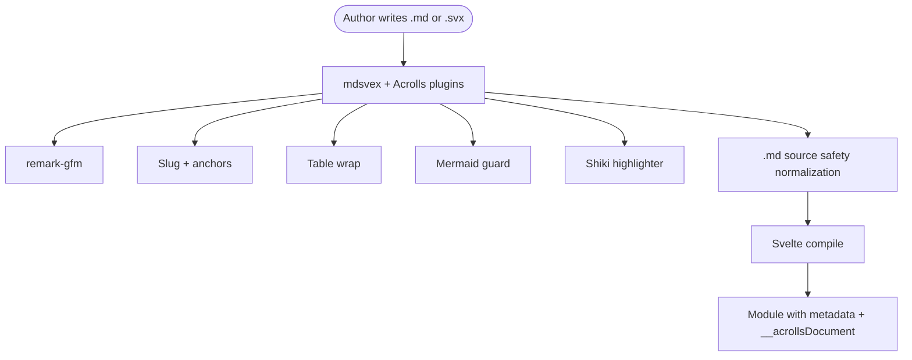
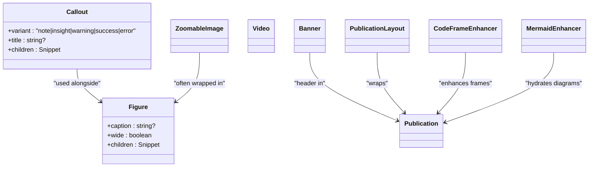
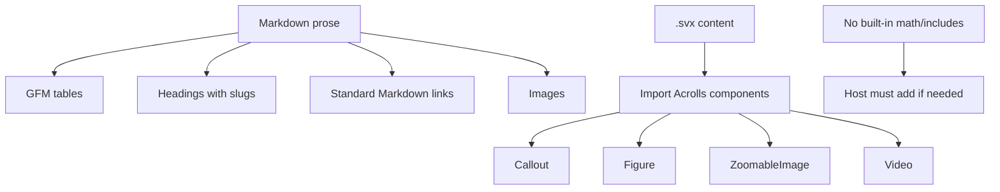

# Authoring & Rendering Features

<cite>
**Referenced Files in This Document**
- [content-authoring.md](file://docs/content-authoring.md)
- [index.ts (mdsvex)](file://packages/mdsvex/src/index.ts)
- [highlighter.ts](file://packages/mdsvex/src/highlighter.ts)
- [rehype-code.ts](file://packages/mdsvex/src/rehype-code.ts)
- [index.ts (svelte exports)](file://packages/svelte/src/lib/index.ts)
- [Callout.svelte](file://packages/svelte/src/lib/Callout.svelte)
- [Figure.svelte](file://packages/svelte/src/lib/Figure.svelte)
- [with-components.svx](file://examples/kit-consumer/src/content/with-components.svx)
</cite>

## Content Format & Component Model

Acrolls treats content as source-owned Markdown or mdsvex. The supported file types are:

- `.md` — Pure Markdown plus YAML frontmatter; the recommended default for prose.
- `.svx` — Markdown with Svelte components imported and used directly inside content.

Frontmatter is optional. When absent, Acrolls injects an empty `metadata` export so eager module globs stay build-safe. Navigation falls back to configured titles or humanized filenames. A leading H1 in the body still renders but does not become navigation metadata.

The mdsvex preprocessor pipeline adds:

- GitHub Flavored Markdown via remark-gfm.
- Heading slug generation and hover anchors.
- Table wrapping for keyboard-focusable scrolling tables.
- Mermaid guard handling.
- Shiki-based code highlighting with dual themes.
- Source normalization for `.md` files to protect constructs that look like Svelte expressions.



**Diagram sources**
- [index.ts (mdsvex):86-114](file://packages/mdsvex/src/index.ts#L86-L114)
- [index.ts (mdsvex):121-170](file://packages/mdsvex/src/index.ts#L121-L170)

Component availability inside content differs by extension:

- In `.md`, you write Markdown. You can import Svelte components in a host layout or route, but the content file itself is prose.
- In `.svx`, you can import Acrolls primitives such as `Callout`, `Figure`, `Banner`, `Video`, `ZoomableImage`, and `PublicationLayout` directly in the content’s script block and render them inline.

This means Acrolls’ interactive component story is Svelte-native through mdsvex `.svx`, not MDX.

**Section sources**
- [content-authoring.md:7-13](file://docs/content-authoring.md#L7-L13)
- [content-authoring.md:16-21](file://docs/content-authoring.md#L16-L21)
- [content-authoring.md:167-181](file://docs/content-authoring.md#L167-L181)
- [content-authoring.md:254-275](file://docs/content-authoring.md#L254-L275)
- [index.ts (mdsvex):86-114](file://packages/mdsvex/src/index.ts#L86-L114)
- [index.ts (mdsvex):121-170](file://packages/mdsvex/src/index.ts#L121-L170)
- [index.ts (svelte exports):1-9](file://packages/svelte/src/lib/index.ts#L1-L9)
- [with-components.svx:1-19](file://examples/kit-consumer/src/content/with-components.svx#L1-L19)

## Built-In Component Breadth

Acrolls ships a focused set of publication primitives under `acrolls/svelte`:

| Component | Purpose | Notes |
|---|---|---|
| `Publication` | Wraps article content into the Publication shell | Used by layouts and routes |
| `PublicationLayout` | Full-page docs/blog layout with banner and chrome | Intended for standalone articles |
| `Banner` | Title/description/image header | Consumes frontmatter fields |
| `Callout` | Styled aside blocks for notes, warnings, errors, etc. | Variants: note, insight, warning, success, error |
| `Figure` | Captioned media container | Supports wide mode |
| `Video` | Video embed wrapper | For video content |
| `ZoomableImage` | Image with zoom dialog behavior | Replaces plain static images when used |
| Code frame enhancer | Enhances code blocks after hydration | Exposed for host integration |
| Mermaid enhancer | Hydrates Mermaid diagrams | Client-side rendering |

These components are designed for use in `.svx` content and in host layouts. They are not a general-purpose UI library; they target documentation and publication pages.



**Diagram sources**
- [index.ts (svelte exports):1-9](file://packages/svelte/src/lib/index.ts#L1-L9)
- [Callout.svelte:1-28](file://packages/svelte/src/lib/Callout.svelte#L1-L28)
- [Figure.svelte:1-19](file://packages/svelte/src/lib/Figure.svelte#L1-L19)

Acrolls does not include MDX-style component registries, tabs, steps, cards, accordions, code groups, frames, trees, type tables, live previews, diffs, includes/transclusion, i18n routing, doc versioning, RSS, analytics, PDF/EPUB export, or OpenAPI/GraphQL reference generators. Those capabilities are not found in the repository.

**Section sources**
- [index.ts (svelte exports):1-9](file://packages/svelte/src/lib/index.ts#L1-L9)
- [Callout.svelte:1-28](file://packages/svelte/src/lib/Callout.svelte#L1-L28)
- [Figure.svelte:1-19](file://packages/svelte/src/lib/Figure.svelte#L1-L19)
- [content-authoring.md:254-275](file://docs/content-authoring.md#L254-L275)

## Code Rendering

Acrolls uses Shiki at compile time for code fences. The highlighter registers a fixed language set including JavaScript, TypeScript, TSX, JSX, JSON, HTML, CSS, Sass/SCSS, Bash/Shell, Markdown, Svelte, Rust, Python, Go, YAML, TOML, Diff, Text, and Plaintext. Unknown languages fall back to plain text unless strict mode is enabled, which rejects unsupported languages.

Fence meta fields parsed from the fence line control how code blocks are rendered:

| Meta field | Effect |
|---|---|
| `filename="…"` | Adds a filename label in the code-frame header |
| `lineNumbers` | Enables gutter numbers |
| `wrap` | Enables soft-wrap behavior |
| `highlight="2,4-6"` | Emphasizes specific lines |
| `focus="2-5"` | Dims non-focused lines |
| `add="3-4"` / `remove="1"` | Applies diff colors to added/removed lines |

The renderer builds a code-frame element with data attributes for language, wrap, line numbers, filename, and per-line decorations. Copy and wrap controls appear after hydration inside `Publication`.

```mermaid
sequenceDiagram
participant Author as "Author"
participant Mdsvex as "mdsvex pipeline"
participant RehypeCode as "rehypeAcrollsCode"
participant Highlighter as "createAcrollsHighlighter"
participant Output as "HTML fragment"
Author->>Mdsvex : Write
```ts filename=... highlight=...
  Mdsvex->>RehypeCode: Visit <pre><code> nodes
  RehypeCode->>Highlighter: highlight(code, lang, meta)
  Highlighter->>Highlighter: parseFenceMeta(meta)
  Highlighter->>Highlighter: Shiki codeToHtml with themes
  Highlighter->>Highlighter: decorateLines with highlight/focus/add/remove
  Highlighter-->>RehypeCode: Frame HTML with data attributes
  RehypeCode-->>Output: acrolls-code-frame
```

**Diagram sources**
- [highlighter.ts:103-201](file://packages/mdsvex/src/highlighter.ts#L103-L201)
- [rehype-code.ts:1-20](file://packages/mdsvex/src/rehype-code.ts#L1-L20)

Mermaid diagrams are treated specially. The highlighter returns a fallback structure with a hidden canvas, and client-side hydration renders the diagram lazily. Until JavaScript runs, the raw source remains visible as a safe fallback.

**Section sources**
- [content-authoring.md:183-206](file://docs/content-authoring.md#L183-L206)
- [content-authoring.md:208-218](file://docs/content-authoring.md#L208-L218)
- [highlighter.ts:1-37](file://packages/mdsvex/src/highlighter.ts#L1-L37)
- [highlighter.ts:52-97](file://packages/mdsvex/src/highlighter.ts#L52-L97)
- [highlighter.ts:103-201](file://packages/mdsvex/src/highlighter.ts#L103-L201)
- [rehype-code.ts:1-20](file://packages/mdsvex/src/rehype-code.ts#L1-L20)

## Prose Semantics (tables, anchors, math)

### Tables
GitHub Flavored Markdown tables are supported. Acrolls wraps tables in a keyboard-focusable scroll region so large tables remain accessible without relying on mouse-only scrolling.

### Anchors and headings
Headings receive stable slug IDs and hover anchor links generated at compile time. The guidance is to prefer one H1 per page when the shell already shows the title.

### Math
Math support is not present in the analyzed code. There is no KaTeX, MathJax, or similar plugin wired into the mdsvex pipeline, and no math-related component or directive appears in the svelte package exports. If math is needed, it must be provided by the host through custom preprocessing or a host-level component.

### Includes and transclusion
Includes or transclusion directives are not implemented in the analyzed code. Authors compose content using Markdown and `.svx` components rather than a built-in include syntax.

### Images and video
Markdown images work out of the box. For richer behavior, `.svx` content can use `ZoomableImage` for a zoomable dialog or `Figure` for captioned media. `Video` is available for video embeds.



**Diagram sources**
- [content-authoring.md:167-181](file://docs/content-authoring.md#L167-L181)
- [content-authoring.md:208-218](file://docs/content-authoring.md#L208-L218)
- [content-authoring.md:254-275](file://docs/content-authoring.md#L254-L275)
- [index.ts (svelte exports):1-9](file://packages/svelte/src/lib/index.ts#L1-L9)

**Section sources**
- [content-authoring.md:167-181](file://docs/content-authoring.md#L167-L181)
- [content-authoring.md:208-218](file://docs/content-authoring.md#L208-L218)
- [content-authoring.md:254-275](file://docs/content-authoring.md#L254-L275)
- [index.ts (svelte exports):1-9](file://packages/svelte/src/lib/index.ts#L1-L9)

## Verdict Table per Feature

| Feature | Acrolls implementation | Notes |
|---|---|---|
| Content format | Markdown and mdsvex `.svx`; not MDX | `.md` for prose; `.svx` for Svelte components inside content |
| Components inside content | Available in `.svx` via imports | `Callout`, `Figure`, `Banner`, `Video`, `ZoomableImage`, `PublicationLayout` |
| Islands / auto-hydration | Not implemented as a generic island system | Code frames and Mermaid hydrate within `Publication`; no framework-wide island model |
| Includes / transclusion | Not found in repo | Use `.svx` composition or host-level solutions |
| Math | Not found in repo | No KaTeX/MathJax wiring; host must provide |
| Callouts | Implemented | Variants: note, insight, warning, success, error |
| Syntax breadth | GFM Markdown + fenced code + Mermaid | No tabs/steps/cards/code-group content components beyond callouts and figures |
| Code-block highlighting | Shiki with light/dark themes | Fixed language set; unknown languages fall back to text or fail in strict mode |
| Filename display | Supported via `filename` meta | Renders a filename label in the code-frame header |
| Line actions | Supported via `highlight`, `focus`, `add`, `remove` | Decorations applied per line with data attributes |
| Copy / wrap | Wrap controlled by `wrap` meta; copy/wrap controls appear after hydration | Controls are part of the hydrated code frame |
| Tables | Supported | Wrapped in a keyboard-focusable scroll region |
| Images | Supported | Plain Markdown images work; `ZoomableImage` and `Figure` add behavior in `.svx` |
| Video | Supported via `Video` component | Use in `.svx` content |

**Section sources**
- [content-authoring.md:7-13](file://docs/content-authoring.md#L7-L13)
- [content-authoring.md:167-206](file://docs/content-authoring.md#L167-L206)
- [content-authoring.md:208-218](file://docs/content-authoring.md#L208-L218)
- [content-authoring.md:254-275](file://docs/content-authoring.md#L254-L275)
- [highlighter.ts:1-37](file://packages/mdsvex/src/highlighter.ts#L1-L37)
- [highlighter.ts:52-97](file://packages/mdsvex/src/highlighter.ts#L52-L97)
- [highlighter.ts:103-201](file://packages/mdsvex/src/highlighter.ts#L103-L201)
- [index.ts (svelte exports):1-9](file://packages/svelte/src/lib/index.ts#L1-L9)
- [with-components.svx:1-19](file://examples/kit-consumer/src/content/with-components.svx#L1-L19)