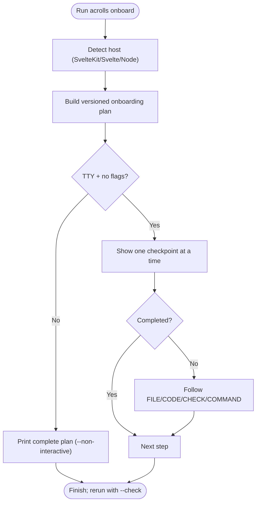
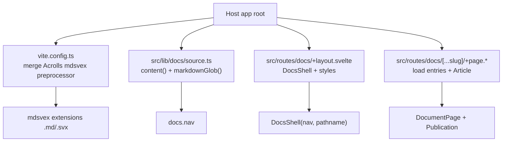
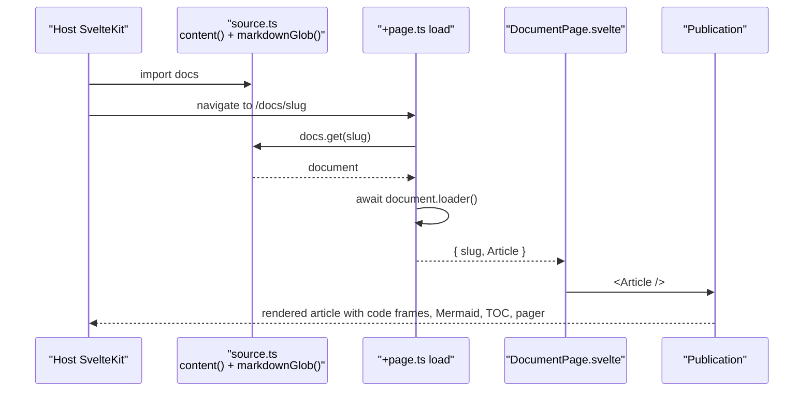
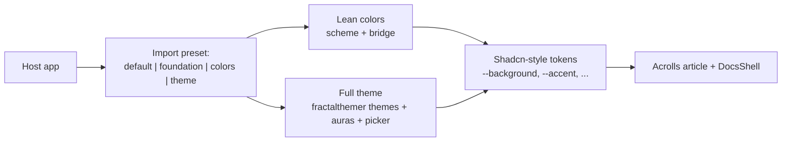
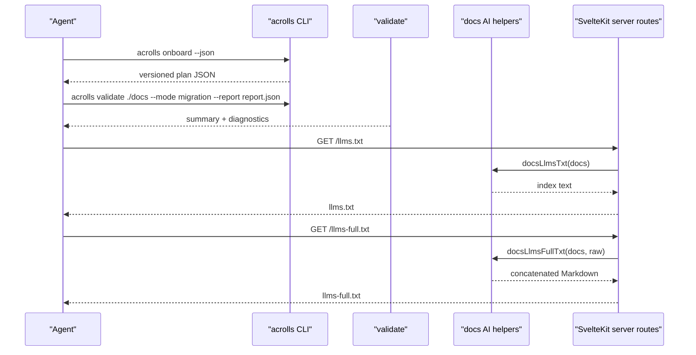

# CLI, Configuration & Extensibility

<cite>
**Referenced Files in This Document**
- [packages/cli/src/index.ts](file://packages/cli/src/index.ts)
- [packages/cli/src/onboarding.ts](file://packages/cli/src/onboarding.ts)
- [packages/cli/src/integrate.ts](file://packages/cli/src/integrate.ts)
- [docs/cli.md](file://docs/cli.md)
- [docs/getting-started.md](file://docs/getting-started.md)
- [packages/acrolls/package.json](file://packages/acrolls/package.json)
- [docs/adr/0001-cli-first-guided-onboarding.md](file://docs/adr/0001-cli-first-guided-onboarding.md)
- [docs/styles.md](file://docs/styles.md)
- [docs/adr/0003-fractalthemer-theming-kit.md](file://docs/adr/0003-fractalthemer-theming-kit.md)
- [packages/docs/src/lib/ai.ts](file://packages/docs/src/lib/ai.ts)
- [examples/kit-consumer/src/routes/llms.txt/+server.ts](file://examples/kit-consumer/src/routes/llms.txt/+server.ts)
- [examples/kit-consumer/src/routes/llms-full.txt/+server.ts](file://examples/kit-consumer/src/routes/llms-full.txt/+server.ts)
</cite>

## Onboarding Path

### Acrolls: guided, read-only onboarding with a separate mutating command
- Single-command feel: `acrolls onboard --docs-dir docs --base-href /docs` walks through installation, preprocessor wiring, styles, content, generated source, routes, validation, local checks, and deployment verification. It is guidance-only and does not edit host files by default.
- Interactive TTY mode shows one checkpoint at a time; `--non-interactive` prints the full plan for agents or CI; `--check` rescans completed checkpoints; `--json` emits a versioned plan for UIs or coding agents.
- The only mutating command is `acrolls integrate`, which requires explicit `--yes` after a dry-run and refuses to rewrite an existing Vite config so it cannot overwrite custom plugin arrays.
- Exit codes 0/1/2 are a stable contract used across commands.

**Diagram sources**
- [packages/cli/src/index.ts:19-34](file://packages/cli/src/index.ts#L19-L34)
- [packages/cli/src/onboarding.ts:56-319](file://packages/cli/src/onboarding.ts#L56-L319)
- [packages/cli/src/onboarding.ts:371-441](file://packages/cli/src/onboarding.ts#L371-L441)

**Section sources**
- [docs/cli.md:16-48](file://docs/cli.md#L16-L48)
- [docs/cli.md:69-138](file://docs/cli.md#L69-L138)
- [docs/cli.md:267-299](file://docs/cli.md#L267-L299)
- [docs/cli.md:315-329](file://docs/cli.md#L315-L329)
- [docs/getting-started.md:13-35](file://docs/getting-started.md#L13-L35)
- [packages/cli/src/index.ts:118-165](file://packages/cli/src/index.ts#L118-L165)
- [packages/cli/src/onboarding.ts:56-319](file://packages/cli/src/onboarding.ts#L56-L319)
- [packages/cli/src/integrate.ts:146-201](file://packages/cli/src/integrate.ts#L146-L201)
- [docs/adr/0001-cli-first-guided-onboarding.md:16-23](file://docs/adr/0001-cli-first-guided-onboarding.md#L16-L23)

### Blume: single-command site ownership via `blume init`
- Blume owns the site end-to-end: `blume init` scaffolds a new Astro+Vite project, then `blume dev`/`build`/`eject` drive development, production builds, and extraction of the generated site back into host control.
- Operator experience centers around a single CLI that creates, runs, and ejects the entire documentation site.

### Scribe: single-command integration into an existing site
- Scribe positions itself as a publishing layer for the site you already own. Its public beta surface offers a single-command onboarding flow (`bunx @scribe-sdk/cli@beta integrate`) that integrates Markdown/MDX compilation into an existing Next.js or Vite site without moving content to a hosted CMS.
- Operator experience emphasizes minimal friction into an existing codebase rather than owning the whole site.

## Configuration Surface

### Acrolls: configuration lives in code and entrypoints, not a dedicated config file
- Host configuration is done by importing supported `acrolls/*` entrypoints declared in the public package exports. There is no `blume.config.ts` equivalent; instead, hosts configure mdsvex in their build config and compose content via the collection API.
- Typical surface:
  - Build-time: import `createAcrollsMdsvexPreprocessor` from `acrolls/mdsvex` and merge it into the SvelteKit/Vite preprocess pipeline.
  - Content: define a source with `content({ loader: markdownGlob(...) })` and `defineDocsConfig({ title, baseHref, subtitle })`.
  - Shell: render `DocsShell` in a layout and wrap articles with `Publication`.
  - Styles: import one preset such as `acrolls/styles/default.css` or `acrolls/styles/foundation.css`, plus `acrolls/docs/styles.css` when using the docs shell.
- The CLI’s onboarding plan generates snippets for each of these files and verifies them with `--check`.

**Diagram sources**
- [packages/acrolls/package.json:14-57](file://packages/acrolls/package.json#L14-L57)
- [docs/getting-started.md:61-87](file://docs/getting-started.md#L61-L87)
- [docs/getting-started.md:165-286](file://docs/getting-started.md#L165-L286)
- [docs/getting-started.md:288-399](file://docs/getting-started.md#L288-L399)
- [packages/cli/src/onboarding.ts:161-170](file://packages/cli/src/onboarding.ts#L161-L170)

**Section sources**
- [packages/acrolls/package.json:14-57](file://packages/acrolls/package.json#L14-L57)
- [docs/getting-started.md:61-87](file://docs/getting-started.md#L61-L87)
- [docs/getting-started.md:165-286](file://docs/getting-started.md#L165-L286)
- [docs/getting-started.md:288-399](file://docs/getting-started.md#L288-L399)
- [docs/cli.md:69-138](file://docs/cli.md#L69-L138)

### Blume: configuration via `blume.config.ts`
- Blume uses a dedicated configuration file (`blume.config.ts`) to declare content sources, routing, i18n, search, analytics, export formats, and other site-level behavior. This centralizes configuration in a single file owned by the Blume CLI.

### Scribe: configuration via host code and entrypoints
- Scribe integrates into an existing site through code imports and build configuration rather than a single framework-owned config file. The operator adds Scribe’s compiler and content pipeline into their current Next.js or Vite setup, keeping configuration close to the host’s existing structure.

## Customization & Escape Hatches

### Acrolls: host-owned components, registry-like composition, and generated pages
- Component overrides: hosts wrap articles with `Publication` and can place any Svelte component tree inside it. The docs shell exposes `DocsShell` and `DocsSidebar`, letting hosts keep their outer three-column shell while reusing Acrolls chrome.
- Registry-style composition: the collection API composes loaders and schemas. Hosts use `markdownGlob` with lazy body and eager metadata/facts globs, Standard Schema validation, blessed genre fields, naming conventions, and `hidden` vs `filter` semantics. Route overrides and group landings allow fine-grained control over navigation and URLs.
- Custom pages: hosts write SvelteKit routes under the configured base href and resolve documents via `docs.get(slug)` and `document.loader()` in route load functions. A shared `DocumentPage.svelte` keeps rendering consistent.
- Eject vs host-owned: Acrolls never takes ownership of deployment, adapters, or global site routing. `integrate` backs up edited files under `.acrolls/backup/<timestamp>` before writing and refuses to rewrite an existing Vite config. Operators can fully customize routes, layouts, and content sources.

**Diagram sources**
- [docs/getting-started.md:200-229](file://docs/getting-started.md#L200-L229)
- [docs/getting-started.md:288-399](file://docs/getting-started.md#L288-L399)
- [packages/cli/src/onboarding.ts:548-564](file://packages/cli/src/onboarding.ts#L548-L564)
- [packages/cli/src/onboarding.ts:567-603](file://packages/cli/src/onboarding.ts#L567-L603)

**Section sources**
- [docs/getting-started.md:165-286](file://docs/getting-started.md#L165-L286)
- [docs/getting-started.md:288-399](file://docs/getting-started.md#L288-L399)
- [packages/cli/src/integrate.ts:196-201](file://packages/cli/src/integrate.ts#L196-L201)
- [packages/cli/src/integrate.ts:203-286](file://packages/cli/src/integrate.ts#L203-L286)

### Blume: component registry, custom pages, and eject
- Blume provides a built-in component library (cards, steps, tabs, accordions, badges, code groups, frames, trees, type tables, live previews, diffs) and a registry model for extending content components.
- Custom pages are part of the Blume site model, and `blume eject` extracts the generated site so the host can take ownership of the output.

### Scribe: host-owned components and compile-time output
- Scribe keeps Markdown/MDX source authoritative in the host repo and produces compile-time output. Customization happens through host-owned components and integrations rather than a framework-managed registry.

## Theming

### Acrolls: lean colors and optional full theme builder
- Two color tiers:
  - Lean: `acrolls/styles/colors` gives light/dark with zero extra dependencies.
  - Full: `acrolls/styles/theme` forwards fractalthemer, adding 40+ curated themes, aura backgrounds, and a styled theme picker.
- Style presets: `default`, `foundation`, `colors`, and `theme` are exposed as both CSS and Sass entrypoints; docs shell has its own sheet.
- Token bridge: Acrolls reads shadcn-style tokens (`--background`, `--card`, `--accent`, `--border`, etc.) and bridges fractalthemer semantic tokens onto them. Hosts can override tokens directly on `.acrolls` or `.acrolls-docs-shell`.
- Dark mode: responds to `prefers-color-scheme` and `data-theme`; the full theme kit handles light/dark pairs automatically.
- Fractalthemer is an optional peer dependency; Sass consumers must register a Node package importer for `pkg:` URLs unless they use the precompiled CSS.

**Diagram sources**
- [docs/styles.md:3-18](file://docs/styles.md#L3-L18)
- [docs/styles.md:47-77](file://docs/styles.md#L47-L77)
- [docs/styles.md:95-178](file://docs/styles.md#L95-L178)
- [docs/adr/0003-fractalthemer-theming-kit.md:19-28](file://docs/adr/0003-fractalthemer-theming-kit.md#L19-L28)

**Section sources**
- [docs/styles.md:3-18](file://docs/styles.md#L3-L18)
- [docs/styles.md:47-77](file://docs/styles.md#L47-L77)
- [docs/styles.md:95-178](file://docs/styles.md#L95-L178)
- [docs/adr/0003-fractalthemer-theming-kit.md:19-28](file://docs/adr/0003-fractalthemer-theming-kit.md#L19-L28)

### Blume: built-in theming and export story
- Blume includes theming as part of its site model and supports export formats such as PDF and EPUB, which implies a theming and layout system integrated with its generator.

### Scribe: theming through host styling
- Because Scribe compiles content into an existing site, theming is typically handled by the host’s existing style system rather than a framework-owned theme builder.

## Agent-Readable Tooling

### Acrolls: structured onboarding plan, corpus validation, and static AI surfaces
- Onboarding plan: `--json` emits a versioned plan with steps, snippets, cautions, and checks that agents can render and execute in order.
- Corpus validation: `acrolls validate` compiles Markdown through mdsvex and the HTML pipeline, reports diagnostics with line/column locations, supports authored/migration modes, and returns stable exit codes for CI.
- Static AI surfaces: `docsLlmsTxt`, `docsLlmsFullTxt`, and `docsPageMarkdown` generate agent-friendly outputs from the content tree. Documents can opt out via frontmatter `ai.exclude`. Example routes expose `/llms.txt` and `/llms-full.txt`.

**Diagram sources**
- [docs/cli.md:125-138](file://docs/cli.md#L125-L138)
- [docs/cli.md:141-208](file://docs/cli.md#L141-L208)
- [packages/docs/src/lib/ai.ts:1-77](file://packages/docs/src/lib/ai.ts#L1-L77)
- [examples/kit-consumer/src/routes/llms.txt/+server.ts:1-10](file://examples/kit-consumer/src/routes/llms.txt/+server.ts#L1-L10)
- [examples/kit-consumer/src/routes/llms-full.txt/+server.ts:1-10](file://examples/kit-consumer/src/routes/llms-full.txt/+server.ts#L1-L10)

**Section sources**
- [docs/cli.md:125-138](file://docs/cli.md#L125-L138)
- [docs/cli.md:141-208](file://docs/cli.md#L141-L208)
- [packages/docs/src/lib/ai.ts:1-77](file://packages/docs/src/lib/ai.ts#L1-L77)
- [examples/kit-consumer/src/routes/llms.txt/+server.ts:1-10](file://examples/kit-consumer/src/routes/llms.txt/+server.ts#L1-L10)
- [examples/kit-consumer/src/routes/llms-full.txt/+server.ts:1-10](file://examples/kit-consumer/src/routes/llms-full.txt/+server.ts#L1-L10)

### Blume: agent skills, MCP, and translation tooling
- Blume includes an agent-facing surface beyond static text: agent skills, an MCP server, evaluation tooling, and translation commands. This makes Blume’s operator experience extend into automated agent workflows around content authoring and review.

### Scribe: agent readiness through compile-time output
- Scribe’s compile-time output and local content authority make it straightforward for agents to read source files and verify build artifacts, though the repository context does not describe a dedicated agent protocol comparable to Blume’s MCP/server features.