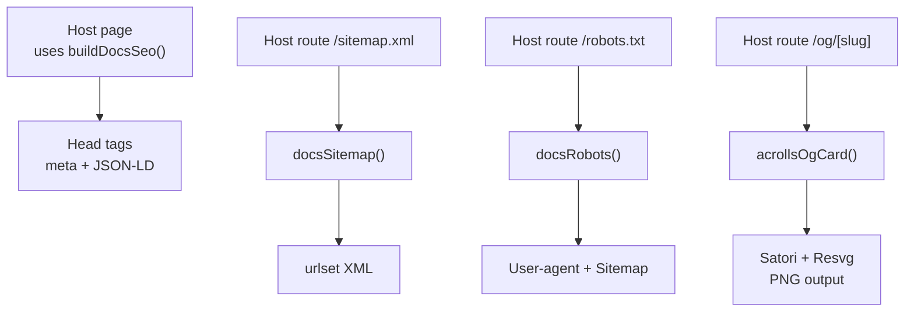
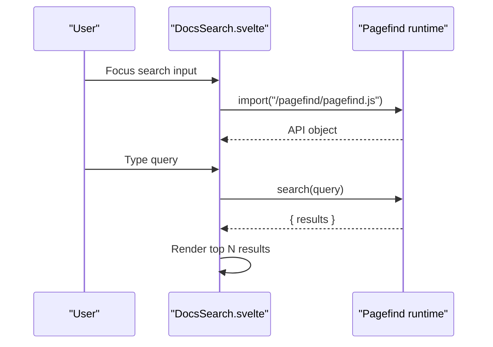
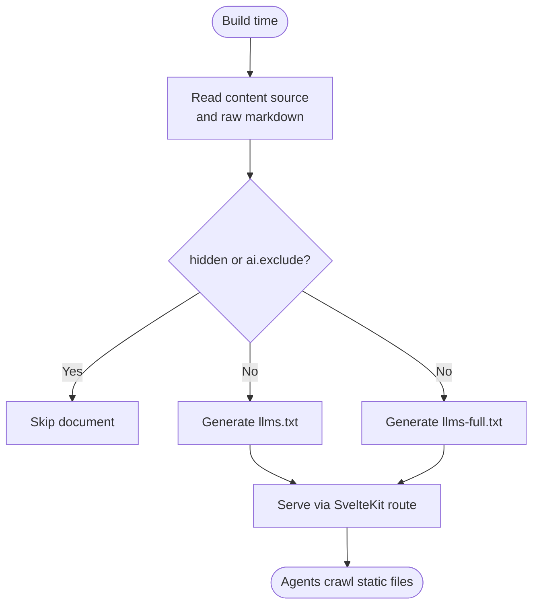

# Discoverability, SEO & AI-Agent Surfaces

<cite>
**Referenced Files in This Document**
- [seo.ts](file://packages/docs/src/lib/seo.ts)
- [og.ts](file://packages/docs/src/lib/og.ts)
- [ai.ts](file://packages/docs/src/lib/ai.ts)
- [DocsSearch.svelte](file://packages/docs/src/lib/DocsSearch.svelte)
- [+server.ts (sitemap.xml)](file://examples/kit-consumer/src/routes/sitemap.xml/+server.ts)
- [+server.ts (robots.txt)](file://examples/kit-consumer/src/routes/robots.txt/+server.ts)
- [+server.ts (llms.txt)](file://examples/kit-consumer/src/routes/llms.txt/+server.ts)
- [+server.ts (llms-full.txt)](file://examples/kit-consumer/src/routes/llms-full.txt/+server.ts)
- [+server.ts (OG image)](file://examples/kit-consumer/src/routes/og/[slug]/+server.ts)
</cite>

## SEO & Feeds

Acrolls ships a framework-neutral SEO layer that turns the generated docs content tree into head metadata, JSON-LD, sitemap, and robots. The host wires these utilities into SvelteKit endpoints or pages.

What Acrolls implements
- Per-page and site-level SEO resolution: title, description, canonical URL, robots directive, Open Graph fields, Twitter card fields, and locale are resolved with clear precedence (per-page frontmatter > document defaults > site defaults). See [buildDocsSeo:72-146](file://packages/docs/src/lib/seo.ts#L72-L146).
- JSON-LD structured data: WebSite on the index, TechArticle for documents, and BreadcrumbList derived from the navigation crumbs. See [JSON-LD generation:103-144](file://packages/docs/src/lib/seo.ts#L103-L144).
- Sitemap generation: `docsSitemap` emits a compliant urlset, skipping hidden and noindex pages and supporting extra URLs. See [sitemap generator:154-172](file://packages/docs/src/lib/seo.ts#L154-L172).
- Robots.txt generation: `docsRobots` writes User-agent rules, optional disallow paths, and an auto-detected sitemap link. See [robots generator:181-190](file://packages/docs/src/lib/seo.ts#L181-L190).
- OG image card design and path helpers: `acrollsOgCard` produces a Satori element tree; `docsOgSlug`, `docsOgImagePath`, and `docsOgEntries` generate filesystem-safe slugs and prerender entries. See [OG utilities:42-158](file://packages/docs/src/lib/og.ts#L42-L158).
- Example host routes that serve sitemap.xml, robots.txt, llms.txt, llms-full.txt, and prerendered /og/[slug] PNGs using the above utilities. See [sitemap route:1-11](file://examples/kit-consumer/src/routes/sitemap.xml/+server.ts#L1-L11), [robots route:1-11](file://examples/kit-consumer/src/routes/robots.txt/+server.ts#L1-L11), [llms.txt route:1-11](file://examples/kit-consumer/src/routes/llms.txt/+server.ts#L1-L11), [llms-full.txt route:1-11](file://examples/kit-consumer/src/routes/llms-full.txt/+server.ts#L1-L11), [OG endpoint:1-48](file://examples/kit-consumer/src/routes/og/[slug]/+server.ts#L1-L48).

What Acrolls does not implement
- RSS/Atom feeds: no feed generator or route was found in the repository.
- Analytics integration: no analytics SDKs, events, or configuration were found in the codebase.
- Hosted search backends: Acrolls provides only a client-side Pagefind-based search component; there is no hosted or semantic search service.
- In-page Ask AI chat, MCP servers, doc evals, translation automation, PDF/EPUB export: none of these server features or exports were found in the repository.

**Diagram sources**
- [seo.ts:72-146](file://packages/docs/src/lib/seo.ts#L72-L146)
- [seo.ts:154-190](file://packages/docs/src/lib/seo.ts#L154-L190)
- [og.ts:42-158](file://packages/docs/src/lib/og.ts#L42-L158)
- [+server.ts (sitemap.xml):1-11](file://examples/kit-consumer/src/routes/sitemap.xml/+server.ts#L1-L11)
- [+server.ts (robots.txt):1-11](file://examples/kit-consumer/src/routes/robots.txt/+server.ts#L1-L11)
- [+server.ts (OG image):1-48](file://examples/kit-consumer/src/routes/og/[slug]/+server.ts#L1-L48)

**Section sources**
- [seo.ts:72-190](file://packages/docs/src/lib/seo.ts#L72-L190)
- [og.ts:42-158](file://packages/docs/src/lib/og.ts#L42-L158)
- [+server.ts (sitemap.xml):1-11](file://examples/kit-consumer/src/routes/sitemap.xml/+server.ts#L1-L11)
- [+server.ts (robots.txt):1-11](file://examples/kit-consumer/src/routes/robots.txt/+server.ts#L1-L11)
- [+server.ts (OG image):1-48](file://examples/kit-consumer/src/routes/og/[slug]/+server.ts#L1-L48)

## Search

Acrolls provides a client-side full-text search component that integrates with Pagefind. It intentionally takes no Pagefind dependency at build time; it dynamically imports the runtime emitted by the host’s post-build step and degrades gracefully when the index is missing.

What Acrolls implements
- DocsSearch component: loads `/pagefind/pagefind.js` on focus, debounces input, runs queries, and renders results with excerpts. It sets `data-pagefind-body`/`data-pagefind-ignore` via the surrounding shell so hosts can control indexing scope. See [DocsSearch implementation:1-109](file://packages/docs/src/lib/DocsSearch.svelte#L1-L109).
- Host responsibility: the host must run Pagefind after building and place the bundle where the component expects it (default `/pagefind/pagefind.js`).

What Acrolls does not implement
- No server-side or hosted search backend.
- No semantic/vector search engine.
- No built-in Pagefind configuration or bundling — this is left to the host’s post-build pipeline.

**Diagram sources**
- [DocsSearch.svelte:39-77](file://packages/docs/src/lib/DocsSearch.svelte#L39-L77)

**Section sources**
- [DocsSearch.svelte:1-109](file://packages/docs/src/lib/DocsSearch.svelte#L1-L109)

## Agent-Facing Surface

Acrolls exposes a static-tier agent surface through plain text files generated from the content tree. These are designed for LLM agents and tooling to discover and read documentation without running JavaScript.

What Acrolls implements
- `llms.txt`: a compact index listing each included document with title, optional summary, and absolute URL. See [docsLlmsTxt:36-47](file://packages/docs/src/lib/ai.ts#L36-L47).
- `llms-full.txt`: every included page’s raw Markdown concatenated with titles and source links. See [docsLlmsFullTxt:49-65](file://packages/docs/src/lib/ai.ts#L49-L65).
- Per-page Markdown helper: `docsPageMarkdown` returns the raw Markdown for a given slug, enabling per-page `.md` endpoints or copy buttons. See [docsPageMarkdown:67-77](file://packages/docs/src/lib/ai.ts#L67-L77).
- Opt-out mechanism: documents can set `ai.exclude: true` in frontmatter to be excluded from all agent surfaces. See [isAiExcluded:16-20](file://packages/docs/src/lib/ai.ts#L16-L20).
- Example host routes serving both `llms.txt` and `llms-full.txt` as prerendered responses. See [llms.txt route:1-11](file://examples/kit-consumer/src/routes/llms.txt/+server.ts#L1-L11), [llms-full.txt route:1-11](file://examples/kit-consumer/src/routes/llms-full.txt/+server.ts#L1-L11).

What Acrolls does not implement
- No server-side chat or Ask-AI interface.
- No MCP server or agent skill definitions.
- No dynamic summarization beyond what authors write in frontmatter.

**Diagram sources**
- [ai.ts:16-77](file://packages/docs/src/lib/ai.ts#L16-L77)
- [+server.ts (llms.txt):1-11](file://examples/kit-consumer/src/routes/llms.txt/+server.ts#L1-L11)
- [+server.ts (llms-full.txt):1-11](file://examples/kit-consumer/src/routes/llms-full.txt/+server.ts#L1-L11)

**Section sources**
- [ai.ts:16-77](file://packages/docs/src/lib/ai.ts#L16-L77)
- [+server.ts (llms.txt):1-11](file://examples/kit-consumer/src/routes/llms.txt/+server.ts#L1-L11)
- [+server.ts (llms-full.txt):1-11](file://examples/kit-consumer/src/routes/llms-full.txt/+server.ts#L1-L11)

## AI Tooling (Ask, MCP, Evals, Translate)

This section covers in-page Ask AI, MCP servers, doc evals, and translation automation.

What Acrolls implements
- Static agent surface: see Agent-Facing Surface above for llms.txt, llms-full.txt, and per-page Markdown helpers.

What Acrolls does not implement
- In-page Ask AI chat: no chat UI or server endpoint was found in the repository.
- MCP server: no MCP server implementation or registration was found.
- Doc evals: no evaluation harness or test fixtures for docs quality were found.
- Translation automation: no i18n/locale routing or automated translation tooling was found.

Comparison note
- Competing frameworks may offer hosted search, MCP servers, evals, and translation tooling; Acrolls currently limits its AI surface to static, machine-readable files generated from the content tree.

[No sources needed since this section summarizes absence of features]

## Export & Analytics

This section covers PDF/EPUB export and analytics integrations.

What Acrolls implements
- None found in the repository. There are no PDF/EPUB generators, analytics SDKs, or event trackers in the codebase.

What Acrolls does not implement
- PDF/EPUB export: no export pipeline was found.
- Analytics: no analytics providers or tracking scripts were found.

[No sources needed since this section summarizes absence of features]

## Gap Summary

- SEO metadata: implemented via `buildDocsSeo` with Open Graph, Twitter cards, canonical URLs, and per-page overrides. See [seo.ts:72-146](file://packages/docs/src/lib/seo.ts#L72-L146).
- JSON-LD: implemented for WebSite, TechArticle, and BreadcrumbList. See [seo.ts:103-144](file://packages/docs/src/lib/seo.ts#L103-L144).
- Sitemap: implemented via `docsSitemap`; served in example host. See [seo.ts:154-172](file://packages/docs/src/lib/seo.ts#L154-L172), [sitemap route:1-11](file://examples/kit-consumer/src/routes/sitemap.xml/+server.ts#L1-L11).
- Robots: implemented via `docsRobots`; served in example host. See [seo.ts:181-190](file://packages/docs/src/lib/seo.ts#L181-L190), [robots route:1-11](file://examples/kit-consumer/src/routes/robots.txt/+server.ts#L1-L11).
- OG images: implemented via `acrollsOgCard`, slug/path helpers, and prerendered PNG endpoint. See [og.ts:42-158](file://packages/docs/src/lib/og.ts#L42-L158), [OG endpoint:1-48](file://examples/kit-consumer/src/routes/og/[slug]/+server.ts#L1-L48).
- RSS/Atom: not found in the repository.
- Analytics: not found in the repository.
- Client search: implemented as a Pagefind consumer component; host owns index generation. See [DocsSearch.svelte:1-109](file://packages/docs/src/lib/DocsSearch.svelte#L1-L109).
- Hosted/semantic search: not found in the repository.
- Agent surfaces: implemented as static `llms.txt`, `llms-full.txt`, and per-page Markdown helpers with opt-out. See [ai.ts:16-77](file://packages/docs/src/lib/ai.ts#L16-L77), [llms.txt route:1-11](file://examples/kit-consumer/src/routes/llms.txt/+server.ts#L1-L11), [llms-full.txt route:1-11](file://examples/kit-consumer/src/routes/llms-full.txt/+server.ts#L1-L11).
- In-page Ask AI: not found in the repository.
- MCP servers: not found in the repository.
- Doc evals: not found in the repository.
- Translation automation: not found in the repository.
- PDF/EPUB export: not found in the repository.