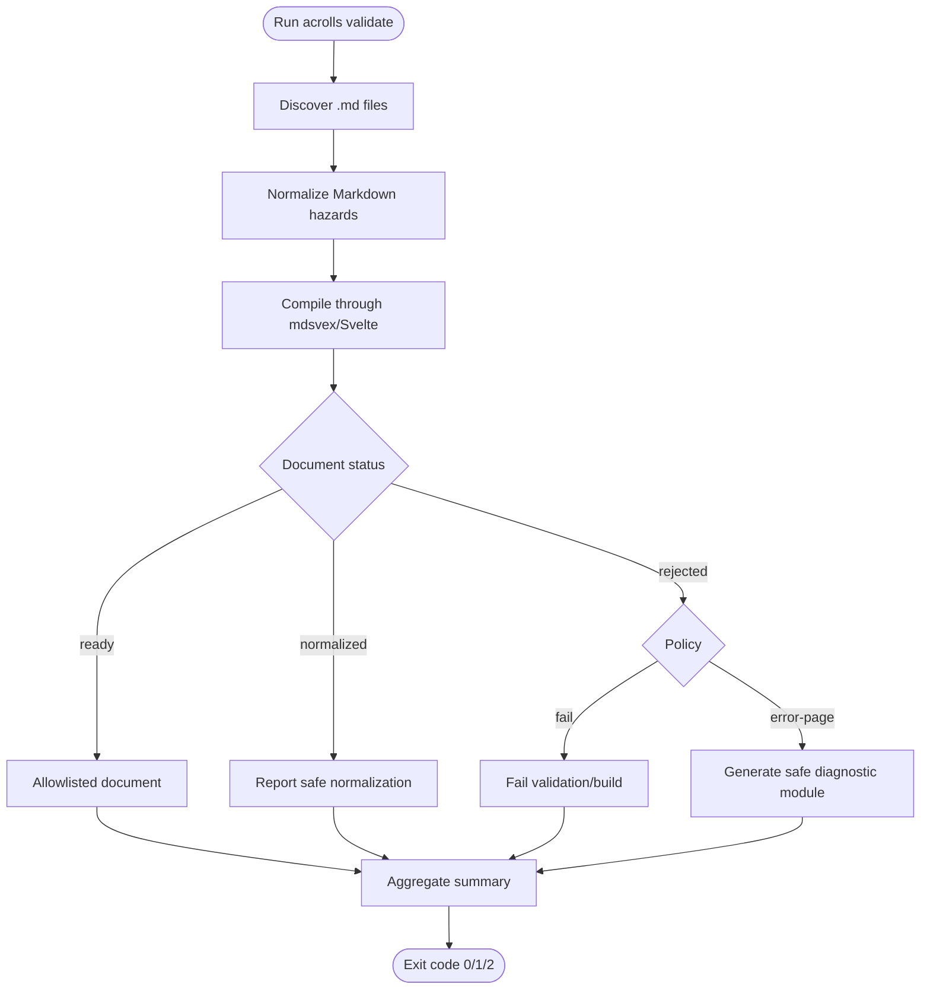

# Gap Analysis Matrix & Differentiators

<cite>
**Referenced Files in This Document**
- [README.md](file://README.md)
- [PRODUCT.md](file://PRODUCT.md)
- [TECH.md](file://TECH.md)
- [VISION.md](file://docs/VISION.md)
- [content-authoring.md](file://docs/content-authoring.md)
- [docs-shell.md](file://docs/docs-shell.md)
- [styles.md](file://docs/styles.md)
- [cli.md](file://docs/cli.md)
- [0002-cube-composable-styling-system.md](file://docs/adr/0002-cube-composable-styling-system.md)
- [0003-fractalthemer-theming-kit.md](file://docs/adr/0003-fractalthemer-theming-kit.md)
- [DocsSearch.svelte](file://packages/docs/src/lib/DocsSearch.svelte)
- [DocsSeo.svelte](file://packages/docs/src/lib/DocsSeo.svelte)
- [seo.ts](file://packages/docs/src/lib/seo.ts)
- [og.ts](file://packages/docs/src/lib/og.ts)
- [ai.ts](file://packages/docs/src/lib/ai.ts)
- [+server.ts (robots)](file://examples/kit-consumer/src/routes/robots.txt/+server.ts)
- [+server.ts (llms.txt)](file://examples/kit-consumer/src/routes/llms.txt/+server.ts)
- [+server.ts (llms-full.txt)](file://examples/kit-consumer/src/routes/llms-full.txt/+server.ts)
- [+server.ts (og)](file://examples/kit-consumer/src/routes/og/[slug]/+server.ts)
- [package.json](file://packages/acrolls/package.json)
</cite>

## Consolidated Matrix

This matrix compares Acrolls with Blume and Scribe across the feature areas most relevant to a Markdown/mdsvex-first publishing + docs shell for SvelteKit. Status is derived from repository source and documentation as of 2026-09-06; competitor facts are attributed to their public sites at that date.

| Area | Acrolls | Blume | Scribe |
|---|---|---|---|
| Content format | Markdown + mdsvex (`.md`, `.svx`) | MDX-first | Markdown / MDX |
| Runtime lock-in | None; compiles into host SvelteKit app | Site-owned via `blume` CLI; template-driven site | Compile-time output into Next.js or Vite sites |
| Docs shell (sidebar, TOC, breadcrumbs, pager, persistence) | Shipped (`DocsShell`, `DocsSidebar`, localStorage open-state, mobile drawer, filter) | Built-in docs system with islands and content components | Not present as a shipped shell; focus is compile-time output |
| Code highlighting | Compile-time Shiki dual-theme code frames with meta fields | Built-in code groups and live previews | Compile-time output; highlights depend on host setup |
| Tables | GFM tables wrapped in keyboard-focusable overflow regions | Type tables, code groups, diffs | Depends on host MDX pipeline |
| Article primitives | `Publication`, Banner, Callout, Figure, Video, ZoomableImage | Cards, steps, tabs, accordions, badges, frames, trees, type tables, live previews, diffs | Host-owned rendering |
| Mermaid diagrams | Lazy client-side Mermaid fences with source fallback | Islands auto-hydration model | Host-owned rendering |
| Search | Optional Pagefind integration; no runtime dependency; marks search body/ignore zones | Client search plus optional hosted/semantic backends | Not found in repo |
| SEO helpers | `buildDocsSeo`, `docsSitemap`, `docsRobots`, JSON-LD, per-page overrides | SEO layer (OG images, RSS, JSON-LD) | Host-owned SEO |
| Open Graph images | Build-time card design (`acrollsOgCard`) with prerendered PNG endpoints | OG images | Not found in repo |
| AI surfaces | Static `llms.txt`, `llms-full.txt`, per-page Markdown export, `ai.exclude` opt-out | MCP server, agent skills, evals, `translate` | Not found in repo |
| i18n / locale routing | Not found in repo | Locale routing | Not found in repo |
| Doc versioning / switcher | Not found in repo | Versioning with switcher | Not found in repo |
| Includes / transclusion | Not found in repo | Includes/transclusion | Not found in repo |
| Analytics | Not found in repo | Vercel/PostHog analytics | Not found in repo |
| PDF / EPUB export | Not found in repo | PDF/EPUB export | Not found in repo |
| API references | Not found in repo | OpenAPI/AsyncAPI and GraphQL reference generators | Not found in repo |
| Onboarding / CLI | `onboard`, `integrate`, `validate`, `studio`, `init`, `docs init` with stable exit codes | `blume` CLI owns site lifecycle | `bunx @scribe-sdk/cli@beta integrate` |
| Migration policy | Authored vs migration mode; corpus preflight; `error-page` for invalid documents | Not found in repo | Not found in repo |
| Theme system | Foundation/default CSS + lean colors + fractalthemer theming kit (40+ themes, auras, picker) | Template-driven styling | Host-owned styling |
| Host ownership | Routing, deployment, auth, global nav, theme-toggle persistence owned by host | Site owned by CLI/template | Content stays local; compile-time output |

**Section sources**
- [README.md:1-75](file://README.md#L1-L75)
- [PRODUCT.md:15-24](file://PRODUCT.md#L15-L24)
- [PRODUCT.md:54-87](file://PRODUCT.md#L54-L87)
- [PRODUCT.md:231-301](file://PRODUCT.md#L231-L301)
- [TECH.md:32-56](file://TECH.md#L32-L56)
- [TECH.md:104-143](file://TECH.md#L104-L143)
- [docs-shell.md:7-19](file://docs/docs-shell.md#L7-L19)
- [docs-shell.md:297-343](file://docs/docs-shell.md#L297-L343)
- [docs-shell.md:346-408](file://docs/docs-shell.md#L346-L348)
- [styles.md:3-18](file://docs/styles.md#L3-L18)
- [styles.md:107-178](file://docs/styles.md#L107-L178)
- [cli.md:32-49](file://docs/cli.md#L32-L49)
- [cli.md:141-208](file://docs/cli.md#L141-L208)
- [cli.md:211-232](file://docs/cli.md#L211-L232)
- [content-authoring.md:167-230](file://docs/content-authoring.md#L167-L230)
- [content-authoring.md:232-253](file://docs/content-authoring.md#L232-L253)
- [0002-cube-composable-styling-system.md:1-22](file://docs/adr/0002-cube-composable-styling-system.md#L1-L22)
- [0003-fractalthemer-theming-kit.md:7-28](file://docs/adr/0003-fractalthemer-theming-kit.md#L7-L28)
- [DocsSearch.svelte:1-108](file://packages/docs/src/lib/DocsSearch.svelte#L1-L108)
- [DocsSeo.svelte:1-44](file://packages/docs/src/lib/DocsSeo.svelte#L1-L44)
- [seo.ts:1-199](file://packages/docs/src/lib/seo.ts#L1-L199)
- [og.ts:1-158](file://packages/docs/src/lib/og.ts#L1-L158)
- [ai.ts:1-77](file://packages/docs/src/lib/ai.ts#L1-L77)
- [+server.ts (robots):1-10](file://examples/kit-consumer/src/routes/robots.txt/+server.ts#L1-L10)
- [+server.ts (llms.txt):1-10](file://examples/kit-consumer/src/routes/llms.txt/+server.ts#L1-L10)
- [+server.ts (llms-full.txt):1-10](file://examples/kit-consumer/src/routes/llms-full.txt/+server.ts#L1-L10)
- [+server.ts (og):1-47](file://examples/kit-consumer/src/routes/og/[slug]/+server.ts#L1-L47)
- [package.json:14-58](file://packages/acrolls/package.json#L14-L58)

## Where Acrolls Leads

Acrolls can defend several concrete differentiators against both Blume and Scribe because they are implemented in source rather than described only in roadmap prose.

### Svelte-native rendering with no runtime lock-in

Acrolls compiles Markdown and mdsvex into Svelte components and static HTML through an mdsvex pipeline that runs inside the host’s SvelteKit build. The runtime surface is a small set of Svelte islands (copy/wrap toggles, image zoom dialog, lazy Mermaid), while Shiki remains compile-time so it does not ship to the browser. The responsibility boundary is explicit: Acrolls owns compilation semantics, article UI, code highlighting, and docs chrome; the host owns routing, deployment, SEO policy, content location, global navigation, and theme-toggle persistence. Consumers install only the public `acrolls` package and import through supported subpaths declared in the package exports.

```mermaid
flowchart TD
Start(["Host builds SvelteKit app"]) --> MDSVEX["mdsvex compiles .md/.svx<br/>with slugs, tables, Shiki"]
MDSVEX --> SvelteGraph["Svelte component graph"]
SvelteGraph --> Publication["Publication layout renders <article class=\"acrolls\">"]
Publication --> StaticHTML["Static HTML + minimal client islands"]
StaticHTML --> End(["Host deploys its own site"])
```

**Diagram sources**
- [TECH.md:32-56](file://TECH.md#L32-L56)
- [README.md:39-50](file://README.md#L39-L50)
- [package.json:14-58](file://packages/acrolls/package.json#L14-L58)

**Section sources**
- [README.md:3-8](file://README.md#L3-L8)
- [README.md:39-50](file://README.md#L39-L50)
- [PRODUCT.md:15-24](file://PRODUCT.md#L15-L24)
- [TECH.md:32-56](file://TECH.md#L32-L56)
- [package.json:14-58](file://packages/acrolls/package.json#L14-L58)

### Article typography and accessibility depth

The publication stack ships semantic tables with keyboard-focusable overflow, stable heading slugs with hover anchors, dual-theme Shiki code frames, zoomable images, and a focused `Publication` wrapper. The docs shell adds nested accordion navigation, on-page TOC from headings, breadcrumbs from navigation trails, previous/next pager order, localStorage open-state persistence, mobile drawer, and sidebar filtering. These behaviors are documented as part of the current docs shell and content authoring surface.

**Section sources**
- [content-authoring.md:167-230](file://docs/content-authoring.md#L167-L230)
- [docs-shell.md:7-19](file://docs/docs-shell.md#L7-L19)
- [docs-shell.md:134-195](file://docs/docs-shell.md#L134-L195)
- [docs-shell.md:262-287](file://docs/docs-shell.md#L262-L287)

### Compile-time Shiki

Shiki is used during the mdsvex-to-Svelte compilation step to produce highlighted code frames with metadata such as filename, line numbers, wrap, highlight, focus, add, and remove. The TECH document explicitly states that there are no compiler dependencies in browser bundles because Shiki stays compile-time. This contrasts with a runtime syntax-highlighting dependency and reduces bundle size and hydration cost.

**Section sources**
- [TECH.md:32-56](file://TECH.md#L32-L56)
- [content-authoring.md:183-207](file://docs/content-authoring.md#L183-L207)

### Corpus preflight with migration policy

Acrolls implements a two-mode validation strategy for existing corpora. Authored mode treats the corpus as controlled and fails the build when documents violate the configured contract. Migration mode accepts frontmatter-free Markdown, reports safe normalizations, and lets hosts choose between failing the gate or rendering a safe diagnostic page for rejected documents while keeping the rest of the corpus available. Directory validation discovers all supported files before rendering and aggregates diagnostics with stable codes, severity, phase, source path, and remediation hints.



**Diagram sources**
- [PRODUCT.md:231-301](file://PRODUCT.md#L231-L301)
- [cli.md:141-208](file://docs/cli.md#L141-L208)

**Section sources**
- [PRODUCT.md:231-301](file://PRODUCT.md#L231-L301)
- [cli.md:141-208](file://docs/cli.md#L141-L208)
- [content-authoring.md:232-253](file://docs/content-authoring.md#L232-L253)

### CUBE-aligned SASS theming

Acrolls exposes foundation and default CSS entrypoints, a lean color pack, and a full theming kit built on fractalthemer. The architecture decision record commits to reworking the styling system around CUBE CSS principles, organizing styles by semantic responsibility such as layout, color-theme, and typography, and allowing hosts to compose only what they need. The theming kit forwards fractalthemer themes, auras, and a theme picker while bridging semantic tokens onto the names Acrolls surfaces consume.

**Section sources**
- [styles.md:3-18](file://docs/styles.md#L3-L18)
- [styles.md:107-178](file://docs/styles.md#L107-L178)
- [0002-cube-composable-styling-system.md:1-22](file://docs/adr/0002-cube-composable-styling-system.md#L1-L22)
- [0003-fractalthemer-theming-kit.md:7-28](file://docs/adr/0003-fractalthemer-theming-kit.md#L7-L28)

### Deterministic host-owned page trees

Acrolls generates a serializable, deterministic page tree from a host-defined configuration over discovered Markdown. The generated navigation contains page and group data only, never loaders, component functions, filesystem handles, or host runtime state. It powers routes, breadcrumbs, pager order, and static entries from one definition. Missing pages remain distinct from invalid pages, duplicate routes fail loudly, and navigation node identities are unique even for routes with long shared prefixes.

**Section sources**
- [PRODUCT.md:89-230](file://PRODUCT.md#L89-L230)
- [TECH.md:104-143](file://TECH.md#L104-L143)

## Where Acrolls Trails

Acrolls intentionally omits several features that Blume ships today. These absences should be stated plainly because they affect positioning relative to competitors.

| Feature | Status in Acrolls | Notes |
|---|---|---|
| i18n / locale routing | Not found in repo | No locale-based route generation or language switching surface |
| Doc versioning / switcher | Not found in repo | No version selector or multi-version docs surface |
| RSS feed | Not found in repo | No RSS generator in SEO helpers |
| OpenAPI / GraphQL reference generator | Not found in repo | No API reference genre support |
| MCP server / Ask-AI | Not found in repo | AI surface is limited to static text exports |
| Analytics integration | Not found in repo | Analytics remain host-owned |
| PDF / EPUB export | Not found in repo | Export formats are not implemented |
| Includes / transclusion | Not found in repo | Content composition stays at Markdown/mdsvex level |
| Tabs / steps / cards / code-group content components | Not found in repo | Acrolls provides callouts, figures, video, banner, and publication primitives |
| Interactive component registry | Not applicable | Acrolls uses Svelte-native `.svx` components rather than a Blume-style registry |

**Section sources**
- [content-authoring.md:278-285](file://docs/content-authoring.md#L278-L285)
- [docs-shell.md:297-343](file://docs/docs-shell.md#L297-L343)
- [docs-shell.md:346-408](file://docs/docs-shell.md#L346-L408)
- [ai.ts:1-77](file://packages/docs/src/lib/ai.ts#L1-L77)

## Where the Comparison Is Not Apples-to-Apples

The comparison must respect three structural differences that change how each product competes.

### Acrolls is a SvelteKit publishing SDK, not a site framework

Blume owns the site through its CLI and template system. Scribe positions itself as a publishing layer for the site you already own but targets Next.js and Vite. Acrolls is explicitly a SvelteKit publishing + documentation framework: the host owns routing, deployment, authentication, analytics, and content storage, while Acrolls owns compilation, article UI, docs chrome, and CLI tooling. This means Acrolls is not trying to replace a site framework; it is trying to make SvelteKit sites publish Markdown articles and docs without building a publishing design system from scratch.

### Acrolls renders mdsvex, not MDX

Acrolls compiles Markdown and `.svx` (Markdown with Svelte components). Its interactive component story is Svelte-native rather than a component registry. This matters because authors who want interactivity write `.svx` and import Acrolls components directly, rather than relying on a framework-managed component registry. It also means Acrolls does not inherit MDX-specific ecosystem assumptions.

### Acrolls’ “next” list lags behind shipped code

The project’s vision document still lists themes, npm releases, `acrolls docs init`, and search as next items, but source shows these capabilities exist: the fractalthemer theming kit is shipped, the public `acrolls` package is published, `docs init` exists in the CLI, and Pagefind-based search is integrated through `DocsSearch`. Capability claims must be derived from packages, examples, and documentation rather than roadmap wording.

**Section sources**
- [README.md:1-8](file://README.md#L1-L8)
- [README.md:39-50](file://README.md#L39-L50)
- [PRODUCT.md:11-24](file://PRODUCT.md#L11-L24)
- [docs/VISION.md:1-38](file://docs/VISION.md#L1-L38)
- [cli.md:32-49](file://docs/cli.md#L32-L49)
- [docs-shell.md:297-343](file://docs/docs-shell.md#L297-L343)

## Strategic Implications for Launch

### Defend the SvelteKit-native boundary

Acrolls should position itself as the SvelteKit-native alternative for teams that already own or plan to own a SvelteKit application. The strongest argument is not feature parity with Blume’s site framework; it is that Acrolls compiles into the host’s SvelteKit app, keeps Shiki out of the browser, and leaves routing, deployment, auth, and global navigation under host control.

### Lead with corpus safety for real-world migrations

Migration mode and corpus preflight are rare among Markdown-first tools. For teams importing existing documentation, the ability to scan an entire directory, classify documents as ready/normalized/rejected, and choose between fail-fast and error-page behavior is a production-grade differentiator. This is especially valuable when a team wants to adopt Acrolls without forcing every existing document to conform immediately.

### Emphasize deterministic page trees over filesystem conventions

A host-defined page tree that generates routes, navigation, breadcrumbs, pager order, and static entries from one source is a strong engineering argument. It avoids duplicated configuration, prevents arbitrary redirects, and makes information architecture explicit. Hosts can still use filesystem conventions as defaults, but the authoritative definition belongs to the host.

### Package the theming kit as a choice, not a requirement

The lean color pack serves hosts that already have a design system. The full theming kit serves hosts that want curated light/dark themes, auras, and a theme picker. Positioning them as optional layers aligns with the CUBE-aligned direction and avoids forcing hosts to accept layout, color, and typography decisions together.

### Treat AI surfaces as a low-cost, high-signal capability

Static `llms.txt`, `llms-full.txt`, per-page Markdown export, and `ai.exclude` opt-out are lightweight compared to hosted AI features but provide immediate value for agents, indexing, and documentation discovery. They fit naturally into a SvelteKit server route pattern and do not require runtime lock-in.

### Be honest about gaps

For launch messaging, acknowledge that Acrolls does not implement i18n routing, doc versioning, RSS, OpenAPI/GraphQL references, analytics, PDF/EPUB export, includes/transclusion, or a Blume-style component registry. That honesty strengthens credibility and clarifies where Acrolls wins: Svelte-native rendering, corpus preflight, deterministic page trees, article typography, compile-time Shiki, and CUBE-aligned theming.