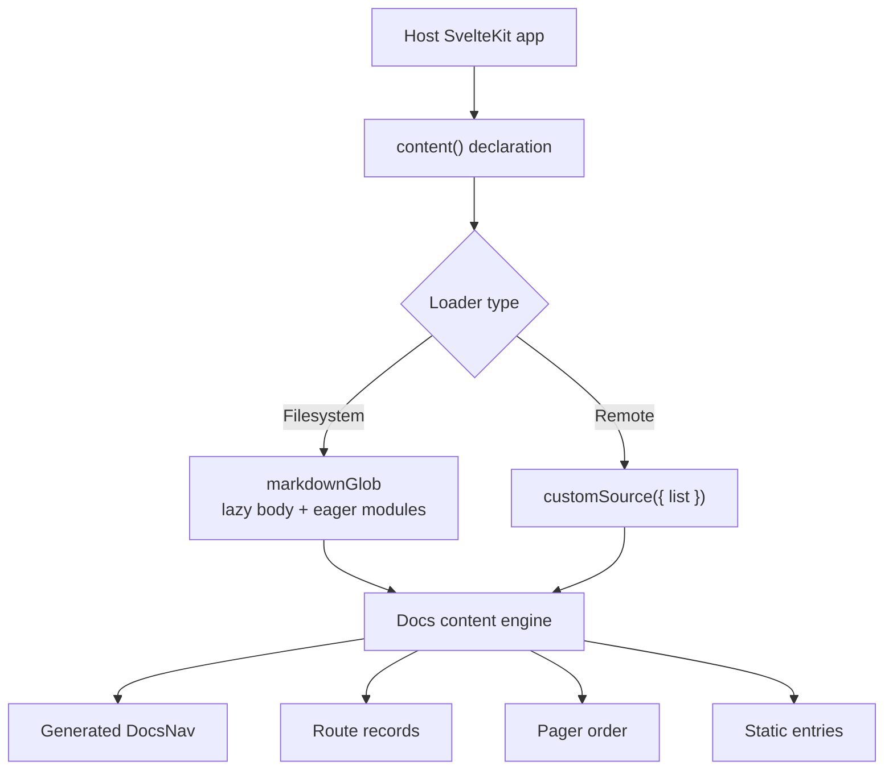
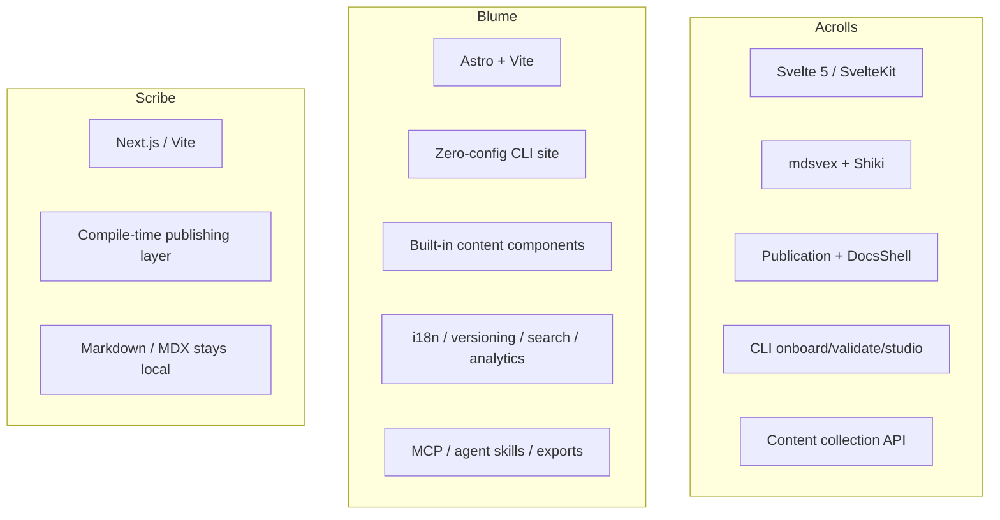
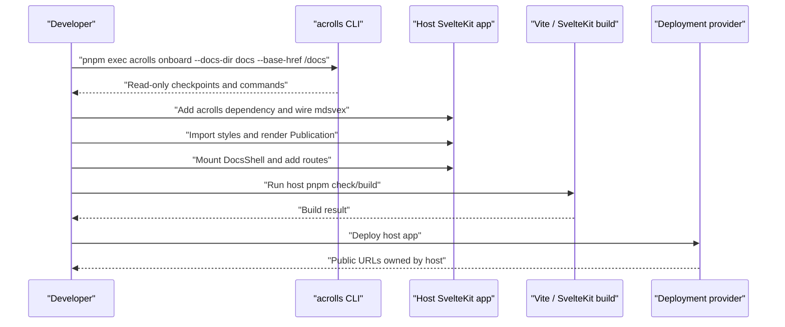
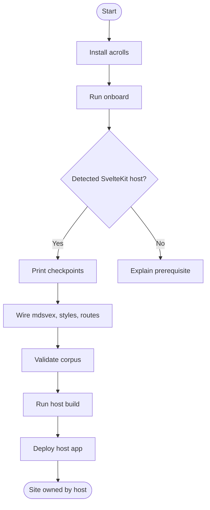

# Positioning & Operating Model

<cite>
**Referenced Files in This Document**
- [README.md](file://README.md)
- [PRODUCT.md](file://PRODUCT.md)
- [TECH.md](file://TECH.md)
- [docs/getting-started.md](file://docs/getting-started.md)
- [docs/integrate-sveltekit.md](file://docs/integrate-sveltekit.md)
- [docs/docs-shell.md](file://docs/docs-shell.md)
- [docs/cli.md](file://docs/cli.md)
- [packages/acrolls/package.json](file://packages/acrolls/package.json)
</cite>

## Who Owns the Site

Acrolls is a publishing SDK for SvelteKit. The host owns routing, deployment, SEO policy, content location, global navigation, and theme-toggle persistence. Acrolls owns mdsvex compilation semantics, the Publication article UI, compile-time code highlighting, docs-shell chrome, and CLI tooling. It is not a CMS, hosted product, or website builder; it does not own your site’s routes or deployment pipeline.

Blume positions itself as a zero-config, CLI-driven Astro site that the tool owns end-to-end (with an eject path). In that model, the framework scaffolds and drives the site surface, and the operator typically works inside the generated project rather than integrating into an existing app.

Scribe positions itself as a compile-time publishing layer for the site you already own. It keeps Markdown/MDX source authoritative and local, emits build output into your Next.js/Vite site, and avoids a hosted CMS or runtime lock-in.

Acrolls occupies the same “own your content, compile into your site” position as Scribe, but is SvelteKit-native: the host keeps routing and deployment, while Acrolls owns article rendering and the docs shell.

**Section sources**
- [README.md:7-8](file://README.md#L7-L8)
- [PRODUCT.md:15-23](file://PRODUCT.md#L15-L23)
- [docs/getting-started.md:13-32](file://docs/getting-started.md#L13-L32)

## Config-Driven vs. Code-Driven

Acrolls is primarily code-driven around a single collection declaration. A host declares one `content({ loader, schema?, filter?, config })` object that names where documents come from, how they are validated, which of them are published, and how they are configured. That single declaration resolves to the content source used by navigation, routes, breadcrumbs, pager order, and static entries.

The default loader is filesystem-based through `markdownGlob`, which uses two globs over the same pattern: a lazy body glob to keep document components out of the eager module graph, and an eager modules glob that supplies both frontmatter metadata and preprocessor facts. For remote or CMS-backed sources, the `customSource({ list })` seam lets the host supply documents without changing navigation or routing logic.

Blume is presented as a zero-config, template-first experience. The CLI owns the site lifecycle (`init`/`dev`/`build`/`eject`) and ships a rich set of built-in content components and features such as transclusion, versioning, i18n, search backends, analytics, PDF/EPUB export, and API reference generators. That model leans on configuration conventions and generator output rather than a host-owned collection API.

Scribe is also positioned as a compile-time publishing layer for the site you already own, with a single-command onboarding flow and no hosted CMS. Its emphasis is on keeping source authoritative and local while emitting build output into your existing Next.js/Vite application.

Acrolls differs from Blume by being framework-native and collection-API driven rather than a self-contained site generator. It differs from Scribe by targeting SvelteKit/mdsvex/Svelte components in content instead of MDX, and by owning a full docs shell plus a guided CLI onboarding flow.

**Diagram sources**
- [docs/integrate-sveltekit.md:199-241](file://docs/integrate-sveltekit.md#L199-L241)
- [docs/integrate-sveltekit.md:338-376](file://docs/integrate-sveltekit.md#L338-L376)
- [TECH.md:104-136](file://TECH.md#L104-L136)

**Section sources**
- [docs/integrate-sveltekit.md:199-241](file://docs/integrate-sveltekit.md#L199-L241)
- [docs/integrate-sveltekit.md:338-376](file://docs/integrate-sveltekit.md#L338-L376)
- [TECH.md:104-136](file://TECH.md#L104-L136)
- [docs/getting-started.md:165-242](file://docs/getting-started.md#L165-L242)

## Framework Support

Acrolls targets Svelte 5 runes, SvelteKit 2.62+, and mdsvex. It compiles Markdown and `.svx` files through Shiki at build time, renders articles via a `Publication` component, and provides a docs shell through `acrolls/docs`. The public npm package is `acrolls`; consumers install only that package and import through supported subpaths such as `acrolls/mdsvex`, `acrolls/svelte`, `acrolls/docs`, `acrolls/content`, `acrolls/sveltekit`, and `acrolls/styles/*`. Scoped `@acrolls/*` packages are bundled implementation units and are not direct consumer dependencies.

Blume targets Astro and Vite, ships a markdown-first workflow, and includes a broad built-in component library and feature set such as cards, steps, tabs, accordions, badges, code groups, frames, trees, type tables, live previews, diffs, includes/transclusion, math, content sources, versioning, i18n, client search, analytics, PDF/EPUB export, SEO layers, OpenAPI/AsyncAPI and GraphQL references, changelog/blog genres, registry components, custom pages, MCP server, agent skills, and evals.

Scribe targets Next.js and Vite today and positions itself as a publish layer for the site you already own, with open-source Markdown/MDX source staying local and compile-time output.

Acrolls intentionally does not implement many of Blume’s built-in content components and platform features. It has no i18n/locale routing, no doc versioning switcher, no RSS feed, no OpenAPI/GraphQL reference generator, no MCP server or Ask-AI, no analytics, no PDF/EPUB export, and no includes/transclusion. Its interactive content story is Svelte-native through `.svx`, not a Blume-style component registry.

**Diagram sources**
- [TECH.md:3-13](file://TECH.md#L3-L13)
- [packages/acrolls/package.json:14-57](file://packages/acrolls/package.json#L14-L57)
- [docs/docs-shell.md:7-19](file://docs/docs-shell.md#L7-L19)
- [docs/cli.md:32-48](file://docs/cli.md#L32-L48)

**Section sources**
- [TECH.md:3-13](file://TECH.md#L3-L13)
- [packages/acrolls/package.json:14-57](file://packages/acrolls/package.json#L14-L57)
- [docs/docs-shell.md:7-19](file://docs/docs-shell.md#L7-L19)
- [docs/cli.md:32-48](file://docs/cli.md#L32-L48)

## Lock-In & Exit Story

Acrolls’ exit story is integration into an existing SvelteKit application. The host installs `acrolls`, wires mdsvex in its Vite configuration, imports styles once per docs/blog surface, and renders articles through `Publication`. For a generated docs area, the host adds a content source, mounts `DocsShell`, and wires root/catch-all routes under a chosen public base href. The CLI provides guided, read-only onboarding and a separate reviewed mutation command for automated edits.

Blume’s exit story centers on ejecting from the site it owns. Because the CLI drives the entire site lifecycle, operators typically work within the generated project and use eject when they need to step outside the framework’s control.

Scribe’s exit story is compile-time output into the site you already own, with no hosted CMS and no runtime lock-in. Source stays local and authoritative, and the tool emits build artifacts rather than taking over runtime routing.

Acrolls deliberately stops at the deployment boundary. Onboarding and CLI guidance do not choose the host adapter, provider, credentials, environment variables, CDN rules, or final public URL. The host remains responsible for deployment, authentication, analytics, and global navigation.

**Diagram sources**
- [docs/cli.md:16-28](file://docs/cli.md#L16-L28)
- [docs/getting-started.md:13-32](file://docs/getting-started.md#L13-L32)
- [docs/integrate-sveltekit.md:7-73](file://docs/integrate-sveltekit.md#L7-L73)
- [docs/docs-shell.md:134-195](file://docs/docs-shell.md#L134-L195)

**Section sources**
- [docs/cli.md:16-28](file://docs/cli.md#L16-L28)
- [docs/getting-started.md:13-32](file://docs/getting-started.md#L13-L32)
- [docs/integrate-sveltekit.md:7-73](file://docs/integrate-sveltekit.md#L7-L73)
- [docs/docs-shell.md:134-195](file://docs/docs-shell.md#L134-L195)

## Stage & Install Path

Acrolls is in alpha with a published public npm package. The installation contract is to install only `acrolls` and run commands from the host root. The recommended first-run path is `pnpm add acrolls@latest`, then `pnpm exec acrolls onboard --docs-dir docs --base-href /docs`. The CLI detects the host, prints exact file/code/command checkpoints, and stops before mutating host files unless `integrate --yes` is explicitly used.

Blume’s stage is best understood as a zero-config CLI-driven site generator. The CLI owns initialization, development, building, and ejecting the generated Astro site.

Scribe’s stage is described as public beta with a single-command integrate flow and a roadmap page.

Acrolls’ install path is intentionally narrow: one package, supported `acrolls/*` entrypoints, and host-owned configuration merges. The monorepo supports development commands such as `pnpm install`, `pnpm build`, `pnpm check`, `pnpm test`, `pnpm dev:docs`, `pnpm dev:ui`, and `pnpm verify:packed-consumer`.

**Diagram sources**
- [docs/cli.md:16-28](file://docs/cli.md#L16-L28)
- [docs/getting-started.md:13-32](file://docs/getting-started.md#L13-L32)
- [README.md:17-22](file://README.md#L17-L22)
- [README.md:52-64](file://README.md#L52-L64)

**Section sources**
- [docs/cli.md:16-28](file://docs/cli.md#L16-L28)
- [docs/getting-started.md:13-32](file://docs/getting-started.md#L13-L32)
- [README.md:17-22](file://README.md#L17-L22)
- [README.md:52-64](file://README.md#L52-L64)