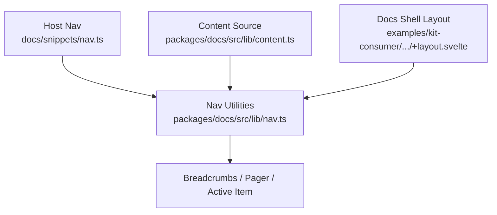
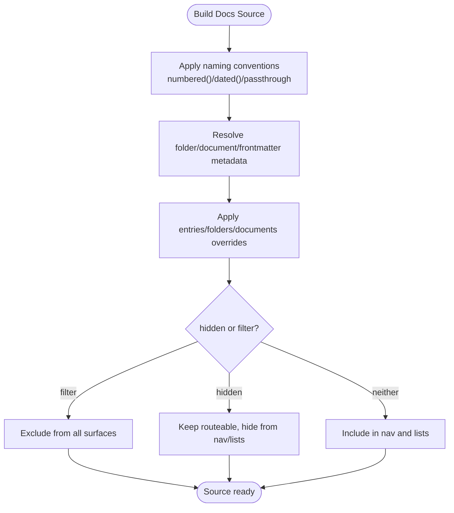
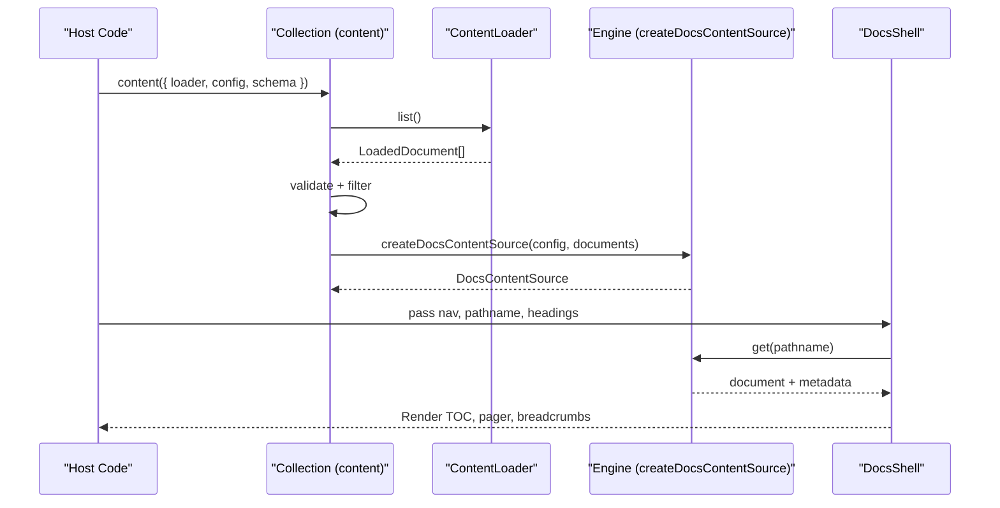

# Site Structure: Navigation, Versioning, i18n, Sources

<cite>
**Referenced Files in This Document**
- [collection.ts](file://packages/docs/src/lib/collection.ts)
- [content.ts](file://packages/docs/src/lib/content.ts)
- [nav.ts](file://packages/docs/src/lib/nav.ts)
- [merge.ts](file://packages/docs/src/lib/merge.ts)
- [nav.ts (snippet)](file://docs/snippets/nav.ts)
- [+layout.svelte (kit-consumer docs shell)](file://examples/kit-consumer/src/routes/docs/+layout.svelte)
</cite>

## Table of Contents
- Navigation Model
- Ordering, Labels & Metadata
- Content Sources
- Versioning
- Internationalization
- Gap Summary

## Navigation Model
Acrolls supports two complementary navigation models that can be used together or independently.

- Host-defined page tree (explicit): The host declares a typed `DocsNav` with sections, groups, and leaf items. Each item carries `title`, `href`, optional `slug`, `description`, and nested `children`. Acrolls normalizes IDs for stable rendering and derives active state, breadcrumbs, and pager links from this tree. See the snippet path for a complete example structure.
  - Section sources
    - [nav.ts (snippet):1-56](file://docs/snippets/nav.ts#L1-L56)
    - [nav.ts:12-92](file://packages/docs/src/lib/nav.ts#L12-L92)
    - [nav.ts:94-177](file://packages/docs/src/lib/nav.ts#L94-L177)
    - [nav.ts:130-144](file://packages/docs/src/lib/nav.ts#L130-L144)

- File-convention nav (implicit): When no explicit host tree is provided, Acrolls builds a navigation tree from discovered `.md` documents, folder structure, naming conventions (`numbered()`, `dated()`), and folder/document metadata. It also supports virtual groups and route overrides via `entries`, so hosts can reorganize content without moving files.
  - Section sources
    - [content.ts:77-109](file://packages/docs/src/lib/content.ts#L77-L109)
    - [content.ts:256-332](file://packages/docs/src/lib/content.ts#L256-L332)
    - [content.ts:568-633](file://packages/docs/src/lib/content.ts#L568-L633)

- Breadcrumbs and pager: Acrolls computes breadcrumb trails and previous/next pager links directly from the active navigation path. These are consumed by the docs shell to render “Read more” style navigation.
  - Section sources
    - [nav.ts:94-177](file://packages/docs/src/lib/nav.ts#L94-L177)
    - [nav.ts:130-144](file://packages/docs/src/lib/nav.ts#L130-L144)
    - [+layout.svelte (kit-consumer docs shell):1-46](file://examples/kit-consumer/src/routes/docs/+layout.svelte#L1-L46)

**Diagram sources**
- [nav.ts (snippet):1-56](file://docs/snippets/nav.ts#L1-L56)
- [nav.ts:12-177](file://packages/docs/src/lib/nav.ts#L12-L177)
- [content.ts:77-109](file://packages/docs/src/lib/content.ts#L77-L109)
- [+layout.svelte (kit-consumer docs shell):1-46](file://examples/kit-consumer/src/routes/docs/+layout.svelte#L1-L46)

## Ordering, Labels & Metadata
Acrolls resolves ordering and labels through a layered pipeline that blends file conventions, frontmatter, and configuration.

- Naming conventions:
  - `numbered()` reads an `NN-` prefix to set order and strip it from slugs/titles; warns on mixed prefixed/unprefixed siblings and duplicate numbers.
  - `dated()` reads a date prefix (default `YYYY-MM-DD`) to order chronologically and strip it; supports custom formats.
  - `passthroughNaming` leaves segments untouched.
  - Diagnostics surface ordering issues per directory.
  - Section sources
    - [content.ts:191-254](file://packages/docs/src/lib/content.ts#L191-L254)
    - [naming.test.ts:1-83](file://packages/docs/src/lib/naming.test.ts#L1-L83)

- Folder meta overrides:
  - `folders: { path: { title, description, badge, index, order, hidden, defaultOpen, id } }` override folder-level behavior and landing pages.
  - Keys match both raw paths and slug-space equivalents; mismatches throw at build time.
  - Section sources
    - [content.ts:43-53](file://packages/docs/src/lib/content.ts#L43-L53)
    - [content.ts:491-566](file://packages/docs/src/lib/content.ts#L491-L566)

- Document and entry overrides:
  - `documents: { key: { title, description, order, hidden, id, badge } }` override single-file metadata.
  - `entries: { key: { kind: 'page'|'group', href, landing, parent, ... } }` create virtual groups, rename routes, and assign group landings without moving files.
  - Section sources
    - [content.ts:55-66](file://packages/docs/src/lib/content.ts#L55-L66)
    - [content.ts:568-633](file://packages/docs/src/lib/content.ts#L568-L633)

- Frontmatter and authored mode:
  - In `authored` convention mode, ordinary pages require YAML frontmatter with a non-empty string `title`; index pages ignore frontmatter titles in favor of folder/group titles.
  - Leading H1 mismatch emits a warning when suppressed.
  - Section sources
    - [content.ts:31-39](file://packages/docs/src/lib/content.ts#L31-L39)
    - [content.ts:340-423](file://packages/docs/src/lib/content.ts#L340-L423)

- Hidden vs filter:
  - `hidden` keeps a document routeable but removes it from lists and navigation surfaces.
  - `filter` excludes a document entirely (not reachable by URL).
  - Section sources
    - [collection.ts:147-157](file://packages/docs/src/lib/collection.ts#L147-L157)
    - [collection.ts:206-219](file://packages/docs/src/lib/collection.ts#L206-L219)

**Diagram sources**
- [content.ts:191-254](file://packages/docs/src/lib/content.ts#L191-L254)
- [content.ts:568-633](file://packages/docs/src/lib/content.ts#L568-L633)
- [collection.ts:147-157](file://packages/docs/src/lib/collection.ts#L147-L157)

## Content Sources
Acrolls separates discovery from validation and routing through a pluggable loader seam.

- Collection API:
  - `content({ loader, config, schema })` returns a collection with `source()`, `sourceSync()`, `get()`, `list()`, `ids()`.
  - Pipeline: load → validate (Standard Schema layers) → filter → engine input.
  - Section sources
    - [collection.ts:125-221](file://packages/docs/src/lib/collection.ts#L125-L221)
    - [collection.ts:171-197](file://packages/docs/src/lib/collection.ts#L171-L197)
    - [collection.ts:227-288](file://packages/docs/src/lib/collection.ts#L227-L288)

- Loader contract:
  - `ContentLoader.list()` yields `LoadedDocument[]` with `key`, `data`, `meta`, and lazy `load()`.
  - `eager` enables synchronous pipelines; `sectionOrder` hints preserve declared source order across merges.
  - Section sources
    - [collection.ts:42-73](file://packages/docs/src/lib/collection.ts#L42-L73)

- Multi-source composition:
  - `mergeLoaders([...])` prefixes each source’s keys to produce first-level sections and preserves declaration order as fallback section order.
  - `mergeRaw(...)` aligns static AI assets (llms.txt, per-page markdown) with merged keys.
  - Section sources
    - [merge.ts:1-122](file://packages/docs/src/lib/merge.ts#L1-L122)

- Engine integration:
  - `createDocsContentSource(config, documents, sectionOrder)` builds the route map, applies overrides, constructs nav (defined or inferred), and exposes `get/load/entries`.
  - Section sources
    - [content.ts:256-332](file://packages/docs/src/lib/content.ts#L256-L332)

**Diagram sources**
- [collection.ts:171-221](file://packages/docs/src/lib/collection.ts#L171-L221)
- [content.ts:256-332](file://packages/docs/src/lib/content.ts#L256-L332)
- [+layout.svelte (kit-consumer docs shell):1-46](file://examples/kit-consumer/src/routes/docs/+layout.svelte#L1-L46)

## Versioning
- Not found in the repo. There is no doc versioning switcher, versioned base paths, or version-aware routing in the analyzed code.

## Internationalization
- Not found in the repo. There is no locale routing, i18n navigation, or localized content resolution in the analyzed code.

## Gap Summary
- Where Acrolls is ahead:
  - Explicit host-defined page tree with rich grouping, virtual entries, and route overrides alongside a robust file-convention fallback.
  - Strong folder/document metadata overrides and strict validation with actionable diagnostics.
  - Pluggable multi-source loader model with safe merging and aligned static assets.
  - Built-in breadcrumbs, pager, and TOC derived from the active navigation path.
  - SEO helpers, OG image cards, and static AI surfaces (llms.txt, per-page markdown) integrated into the same hierarchy.

- Where Acrolls is absent (relative to competitors such as Blume and Scribe):
  - No built-in doc versioning or version switcher.
  - No locale routing or i18n navigation.
  - No MDX-style component registry; interactive content uses Svelte components within mdsvex rather than a generic MDX registry.
  - No includes/transclusion, tabs/steps/cards/code-group content components beyond the documented set.
  - No RSS feed, OpenAPI/GraphQL reference generator, analytics, PDF/EPUB export, or hosted search backends.