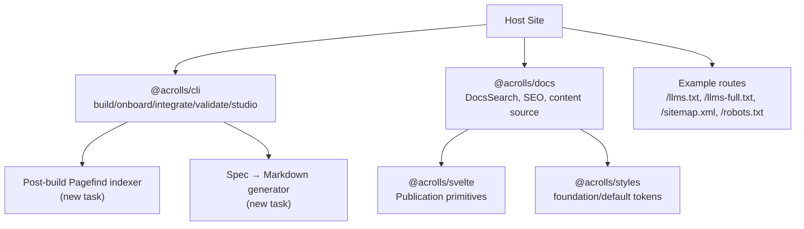

# Feature Parity Workplan

<cite>
**Referenced Files in This Document**
- [PRODUCT.md](file://PRODUCT.md)
- [TECH.md](file://TECH.md)
- [VISION.md](file://docs/VISION.md)
- [todo.md](file://tasks/todo.md)
- [DocsSearch.svelte](file://packages/docs/src/lib/DocsSearch.svelte)
- [seo.ts](file://packages/docs/src/lib/seo.ts)
- [+server.ts (llms.txt)](file://examples/kit-consumer/src/routes/llms.txt/+server.ts)
- [+server.ts (llms-full.txt)](file://examples/kit-consumer/src/routes/llms-full.txt/+server.ts)
- [+server.ts (sitemap.xml)](file://examples/kit-consumer/src/routes/sitemap.xml/+server.ts)
- [+server.ts (robots.txt)](file://examples/kit-consumer/src/routes/robots.txt/+server.ts)
</cite>

## Table of Contents
- Feature
- Competitive Driver
- Owning Module & Entry Point
- Scope Cuts (v1 vs later)
- Effort & Risk

## Feature
This workplan enumerates the feature gaps needed to compete with Blume and Scribe, sized by owning module and anchored to existing entry points. Each item states what exists today, what is missing, and where it should be implemented so work stays inside Acrolls’ responsibility boundary.

- Search packaging beyond raw Pagefind
  - What exists: A client-side `DocsSearch` component that dynamically loads a host-provided Pagefind bundle and renders results; SEO helpers for sitemap/robots are present.
  - What is missing: A post-build step that runs Pagefind over the generated docs output, emits the index under `/pagefind`, and wires the search box into the default docs shell. The component already degrades gracefully when the index is absent.
  - Where to implement: Add a build-time script or CLI subcommand under `@acrolls/cli` that invokes Pagefind against the built site and outputs the index; integrate it into the example host’s build pipeline and document it as part of onboarding.
  - Size: Medium. Requires a small CLI task, documentation updates, and an example integration.

- RSS feeds
  - What exists: None found in the repo.
  - What is missing: An RSS generator that walks the content source and emits `/feed.xml` (and optionally per-genre feeds like `/blog/feed.xml`, `/changelog/feed.xml`) using frontmatter fields such as title, description, date, and canonical URL.
  - Where to implement: Pure function in `packages/docs/src/lib/seo.ts` (or a new `rss.ts` co-located), plus example routes under `examples/kit-consumer/src/routes`.
  - Size: Small. Straightforward XML generation over the content tree.

- Blog/changelog index pages
  - What exists: No genre-aware index pages found in the repo.
  - What is missing: Index routes that list posts and changelog entries, sorted by date, with pagination or “load more”, and links to full articles. These are host-facing surfaces but can be scaffolded via the docs shell and content source.
  - Where to implement: Example routes under `examples/kit-consumer/src/routes/blog` and `.../changelog`, consuming the same content source used by the docs shell; optional helper utilities in `@acrolls/docs` for sorting/filtering by genre if hosts request it.
  - Size: Small to medium depending on pagination complexity.

- Doc versioning
  - What exists: None found in the repo.
  - What is missing: A version selector that switches between published doc versions, resolves versioned base paths, and rewrites navigation/routing accordingly.
  - Where to implement: UI layer in `packages/docs` (version switcher component) plus routing glue in `packages/sveltekit` to resolve versioned content sources; host owns version storage and deployment strategy.
  - Size: Medium. Involves nav rewriting, route resolution, and UX for version switching.

- i18n (locale routing)
  - What exists: None found in the repo.
  - What is missing: Locale-based routing (`/[locale]/docs/...`), locale selection UI, and content discovery per locale.
  - Where to implement: Routing and content-source composition in `packages/sveltekit`; locale picker in `packages/docs`; host owns translation assets and locale-specific content directories.
  - Size: Medium. Significant routing and content-source changes; must not break non-i18n hosts.

- Content-component set (tabs, steps, cards, code groups)
  - What exists: Publication primitives include Callout, Figure, Video, Banner, Publication, PublicationLayout, ZoomableImage, and a DocsAccordion used only for navigation. There is no tabs/steps/cards/code-group component library.
  - What is missing: A composable set of content components authors can embed in `.svx` files, aligned with the publication style system.
  - Where to implement: New components under `packages/svelte` (e.g., Tabs, Steps, Cards, CodeGroup) with styles under `packages/styles`; ensure they compose with Shiki code frames and follow the publication accessibility rules.
  - Size: Medium. Multiple components, shared styling, and consistent authoring ergonomics.

- API-reference generation (OpenAPI/AsyncAPI/GraphQL)
  - What exists: None found in the repo.
  - What is missing: A build-time generator that reads OpenAPI/AsyncAPI/GraphQL specs and produces reference pages rendered through the Publication layout, including typed examples and interactive sections.
  - Where to implement: CLI task under `@acrolls/cli` to generate Markdown from specs, consumed by the docs content source; rendering uses existing Publication primitives.
  - Size: Medium to large. Spec parsing, schema-driven page generation, and example rendering.

- MCP/agent surface beyond the static tier
  - What exists: Static agent surface via `/llms.txt`, `/llms-full.txt`, and page markdown helpers exposed as prerendered routes in the example host.
  - What is missing: A runtime server (MCP or agent endpoint) that serves dynamic tooling, query responses, or skill endpoints backed by the content source.
  - Where to implement: Optional server package under `@acrolls/docs` or a new `@acrolls/mcp` package; host deploys and secures the endpoint. Keep the static tier unchanged.
  - Size: Large. Requires protocol implementation, security model, and hosting guidance.

- `create acrolls` scaffold plus docs/marketing site
  - What exists: CLI commands `init`, `onboard`, `integrate`, `validate`, `studio`; a marketing/docs site for Acrolls itself is listed as future work in the vision.
  - What is missing: A one-command scaffold that creates a minimal SvelteKit project pre-wired with Acrolls docs, plus a hosted docs/marketing site for Acrolls.
  - Where to implement: Extend `@acrolls/cli` with a `create` command that scaffolds a starter project; build the official site under `sites/acrolls` (as noted in the vision).
  - Size: Medium for scaffold; large for the official site.

## Competitive Driver
- Blume (useblume.dev): Astro+Vite, zero-config template, MDX-first, built-in component library (cards, steps, tabs, accordions, badges, code groups, frames, trees, type tables, live previews, diffs), includes/transclusion, math, content sources, folder `meta.ts`, versioning with switcher, i18n with locale routing, client search plus optional hosted/semantic backends, llms.txt + mirrors + hosted MCP server + agent skills + evals + translate, analytics, PDF/EPUB export, SEO layer (OG images, RSS, JSON-LD), OpenAPI/AsyncAPI and GraphQL references, changelog + blog genres, registry components and custom pages.
- Scribe (scribeit.dev): Publishing layer for your existing site, Markdown/MDX source stays local, compile-time output, no hosted CMS, supports Next.js and Vite, single-command onboarding, public beta stage.

Acrolls competes by being SvelteKit-native: mdsvex compilation semantics, Publication article UI, docs-shell chrome, CLI tooling, and a pluggable content-source seam. It does not currently implement i18n/locale routing, doc versioning, RSS, OpenAPI/GraphQL references, MCP server, analytics, PDF/EPUB export, includes/transclusion, or the broader component library cited above.

## Owning Module & Entry Point
- Search packaging beyond raw Pagefind
  - Owner: `@acrolls/cli` (build task) + `@acrolls/docs` (search component wiring)
  - Entry points: `packages/docs/src/lib/DocsSearch.svelte`, example build scripts
  - Notes: Component already loads a host-provided Pagefind bundle at runtime; the gap is the post-build indexing step and docs-shell integration.

- RSS feeds
  - Owner: `@acrolls/docs` (generator) + example host routes
  - Entry points: `packages/docs/src/lib/seo.ts` (co-locate RSS generator), `examples/kit-consumer/src/routes`

- Blog/changelog index pages
  - Owner: Example host routes + optional helpers in `@acrolls/docs`
  - Entry points: `examples/kit-consumer/src/routes/blog`, `.../changelog`

- Doc versioning
  - Owner: `@acrolls/docs` (UI) + `@acrolls/sveltekit` (routing glue)
  - Entry points: Existing docs shell and content source adapter

- i18n (locale routing)
  - Owner: `@acrolls/sveltekit` (routing/content composition) + `@acrolls/docs` (locale picker)
  - Entry points: Content source adapter and docs shell

- Content-component set (tabs, steps, cards, code groups)
  - Owner: `@acrolls/svelte` (components) + `@acrolls/styles` (styling)
  - Entry points: Existing Publication primitives and style system

- API-reference generation
  - Owner: `@acrolls/cli` (spec → Markdown) + `@acrolls/docs` (rendering via Publication)
  - Entry points: CLI tasks and docs content source

- MCP/agent surface beyond the static tier
  - Owner: Optional new package (e.g., `@acrolls/mcp`) + host deployment
  - Entry points: Existing static routes in example host (`/llms.txt`, `/llms-full.txt`)

- `create acrolls` scaffold plus docs/marketing site
  - Owner: `@acrolls/cli` (scaffold) + official site (future)
  - Entry points: CLI commands, `docs/VISION.md` site plan

**Diagram sources**
- [DocsSearch.svelte:1-109](file://packages/docs/src/lib/DocsSearch.svelte#L1-L109)
- [seo.ts:1-200](file://packages/docs/src/lib/seo.ts#L1-L200)
- [+server.ts (llms.txt):1-11](file://examples/kit-consumer/src/routes/llms.txt/+server.ts#L1-L11)
- [+server.ts (llms-full.txt):1-11](file://examples/kit-consumer/src/routes/llms-full.txt/+server.ts#L1-L11)
- [+server.ts (sitemap.xml):1-11](file://examples/kit-consumer/src/routes/sitemap.xml/+server.ts#L1-L11)
- [+server.ts (robots.txt):1-10](file://examples/kit-consumer/src/routes/robots.txt/+server.ts#L1-L10)

## Scope Cuts (v1 vs later)
- v1 (near-term, within current boundaries)
  - Post-build Pagefind packaging and docs-shell wiring
  - RSS feed generator and example routes
  - Blog/changelog index pages in the example host
  - Content-component set (Tabs, Steps, Cards, CodeGroup) in `@acrolls/svelte` with styles in `@acrolls/styles`
  - API-reference generation CLI task producing Markdown consumable by the docs content source
  - `create acrolls` scaffold command extending the existing CLI

- Later (deferred until core parity is stable)
  - Doc versioning (requires nav/route rewriting and UX)
  - i18n/locale routing (significant routing and content-source changes)
  - MCP/agent runtime server (protocol and security scope beyond static tier)
  - Official docs/marketing site for Acrolls (listed as future in the vision)

These cuts respect the responsibility boundary: Acrolls owns compilation, article UI, docs shell, CLI, and content-source plumbing; hosts own routing, deployment, SEO policy, content location, global navigation, and theme persistence.

**Section sources**
- [PRODUCT.md:54-87](file://PRODUCT.md#L54-L87)
- [VISION.md:29-37](file://docs/VISION.md#L29-L37)
- [todo.md:1-18](file://tasks/todo.md#L1-L18)

## Effort & Risk
- Search packaging beyond raw Pagefind
  - Effort: Medium. Build task + docs-shell integration + docs update.
  - Risk: Low. Component already handles missing index; risk is ensuring correct post-build path and performance.

- RSS feeds
  - Effort: Small. Generator + example routes.
  - Risk: Low. XML generation is straightforward; ensure frontmatter fields are available.

- Blog/changelog index pages
  - Effort: Small to medium. Sorting, pagination, and host wiring.
  - Risk: Low. Reuses content source; pagination adds minor complexity.

- Doc versioning
  - Effort: Medium. Version switcher, nav/route resolution, content source scoping.
  - Risk: Medium. Must preserve non-versioned hosts and avoid breaking existing routes.

- i18n (locale routing)
  - Effort: Medium. Locale routing, content discovery, locale picker.
  - Risk: Medium. Routing changes must be opt-in and backward compatible.

- Content-component set (tabs, steps, cards, code groups)
  - Effort: Medium. Multiple components, shared styles, accessibility.
  - Risk: Low to medium. Align with existing Publication patterns; ensure keyboard and screen-reader support.

- API-reference generation
  - Effort: Medium to large. Spec parsing, schema-driven pages, examples.
  - Risk: Medium. Spec diversity and example rendering require careful design.

- MCP/agent surface beyond the static tier
  - Effort: Large. Protocol implementation, security, hosting guidance.
  - Risk: High. Runtime server introduces auth, rate limiting, and deployment concerns.

- `create acrolls` scaffold plus docs/marketing site
  - Effort: Medium for scaffold; large for official site.
  - Risk: Low for scaffold; medium for site (content, branding, maintenance).

**Section sources**
- [TECH.md:65-74](file://TECH.md#L65-L74)
- [TECH.md:104-143](file://TECH.md#L104-L143)
- [seo.ts:149-190](file://packages/docs/src/lib/seo.ts#L149-L190)
- [DocsSearch.svelte:1-109](file://packages/docs/src/lib/DocsSearch.svelte#L1-L109)