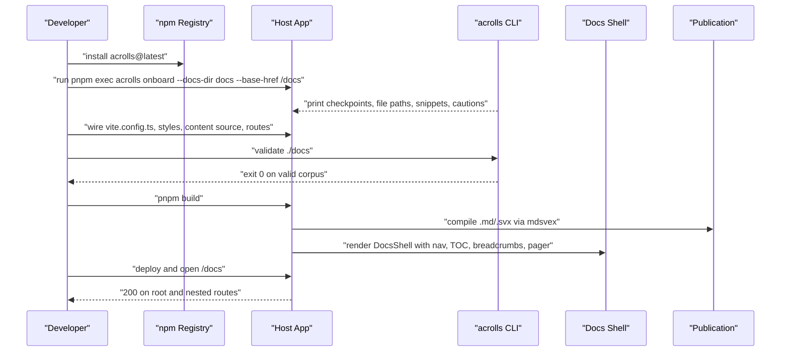
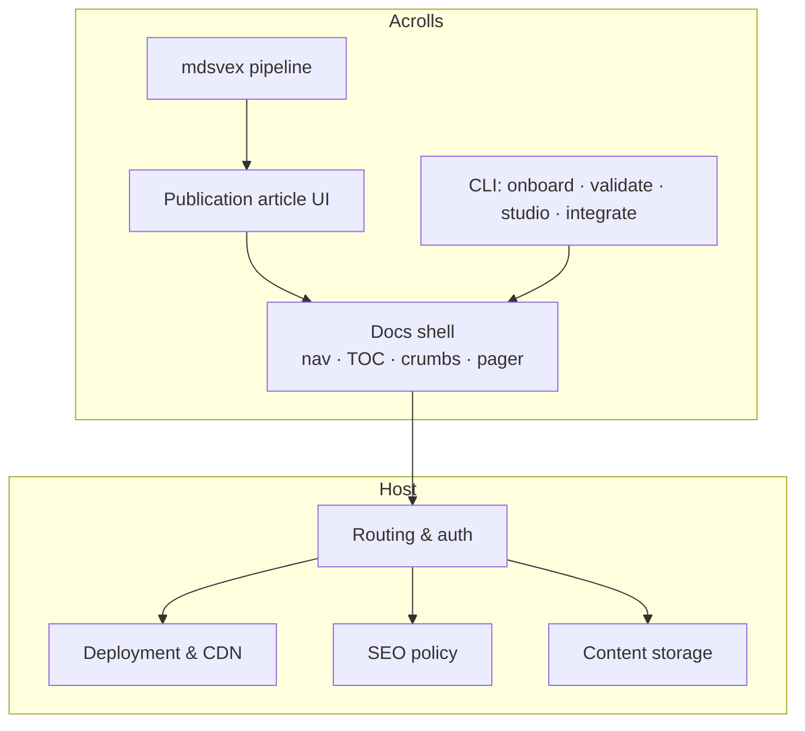

# Launch Checklist & Go/No-Go Criteria

<cite>
**Referenced Files in This Document**
- [docs/checklist.md](file://docs/checklist.md)
- [tasks/todo.md](file://tasks/todo.md)
- [tasks/plan.md](file://tasks/plan.md)
- [docs/release.md](file://docs/release.md)
- [README.md](file://README.md)
- [docs/README.md](file://docs/README.md)
- [llms.txt](file://llms.txt)
- [PRODUCT.md](file://PRODUCT.md)
- [TECH.md](file://TECH.md)
</cite>

## Table of Contents
- Prerequisite Gates
- Launch Assets
- Public Announce Sequence
- Explicit No-Go Conditions
- Post-Launch Ownership

## Prerequisite Gates
Run these gates in order. Each gate is executable from the repository root unless noted otherwise. Do not proceed until every gate below passes.

1. Monorepo health
   - Install and build: `pnpm install && pnpm build`
   - Type-check and tests: `pnpm check && pnpm test`
   - Example kit checks: `pnpm --filter @acrolls/example-kit check && pnpm --filter @acrolls/example-kit build`
   - Acceptance: all commands exit 0; no chunk-size warnings remain for the example.

2. Published package contract
   - Verify the public package tarball contains runtime files, README, license, public exports, and bundled dependencies with no test/source artifacts.
   - Run the packed-consumer gate: `pnpm verify:packed-consumer`
   - Confirm a fresh consumer can install only `acrolls@latest`, run `pnpm exec acrolls --version`, onboard, validate, check, and build without direct `@acrolls/*`, workspace, clone, or `file:` dependencies.

3. CLI surface
   - `acrolls onboard --check` rescans completed checkpoints on an existing host.
   - `acrolls validate <file|directory>` exits 0 on valid content and non-zero on invalid content according to the selected policy.
   - Exit codes are stable: 0 success, 1 operational failure, 2 usage error.

4. Docs shell and article rendering
   - Start the docs watcher + example host: `pnpm dev:docs`
   - Open http://127.0.0.1:5173/docs and confirm:
     - Docs root and one nested document return 200
     - Sidebar sections collapse/expand and persist after reload
     - Nested child highlights and opens ancestors
     - Group landing links and badges display as configured
     - TOC lists h2/h3 and tracks scroll
     - Browser console has no runtime errors during navigation
     - Code fences show copy after click
   - Production smoke: `pnpm build` succeeds and deployed routes render correctly.

5. Blocker workstream completion
   - All items marked complete in tasks/todo.md must be verified against the built example, not inferred from static checks.
   - The packed-consumer gate and browser acceptance for docs navigation, TOC, pager, persistence, accessibility, and console errors must pass before launch.

6. Third-host trial (independent validation)
   - Create a new SvelteKit site, install `acrolls@latest`, run `acrolls onboard --docs-dir docs --base-href /docs`, follow generated checkpoints, then run `acrolls validate ./docs`, `pnpm check`, and `pnpm build`.
   - Confirm `/docs`, one nested document, direct refreshes, unknown slug handling, code highlighting, tables, Mermaid, navigation, and the deployed URL.

Section sources
- [docs/checklist.md:10-64](file://docs/checklist.md#L10-L64)
- [tasks/todo.md:1-18](file://tasks/todo.md#L1-L18)
- [tasks/plan.md:22-35](file://tasks/plan.md#L22-L35)
- [docs/release.md:22-85](file://docs/release.md#L22-L85)
- [README.md:52-70](file://README.md#L52-L70)
- [docs/README.md:89-101](file://docs/README.md#L89-L101)
- [llms.txt:7-31](file://llms.txt#L7-L31)

## Launch Assets
Prepare these assets before announcing. Treat each item as a deliverable that must exist and be verifiable.

- Documentation handbook
  - Present at docs/README.md with clear first-path guidance, third-host trial steps, and links to integration, authoring, styles, CLI, troubleshooting, release, and checklist pages.
  - Ensure llms.txt points agents to the same canonical index.

- Integration and authoring guides
  - Getting started, SvelteKit integration, content authoring, docs shell, styles, CLI reference, troubleshooting, and checklist must be current and cross-linked.

- Release and registry test guide
  - docs/release.md must describe build, pack, publish, and fresh-consumer verification steps using only the public npm package.

- Example host and acceptance route
  - examples/kit-consumer must build and render the combined acceptance route with code frames, callouts, tables, and figures.
  - The acceptance route proves mdsvex compilation, Publication rendering, docs shell wiring, and CSS tokens together.

- CLI onboarding plan
  - Onboarding checkpoints must include installation, preprocessor wiring, style import, content directory, generated source, DocsShell + Publication renderer, root/catch-all routes, corpus validation, local checks, production build, and deployment verification.

- Announcement assets
  - One-line positioning statement: “Acrolls is a SvelteKit publishing + documentation framework — Markdown/mdsvex articles and a Fumadocs-class docs shell.”
  - Installation command: `pnpm add acrolls@latest && pnpm exec acrolls onboard --docs-dir docs --base-href /docs`
  - Public entrypoints list: mdsvex, svelte, docs, content, sveltekit, styles/*, docs/styles.css.
  - Responsibility boundary: Acrolls owns compile, article UI, docs chrome, and CLI; hosts own routing, auth, deployment, SEO, content storage, and global navigation.

- First-host case study
  - Identify one real host that installed only `acrolls@latest`, ran onboard, validated, built, and deployed `/docs` plus nested routes without direct `@acrolls/*` dependencies.
  - Capture: host name, base href, docs directory, any custom schema/filter, known limitations, and a live URL.
  - If none exists yet, create it by following the third-host trial and treat it as the first case study.

Section sources
- [docs/README.md:1-41](file://docs/README.md#L1-L41)
- [docs/README.md:89-101](file://docs/README.md#L89-L101)
- [docs/release.md:10-85](file://docs/release.md#L10-L85)
- [README.md:39-50](file://README.md#L39-L50)
- [llms.txt:33-48](file://llms.txt#L33-L48)
- [PRODUCT.md:15-23](file://PRODUCT.md#L15-L23)

## Public Announce Sequence
Use this sequence when announcing Acrolls publicly. It assumes all prerequisite gates have passed and all launch assets are ready.

1. Pre-announce readiness
   - Confirm monorepo health, published package contract, CLI behavior, docs shell rendering, and packed-consumer gate.
   - Confirm the example host builds and the acceptance route renders end-to-end.

2. Publish the public package
   - Build, pack, and publish only `acrolls`.
   - Verify the tarball layout, exports, and bundled dependencies.
   - Test a fresh consumer: install, onboard, validate, check, build, and deploy.

3. Publish announcement content
   - Positioning: “SvelteKit publishing + documentation framework — Markdown/mdsvex articles and a Fumadocs-class docs shell.”
   - Installation command and supported imports through `acrolls/*`.
   - Responsibility boundary and what hosts still own.
   - Link to docs/README.md, getting started, CLI reference, and checklist.

4. Share first-host case study
   - Provide the first verified host that used only `acrolls@latest`, onboarded, validated, built, and deployed `/docs` plus nested routes.
   - Include live URL and any notable configuration choices.

5. Post-announce verification
   - Re-run `pnpm verify:packed-consumer` from a clean environment.
   - Revisit the third-host trial path to ensure the announced flow still works.
   - Monitor issues for missing prerequisites, version mismatches, or misapplied integrations.

**Diagram sources**
- [docs/release.md:22-85](file://docs/release.md#L22-L85)
- [docs/README.md:89-101](file://docs/README.md#L89-L101)
- [llms.txt:7-31](file://llms.txt#L7-L31)
- [README.md:52-70](file://README.md#L52-L70)

Section sources
- [docs/release.md:22-85](file://docs/release.md#L22-L85)
- [docs/README.md:89-101](file://docs/README.md#L89-L101)
- [llms.txt:7-31](file://llms.txt#L7-L31)
- [README.md:52-70](file://README.md#L52-L70)

## Explicit No-Go Conditions
Do not announce if any of the following conditions hold. Resolve them first.

- Monorepo build or tests fail
  - `pnpm build`, `pnpm check`, or `pnpm test` does not exit 0.

- Packed-consumer gate fails
  - `pnpm verify:packed-consumer` cannot install, onboard, validate, check, or build a fresh consumer using only `acrolls@latest`.

- Direct dependency leakage
  - A consumer host installs or imports `@acrolls/*`, workspace paths, clones, or `file:` dependencies instead of using only `acrolls` and its documented subpaths.

- Missing CLI behavior
  - `acrolls onboard`, `acrolls validate`, `acrolls init`, or `acrolls studio` do not behave as documented, including exit codes and read-only guarantees.

- Docs shell rendering defects
  - Docs root or nested routes return non-200, sidebar persistence fails, TOC/pager/breadcrumbs break, or the browser console shows runtime errors during navigation.

- Example acceptance route broken
  - examples/kit-consumer does not build or render the combined acceptance route with code frames, callouts, tables, and figures.

- Unresolved blocker tasks
  - Any unchecked item in tasks/todo.md that affects core launch gates remains incomplete.

- Deployment ownership confusion
  - Announcement implies Acrolls chooses adapters, configures authentication, supplies credentials, or proves deployed URLs. Acrolls must not claim host-owned responsibilities.

- Security or trust boundaries violated
  - Studio binds to anything other than localhost, or `.svx` execution is treated as untrusted migration content.

Section sources
- [tasks/todo.md:1-18](file://tasks/todo.md#L1-L18)
- [tasks/plan.md:22-35](file://tasks/plan.md#L22-L35)
- [docs/release.md:22-85](file://docs/release.md#L22-L85)
- [docs/checklist.md:52-64](file://docs/checklist.md#L52-L64)
- [llms.txt:88-98](file://llms.txt#L88-L98)
- [TECH.md:156-161](file://TECH.md#L156-L161)

## Post-Launch Ownership
After launch, maintain clarity about who owns what.

- Acrolls owns
  - mdsvex compilation semantics, article UI primitives, docs-shell chrome, CLI tooling, and the public `acrolls` package contract.
  - Generated navigation, breadcrumbs, pager order, and static entries derived from the host’s content-source declaration.

- Host owns
  - Routing, authentication, deployment, SEO policy, content location, global navigation, analytics, theme-toggle persistence, and adapter configuration.
  - Any remote CMS, database, or API source plugged into the loader seam.

- Ongoing maintenance
  - Keep docs/README.md, CLI reference, and checklist aligned with implemented behavior.
  - Treat roadmap prose as historical; derive “what is done” from packages/*/src, example routes, package.json scripts, and tests.
  - Preserve the public `acrolls/*` entrypoint contract and avoid introducing breaking changes without a migration path.
  - Continue verifying the packed-consumer gate after updates.

**Diagram sources**
- [PRODUCT.md:15-23](file://PRODUCT.md#L15-L23)
- [TECH.md:32-55](file://TECH.md#L32-L55)
- [llms.txt:33-48](file://llms.txt#L33-L48)

Section sources
- [PRODUCT.md:15-23](file://PRODUCT.md#L15-L23)
- [TECH.md:32-55](file://TECH.md#L32-L55)
- [llms.txt:33-48](file://llms.txt#L33-L48)
- [README.md:39-50](file://README.md#L39-L50)