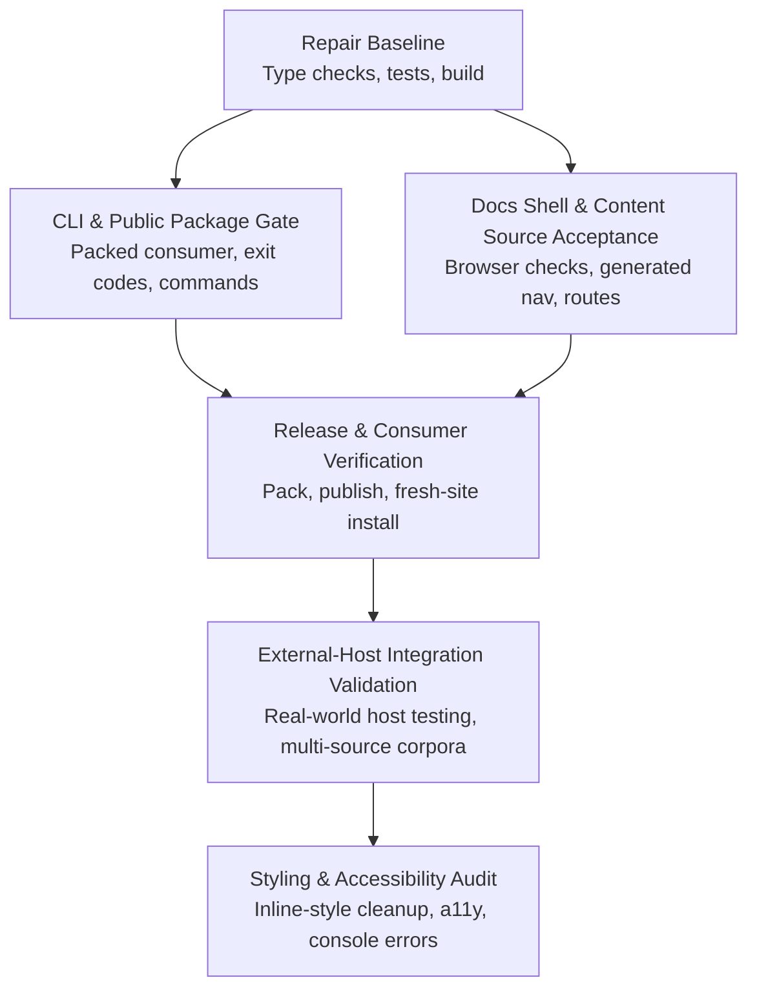

# Launch Readiness: Path to an Industry-Class Docs Framework

<cite>
**Referenced Files in This Document**
- [README.md](file://README.md)
- [package.json](file://package.json)
- [PRODUCT.md](file://PRODUCT.md)
- [VISION.md](file://docs/VISION.md)
- [checklist.md](file://docs/checklist.md)
- [release.md](file://docs/release.md)
- [todo.md](file://tasks/todo.md)
- [plan.md](file://tasks/plan.md)
- [context-map.md](file://tasks/context-map.md)
- [index.ts](file://packages/cli/src/index.ts)
- [package.json](file://packages/acrolls/package.json)
- [test-install-fractaldesign.md](file://docs/evolution/test-install-fractaldesign.md)
- [patch-fractalsvelte.mjs](file://temp/patch-fractalsvelte.mjs)
</cite>

## Update Summary
**Changes Made**
- Added comprehensive external-host integration test results from fractalsvelte project
- Updated P0 blockers with critical production readiness issues discovered during integration testing
- Enhanced measurable gates with real-world validation scenarios
- Added new workstream for external-host integration validation
- Updated dependency order to include external-host verification phase

## Definition of Launch-Ready

"Industry-class" for Acrolls means a SvelteKit publishing + docs framework that a host can install from npm, wire through the documented `acrolls/*` entrypoints, and ship with predictable authoring, validation, navigation, and runtime behavior — without turning into a CMS or hosted product. The gates below are measurable and sourced from the repository's tasks, plans, CLI surface, release procedure, and **external-host integration validation**.

### Measurable Gates

- Build health
  - Monorepo build succeeds: `pnpm install && pnpm build`.
  - Package-level checks pass: `pnpm check`, `pnpm test`, `pnpm --filter @acrolls/docs check`.
  - Example host builds without chunk-size warnings: `pnpm build:example`.

- Public package contract
  - One installable package: `pnpm add acrolls@latest`.
  - Scoped implementation packages are bundled; consumers never depend on `@acrolls/*` directly.
  - Packed consumer gate passes: `pnpm verify:packed-consumer`.

- CLI stability
  - Commands resolve from the host: `pnpm exec acrolls --version`.
  - Exit codes are stable: 0 success, 1 operational failure, 2 usage error.
  - `acrolls validate` accepts a file or directory, reports per-document status, and exits according to mode/policy.
  - `acrolls onboard` produces a versioned plan and supports `--check`, `--json`, `--interactive`, `--non-interactive`.
  - `acrolls studio` previews one source file locally against localhost.

- Content and docs shell
  - Markdown/mdsvex compilation with slugs, tables, Shiki code frames, and fence metadata works end-to-end in the example host.
  - Generated content source drives routes, navigation, breadcrumbs, pager order, and static entries from one declaration.
  - Docs shell provides nested navigation, TOC, breadcrumbs, pager, persistence, mobile drawer, and filter.

- Authoring safety
  - Authored mode fails the build with aggregated diagnostics for invalid documents.
  - Migration mode normalizes safely and supports `fail` or `error-page` policy for rejected documents.
  - `hidden` vs `filter` semantics are enforced: hidden is unlisted but routeable; filtered is fully unreachable.

- Browser acceptance
  - Built example renders `/acceptance` with code frame, table, callout, and figure together.
  - Docs navigation, TOC, pager, open-state persistence, and console state are verified against the built example.

- Styling discipline
  - No inline styles or component `<style>` blocks remain in Acrolls-owned scope (audit item).
  - Styling direction uses custom CSS and pure indented SASS aligned with CUBE CSS; Tailwind is not part of the intended direction.

- Release readiness
  - Release procedure documented and runnable: pack, inspect tarball, publish, then verify in a fresh site.
  - Only the public `acrolls` package is published; scoped packages are bundled dependencies.

- **External-host integration validation** *(NEW)*
  - Successfully integrates with real-world SvelteKit projects using latest toolchain (Vite 8, TypeScript 6, Svelte 5.56).
  - Handles multi-source content corpora (63+ markdown documents) from external repositories.
  - Validates compatibility with different adapters (adapter-vercel), styling systems (fractalthemer), and build configurations.
  - Confirms production readiness across diverse host environments and content structures.

**Section sources**
- [README.md:9-35](file://README.md#L9-L35)
- [package.json:9-22](file://package.json#L9-L22)
- [package.json:72-106](file://packages/acrolls/package.json#L72-L106)
- [release.md:22-85](file://docs/release.md#L22-L85)
- [index.ts:19-33](file://packages/cli/src/index.ts#L19-L33)
- [index.ts:52-99](file://packages/cli/src/index.ts#L52-L99)
- [index.ts:118-165](file://packages/cli/src/index.ts#L118-L165)
- [PRODUCT.md:54-87](file://PRODUCT.md#L54-L87)
- [PRODUCT.md:231-301](file://PRODUCT.md#L231-L301)
- [PRODUCT.md:302-449](file://PRODUCT.md#L302-L449)
- [VISION.md:16-37](file://docs/VISION.md#L16-L37)
- [checklist.md:10-64](file://docs/checklist.md#L10-L64)
- [todo.md:1-18](file://tasks/todo.md#L1-L18)
- [plan.md:22-35](file://tasks/plan.md#L22-L35)
- [test-install-fractaldesign.md:6-33](file://docs/evolution/test-install-fractaldesign.md#L6-L33)
- [test-install-fractaldesign.md:231-238](file://docs/evolution/test-install-fractaldesign.md#L231-L238)

## Workstream Overview & Dependencies

Acrolls' launch axis is organized around four workstreams that must converge before the project can be declared industry-class. Each workstream has explicit outputs and depends on earlier fixes so that downstream verification is meaningful.

**Diagram sources**
- [todo.md:1-18](file://tasks/todo.md#L1-L18)
- [plan.md:9-35](file://tasks/plan.md#L9-L35)
- [release.md:22-85](file://docs/release.md#L22-L85)
- [checklist.md:52-64](file://docs/checklist.md#L52-L64)
- [test-install-fractaldesign.md:231-238](file://docs/evolution/test-install-fractaldesign.md#L231-L238)

### Workstream A: Repair Baseline

- Fix return types for built-in naming conventions so `numbered()` and `dated()` expose `verify()`.
- Re-run focused checks and tests for `@acrolls/docs`, then full monorepo `check`, `test`, and `build`.
- Remove eager compiled-Markdown/Shiki client graph and clear chunk-size warning budget in the example.

Acceptance:
- `pnpm --filter @acrolls/docs check` passes.
- `pnpm check`, `pnpm test`, `pnpm build` pass.
- `pnpm build:example` exits without large-chunk warnings.

**Section sources**
- [todo.md:3-9](file://tasks/todo.md#L3-L9)
- [plan.md:9-28](file://tasks/plan.md#L9-L28)

### Workstream B: CLI & Public Package Gate

- Verify root CLI behavior and the packed public-package contract.
- Confirm starter validation passes and a fresh consumer can install, onboard, validate, and build using only `acrolls`.
- Ensure exit codes, command surfaces, and onboarding JSON are stable and agent-friendly.

Acceptance:
- `pnpm verify:packed-consumer` passes.
- `pnpm exec acrolls --version` resolves from the host.
- `acrolls validate` returns correct exit codes and diagnostic summaries.
- Onboarding plan is reproducible via `--check` and `--json`.

**Section sources**
- [todo.md:10-11](file://tasks/todo.md#L10-L11)
- [index.ts:19-33](file://packages/cli/src/index.ts#L19-L33)
- [index.ts:52-99](file://packages/cli/src/index.ts#L52-L99)
- [index.ts:118-165](file://packages/cli/src/index.ts#L118-L165)
- [release.md:22-85](file://docs/release.md#L22-L85)
- [package.json:72-106](file://packages/acrolls/package.json#L72-L106)

### Workstream C: Docs Shell & Content Source Acceptance

- Complete browser acceptance for docs navigation, TOC, pager, persistence, accessibility, and console errors.
- Validate generated content source wiring: one collection drives routes, navigation, breadcrumbs, pager order, and static entries.
- Confirm the combined acceptance route renders code frames, tables, callouts, and figures together.

Acceptance:
- Built example `/acceptance` renders the full publication stack.
- Docs sidebar persists open state across reloads.
- Nested navigation highlights and opens ancestors correctly.
- No runtime console errors during docs navigation.

**Section sources**
- [todo.md:16-17](file://tasks/todo.md#L16-L17)
- [checklist.md:36-64](file://docs/checklist.md#L36-L64)
- [PRODUCT.md:84-87](file://PRODUCT.md#L84-L87)
- [PRODUCT.md:440-449](file://PRODUCT.md#L440-L449)
- [VISION.md:16-25](file://docs/VISION.md#L16-L25)

### Workstream D: External-Host Integration Validation *(NEW)*

- Validate integration with real-world SvelteKit projects using latest toolchain versions (Vite 8, TypeScript 6, Svelte 5.56).
- Test multi-source content corpora handling (63+ markdown documents from external repositories).
- Verify compatibility with different adapters (adapter-vercel), styling systems (fractalthemer), and build configurations.
- Validate production readiness across diverse host environments and content structures.

Acceptance:
- Successful integration with fractalsvelte project demonstrating real-world usage patterns.
- Multi-source content setup working across 4 different documentation corpora.
- Production build succeeds with latest toolchain versions.
- All 65 pages render correctly with proper navigation, SEO, and functionality.

**Section sources**
- [test-install-fractaldesign.md:6-33](file://docs/evolution/test-install-fractaldesign.md#L6-L33)
- [test-install-fractaldesign.md:231-238](file://docs/evolution/test-install-fractaldesign.md#L231-L238)
- [patch-fractalsvelte.mjs:1-98](file://temp/patch-fractalsvelte.mjs#L1-L98)

### Dependency Order

1. Repair baseline must pass before CLI and consumer verification are meaningful.
2. CLI and packed-consumer gates must pass before release packaging is trusted.
3. Browser acceptance must be evidenced against the built example, not inferred from static checks.
4. **External-host integration validation must demonstrate real-world production readiness.** *(UPDATED)*
5. Styling and accessibility audit should follow once functional gates are green.

**Section sources**
- [plan.md:9-35](file://tasks/plan.md#L9-L35)
- [todo.md:1-18](file://tasks/todo.md#L1-L18)
- [test-install-fractaldesign.md:231-238](file://docs/evolution/test-install-fractaldesign.md#L231-L238)

## P0 Blockers

The following items block declaring the framework industry-class because they prevent reliable authoring, installation, and verification by hosts. **Updated with critical findings from external-host integration testing.**

| Blocker | Why it blocks launch | Evidence / Location |
|---|---|---|
| Root CLI and packed public-package behavior not verified | Consumers cannot trust `acrolls` as the single installable unit; agents and CI cannot rely on stable commands or exit codes. | Tasks list marks this unchecked; release procedure exists but needs execution. | [todo.md:10-11](file://tasks/todo.md#L10-L11) |
| Stale task/checklist and onboarding guidance not reconciled with implemented content API | Hosts may follow outdated steps instead of the collection API and generated source pattern. | Explicitly listed as a remaining task. | [todo.md:12-13](file://tasks/todo.md#L12-L13) |
| Styling-rule violations still present in Acrolls-owned scope | Violates the approved class/style boundaries and risks inconsistent rendering across hosts. | Audit item remains open. | [todo.md:14-15](file://tasks/todo.md#L14-L15) |
| Browser acceptance not completed for docs navigation, TOC, pager, persistence, accessibility, and console errors | Functional features exist but lack evidence against the built example. | Open task requires built-example verification. | [todo.md:16-17](file://tasks/todo.md#L16-L17) |
| **Published package version mismatch with local development** *(NEW - CRITICAL)* | Published `acrolls@0.1.4` is stale but shares the local version number, causing consumers to install old code under current version. | External-host test revealed missing exports and features. | [test-install-fractaldesign.md:38-49](file://docs/evolution/test-install-fractaldesign.md#L38-L49) |
| **Source-safety validation fails on nested object literals** *(NEW - CRITICAL)* | Default `onInvalidDocument: 'fail'` causes entire production build to fail on single malformed document containing nested config examples. | Real-world corpus integration exposed this critical issue. | [test-install-fractaldesign.md:145-168](file://docs/evolution/test-install-fractaldesign.md#L145-L168) |
| **Onboarding plan predates shipped features** *(NEW - HIGH)* | Guided CLI cannot express multi-source setups or any add-on features (search, SEO, OG images, AI/LLMs). | External-host test with 4 different doc sources exposed this limitation. | [test-install-fractaldesign.md:62-76](file://docs/evolution/test-install-fractaldesign.md#L62-L76) |

These blockers map directly to the repair sequence and acceptance criteria defined in the plan. Until they are closed, the framework cannot be confidently recommended for production hosts.

**Section sources**
- [todo.md:10-17](file://tasks/todo.md#L10-L17)
- [plan.md:22-35](file://tasks/plan.md#L22-L35)
- [test-install-fractaldesign.md:38-168](file://docs/evolution/test-install-fractaldesign.md#L38-L168)

## Sequenced Milestones

The ordered path through child workstreams reflects the current repair and verification plan. Each milestone ends with measurable acceptance.

### Milestone 1: Type and Build Baseline

- Fix built-in naming-convention return types so TypeScript callers can use `verify()`.
- Run `@acrolls/docs` checks and tests, then full monorepo checks, tests, and build.

Acceptance:
- `pnpm --filter @acrolls/docs check` passes.
- `pnpm check`, `pnpm test`, `pnpm build` pass.

**Section sources**
- [todo.md:3-9](file://tasks/todo.md#L3-L9)
- [plan.md:9-28](file://tasks/plan.md#L9-L28)

### Milestone 2: CLI and Packed Consumer Gate

- Verify root CLI behavior from the repository root.
- Execute the packed-consumer verification script to prove the public package installs and builds in a fresh consumer.

Acceptance:
- Starter validation passes.
- Pack manifest and fresh consumer build are proven.

**Section sources**
- [todo.md:10-11](file://tasks/todo.md#L10-L11)
- [release.md:22-34](file://docs/release.md#L22-L34)
- [package.json:18-22](file://package.json#L18-L22)

### Milestone 3: Content API and Onboarding Alignment

- Reconcile stale task/checklist and onboarding guidance with the implemented content API.
- Ensure the checklist reflects the collection API, generated source, and docs-shell integration.

Acceptance:
- No completed feature remains represented as an unchecked or malformed task.
- Checklist guides a host through the actual supported flow.

**Section sources**
- [todo.md:12-13](file://tasks/todo.md#L12-L13)
- [checklist.md:10-64](file://docs/checklist.md#L10-L64)

### Milestone 4: External-Host Integration Validation *(NEW)*

- Validate integration with real-world SvelteKit projects using latest toolchain versions.
- Test multi-source content corpora handling from external repositories.
- Verify production readiness across diverse host environments.

Acceptance:
- Successful integration with fractalsvelte project (65 pages, 4 doc sources).
- Production build succeeds with Vite 8, TypeScript 6, Svelte 5.56.
- All pages render correctly with proper navigation, SEO, and functionality.

**Section sources**
- [test-install-fractaldesign.md:231-238](file://docs/evolution/test-install-fractaldesign.md#L231-L238)
- [patch-fractalsvelte.mjs:1-98](file://temp/patch-fractalsvelte.mjs#L1-L98)

### Milestone 5: Styling and Accessibility Audit

- Audit and repair source-level styling-rule violations within approved class/style boundaries.
- Complete browser acceptance for docs navigation, TOC, pager, persistence, accessibility, and console errors.

Acceptance:
- No inline styles or component style blocks remain in Acrolls-owned scope.
- Built example demonstrates correct docs behavior with no console errors.

**Section sources**
- [todo.md:14-17](file://tasks/todo.md#L14-L17)
- [VISION.md:26-27](file://docs/VISION.md#L26-L27)

### Milestone 6: Release and Fresh-Site Verification

- Follow the documented release procedure: pack, inspect, publish, then verify in a new SvelteKit site.
- Confirm only the public `acrolls` package is installed and used by the host.

Acceptance:
- Tarball contains runtime files, README, license, public exports, and bundled dependencies.
- Fresh site installs `acrolls`, runs onboarding, validates docs, checks, and builds successfully.

**Section sources**
- [release.md:22-85](file://docs/release.md#L22-L85)
- [package.json:72-106](file://packages/acrolls/package.json#L72-L106)

## Go / No-Go Gate List

Use this gate list to decide whether Acrolls is ready for production recommendation. All gates must pass before launch.

| Gate | Pass Condition | How to Measure |
|---|---|---|
| Build health | Monorepo build, checks, and tests succeed | `pnpm build`, `pnpm check`, `pnpm test` |
| Example sanity | Example host builds without chunk-size warnings | `pnpm build:example` |
| CLI contract | Commands resolve, help/version work, exit codes stable | `pnpm exec acrolls --help`, `--version`, `validate` |
| Validation pipeline | `acrolls validate` reports per-document status and exits correctly | File or directory validation with authored/migration modes |
| Onboarding plan | `--check` and `--json` produce deterministic, actionable output | Run onboarding in non-interactive and check modes |
| Studio preview | Local preview binds to localhost and shows compilation failures | `acrolls studio <file>` |
| Packed consumer | Public package installs and builds in a fresh consumer | `pnpm verify:packed-consumer` |
| Docs shell behavior | Navigation, TOC, pager, persistence, and console state verified | Built example `/docs` and `/acceptance` |
| Content source wiring | One collection drives routes, nav, breadcrumbs, pager, and entries | Example uses generated source pattern |
| Styling rules | No inline styles or component style blocks in Acrolls-owned scope | Audit result against approved boundaries |
| Release artifact | Tarball includes exports, bundled dependencies, README, license | Inspect `pnpm release:pack` output |
| Fresh-site install | New SvelteKit site installs `acrolls`, onboards, validates, checks, builds | Follow release verification steps |
| **External-host integration** *(NEW)* | Real-world host integration succeeds with latest toolchain | Fractalsvelte project integration test |
| **Multi-source corpora** *(NEW)* | Multiple external doc sources integrate correctly | 4+ doc sources working in single hierarchy |
| **Production readiness** *(NEW)* | Build succeeds with latest Vite/TypeScript/Svelte versions | Vite 8, TypeScript 6, Svelte 5.56 compatibility |

If any gate fails, record the failing step, reproduce with minimal inputs, and close the associated blocker before retesting.

**Section sources**
- [todo.md:1-18](file://tasks/todo.md#L1-L18)
- [plan.md:22-35](file://tasks/plan.md#L22-L35)
- [release.md:22-85](file://docs/release.md#L22-L85)
- [checklist.md:10-64](file://docs/checklist.md#L10-L64)
- [index.ts:19-33](file://packages/cli/src/index.ts#L19-L33)
- [index.ts:52-99](file://packages/cli/src/index.ts#L52-L99)
- [index.ts:118-165](file://packages/cli/src/index.ts#L118-L165)
- [package.json:72-106](file://packages/acrolls/package.json#L72-L106)
- [test-install-fractaldesign.md:231-238](file://docs/evolution/test-install-fractaldesign.md#L231-L238)