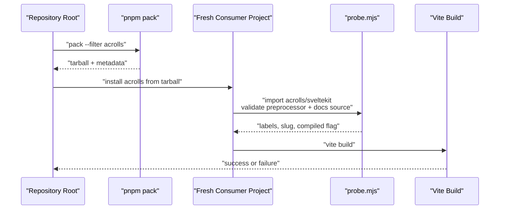
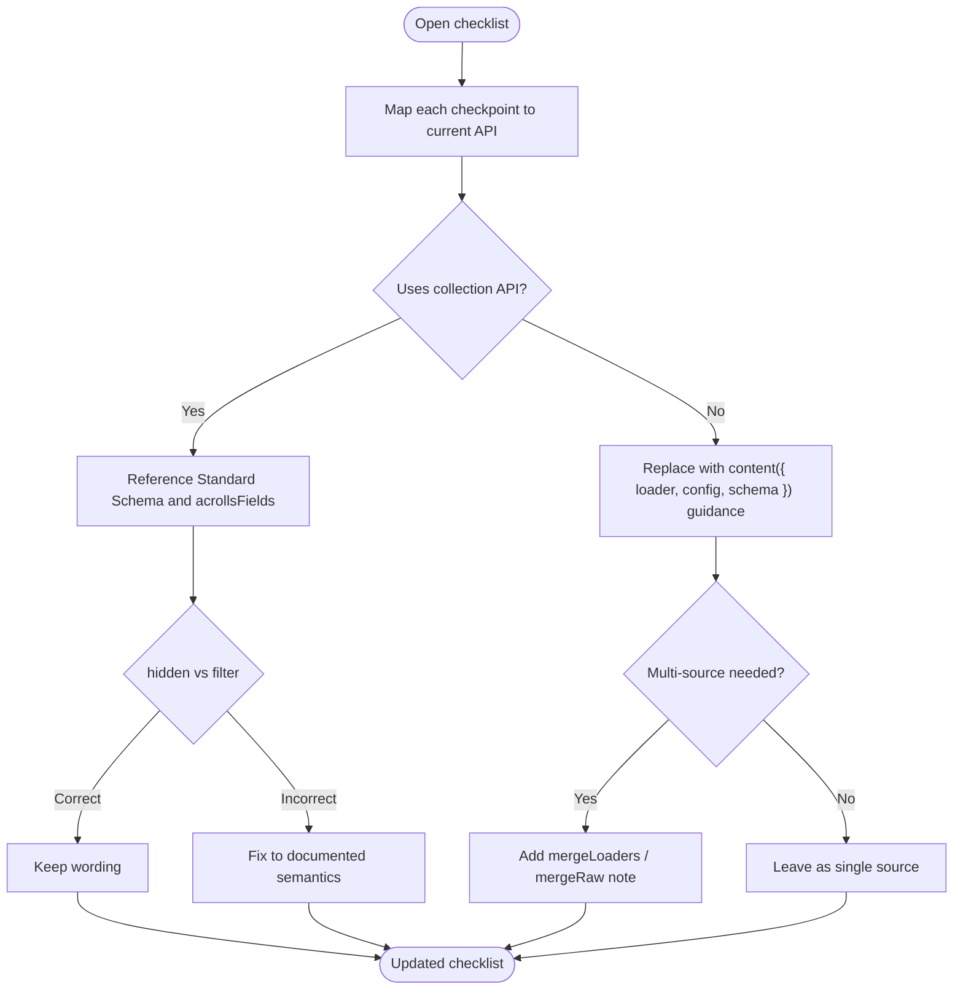
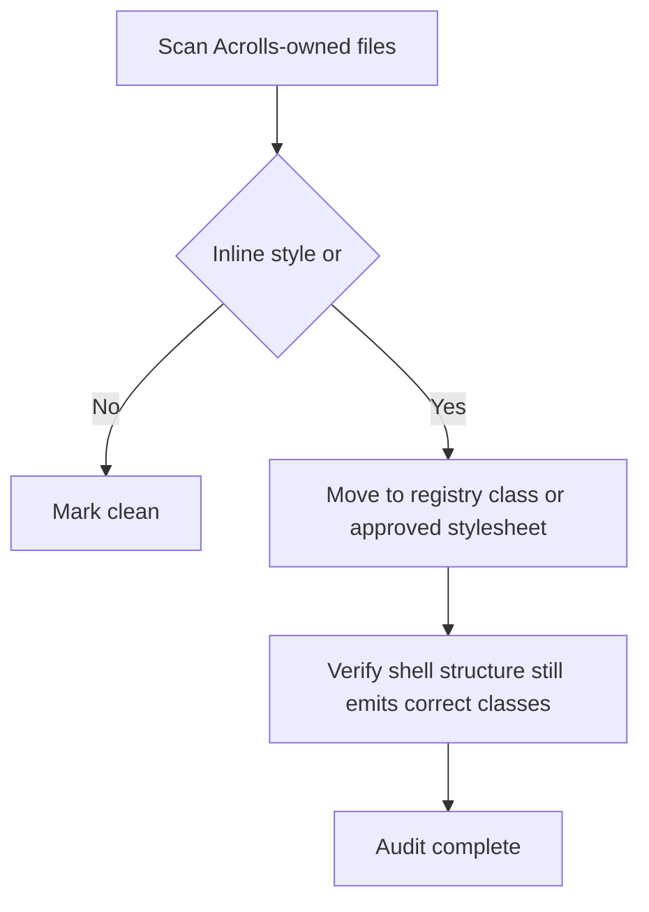
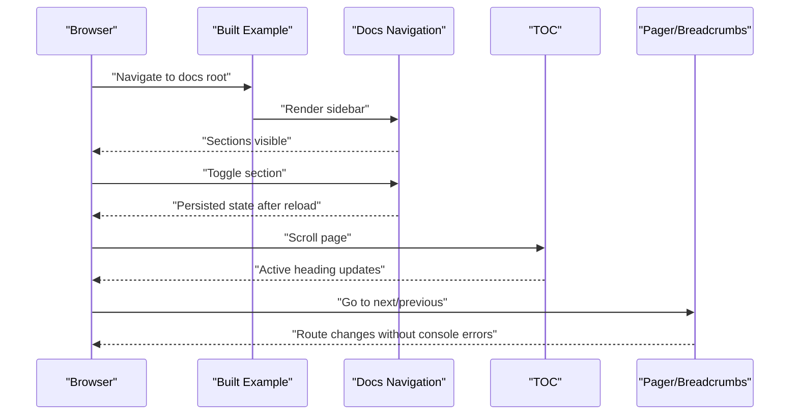

# P0 Blockers & Repair Sequence

<cite>
**Referenced Files in This Document**
- [tasks/todo.md](file://tasks/todo.md)
- [tasks/plan.md](file://tasks/plan.md)
- [scripts/verify-packed-consumer.mjs](file://scripts/verify-packed-consumer.mjs)
- [package.json](file://package.json)
- [packages/acrolls/package.json](file://packages/acrolls/package.json)
- [packages/docs/src/lib/collection.ts](file://packages/docs/src/lib/collection.ts)
- [packages/docs/src/lib/fields.ts](file://packages/docs/src/lib/fields.ts)
- [src/comps/AppShell.svelte](file://src/comps/AppShell.svelte)
- [docs/checklist.md](file://docs/checklist.md)
</cite>

## Blocker
- The repository has four open, evidence-less items that must be closed before any new feature work:
  - Verify the root CLI and packed public-package behavior.
  - Reconcile stale task/checklist/onboarding guidance with the implemented content API.
  - Audit and repair source-level styling-rule violations within approved class/style boundaries.
  - Complete browser acceptance for docs navigation, TOC, pager, persistence, accessibility, and console errors.
- These blockers are gated by explicit acceptance criteria defined in tasks/todo.md and tasks/plan.md and must be evidenced against a built example or a fresh consumer build — not inferred from static checks alone.

**Section sources**
- [tasks/todo.md:10-17](file://tasks/todo.md#L10-L17)
- [tasks/plan.md:22-35](file://tasks/plan.md#L22-L35)

## Current Evidence State
- Public package surface is declared under packages/acrolls/package.json with exports for mdsvex, svelte, docs, docs/content, content, sveltekit, and style entrypoints; bundledDependencies include the internal @acrolls/* packages and unist utilities required at runtime.
- The packed-consumer gate script (scripts/verify-packed-consumer.mjs) packs the acrolls package, validates tarball contents, installs a minimal Vite/SvelteKit consumer using only the published package, runs a probe that exercises the public sveltekit preprocessor, docs source normalization, and breadcrumb helper, compiles SASS via sass, and performs a Vite build.
- Root scripts expose verify:packed-consumer and cli commands used to drive verification from the repository root.
- The modern content API lives in packages/docs/src/lib/collection.ts as content({ loader, config, schema }), with Standard Schema validation, mergeLoaders/mergeRaw re-exports, and a pipeline of load → validate → filter → engine input. Blessed genre schemas are provided in fields.ts as acrollsFields.page, post, change.
- Styling policy is enforced structurally in Acrolls-owned components such as AppShell.svelte, which explicitly avoids inline styles and component style blocks and relies on registry classes emitted by the markup structure.
- Onboarding and integration guidance exists in docs/checklist.md but still contains unchecked checkpoints and references that may not match the current collection API surface.

**Section sources**
- [packages/acrolls/package.json:14-68](file://packages/acrolls/package.json#L14-L68)
- [scripts/verify-packed-consumer.mjs:43-83](file://scripts/verify-packed-consumer.mjs#L43-L83)
- [scripts/verify-packed-consumer.mjs:108-179](file://scripts/verify-packed-consumer.mjs#L108-L179)
- [scripts/verify-packed-consumer.mjs:182-234](file://scripts/verify-packed-consumer.mjs#L182-L234)
- [package.json:9-22](file://package.json#L9-L22)
- [packages/docs/src/lib/collection.ts:171-221](file://packages/docs/src/lib/collection.ts#L171-L221)
- [packages/docs/src/lib/collection.ts:377-381](file://packages/docs/src/lib/collection.ts#L377-L381)
- [packages/docs/src/lib/fields.ts:163-174](file://packages/docs/src/lib/fields.ts#L163-L174)
- [src/comps/AppShell.svelte:4-16](file://src/comps/AppShell.svelte#L4-L16)
- [docs/checklist.md:1-63](file://docs/checklist.md#L1-L63)

## Required Action
Execute the following ordered sequence. Each step must produce observable evidence before proceeding to the next.

### Step 1 — Packed CLI and public-package verification
- Run the root CLI against a real file to confirm stable exit codes and diagnostics.
- Run the packed-consumer gate end-to-end so a fresh consumer can install, probe, compile Sass, and build using only the published tarball.
- If either fails, fix only what is inside Acrolls’ own scripts, bin, exports, or bundled dependencies; do not alter host routing or product scope.

**Diagram sources**
- [scripts/verify-packed-consumer.mjs:43-83](file://scripts/verify-packed-consumer.mjs#L43-L83)
- [scripts/verify-packed-consumer.mjs:108-179](file://scripts/verify-packed-consumer.mjs#L108-L179)
- [scripts/verify-packed-consumer.mjs:182-234](file://scripts/verify-packed-consumer.mjs#L182-L234)

**Section sources**
- [package.json:18-22](file://package.json#L18-L22)
- [scripts/verify-packed-consumer.mjs:43-83](file://scripts/verify-packed-consumer.mjs#L43-L83)
- [scripts/verify-packed-consumer.mjs:182-234](file://scripts/verify-packed-consumer.mjs#L182-L234)

### Step 2 — Reconcile stale task/checklist/onboarding guidance with the implemented content API
- Compare every unchecked item in docs/checklist.md against the actual content API surface in packages/docs/src/lib/collection.ts and fields.ts.
- Update checklist entries to reflect:
  - The collection API shape `content({ loader, config, schema })`.
  - Standard Schema validation and diagnostic reporting.
  - Blessed genre stacks `acrollsFields.page`, `post`, `change`.
  - Merge helpers `mergeLoaders` and `mergeRaw`.
  - Correct semantics for `hidden` vs `filter`.
- Remove or correct any guidance that implies deprecated surfaces or missing capabilities.

**Diagram sources**
- [docs/checklist.md:36-49](file://docs/checklist.md#L36-L49)
- [packages/docs/src/lib/collection.ts:171-221](file://packages/docs/src/lib/collection.ts#L171-L221)
- [packages/docs/src/lib/collection.ts:377-381](file://packages/docs/src/lib/collection.ts#L377-L381)
- [packages/docs/src/lib/fields.ts:163-174](file://packages/docs/src/lib/fields.ts#L163-L174)

**Section sources**
- [docs/checklist.md:36-63](file://docs/checklist.md#L36-L63)
- [packages/docs/src/lib/collection.ts:171-221](file://packages/docs/src/lib/collection.ts#L171-L221)
- [packages/docs/src/lib/fields.ts:163-174](file://packages/docs/src/lib/fields.ts#L163-L174)

### Step 3 — Source-level styling-rule audit
- Scan Acrolls-owned source for inline style attributes and component `<style>` blocks.
- Confirm that structural shells like AppShell.svelte emit registry classes through markup structure rather than custom CSS.
- For any violation found, move styling into approved class/style boundaries without changing host product scope.

**Diagram sources**
- [src/comps/AppShell.svelte:4-16](file://src/comps/AppShell.svelte#L4-L16)

**Section sources**
- [src/comps/AppShell.svelte:4-16](file://src/comps/AppShell.svelte#L4-L16)

### Step 4 — Full browser acceptance of nav, TOC, pager, persistence, accessibility, and console errors
- Build the example docs site and open it in a browser.
- Verify:
  - Docs root and nested pages render and return 200.
  - Sidebar sections collapse/expand and persist after reload.
  - Nested child highlights and opens ancestors.
  - Group landing links and badges display as configured.
  - TOC lists h2/h3 headings and tracks scroll.
  - Pager and breadcrumbs function across routes.
  - No runtime console errors during navigation.
- Record evidence against the built example, not inferred from static checks.

[No diagram sources since this diagram shows conceptual browser acceptance flow]

**Section sources**
- [docs/checklist.md:52-63](file://docs/checklist.md#L52-L63)
- [tasks/plan.md:27-28](file://tasks/plan.md#L27-L28)

## Acceptance Gate
- CLI and packed package gate:
  - `./packages/cli/dist/index.js validate examples/starter/article.md` passes from the repository root.
  - `pnpm verify:packed-consumer` completes successfully, proving the tarball contains required exports and style entrypoints and a fresh consumer can install, probe, compile Sass, and build.
- Content API reconciliation gate:
  - docs/checklist.md no longer represents completed features as unchecked or malformed; all remaining items accurately describe the current collection API, blessed schemas, and loader composition.
- Styling-rule audit gate:
  - No inline styles or component style blocks remain in Acrolls-owned scope; structural shells continue to emit registry classes through markup.
- Browser acceptance gate:
  - Built example renders docs root and nested pages, sidebar persists open state, TOC tracks scroll, pager/breadcrumbs navigate correctly, and the browser console has no runtime errors during navigation.

**Section sources**
- [tasks/plan.md:22-28](file://tasks/plan.md#L22-L28)
- [scripts/verify-packed-consumer.mjs:43-83](file://scripts/verify-packed-consumer.mjs#L43-L83)
- [scripts/verify-packed-consumer.mjs:182-234](file://scripts/verify-packed-consumer.mjs#L182-L234)
- [docs/checklist.md:52-63](file://docs/checklist.md#L52-L63)

## Order Rationale
The repair sequence is ordered to minimize risk and maximize signal:

1. **Packed CLI and public-package verification first.** This proves the external contract consumers depend on works end-to-end. If the tarball or exported entrypoints are broken, downstream reconciliation and UI acceptance cannot be trusted.
2. **Reconcile stale guidance second.** Once the package contract is proven, update documentation and checklists to match the implemented content API so future work does not drift from reality.
3. **Styling-rule audit third.** With the package and documentation aligned, remove styling violations that could break host integration or violate the approved class/style boundaries.
4. **Browser acceptance last.** Only after the package, docs, and styling are stable should full browser acceptance be run, because UI behavior depends on correct package exports, navigation generation, and consistent styling.

This order preserves the boundary between Acrolls-owned implementation and host-owned routing while ensuring each gate produces concrete evidence before the next phase begins.

**Section sources**
- [tasks/plan.md:9-20](file://tasks/plan.md#L9-L20)
- [tasks/todo.md:10-17](file://tasks/todo.md#L10-L17)