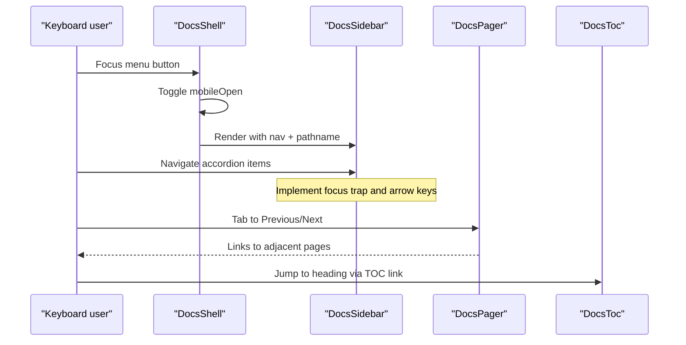
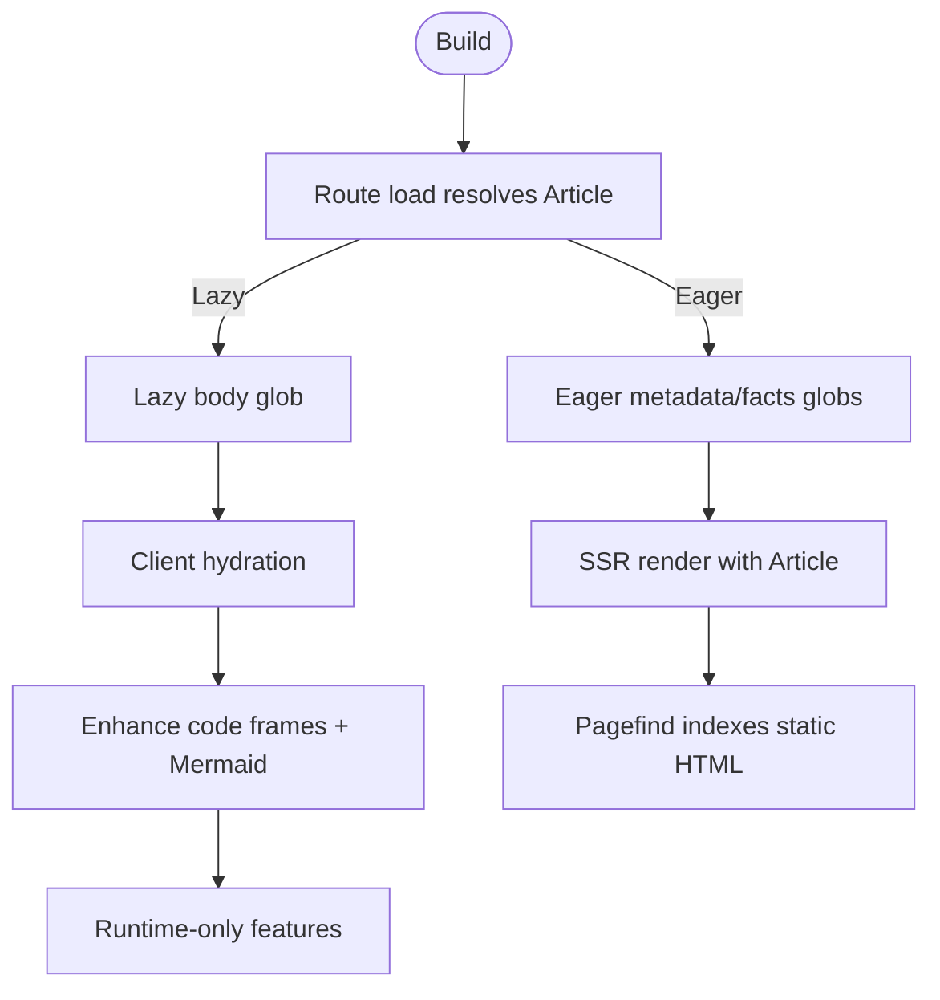
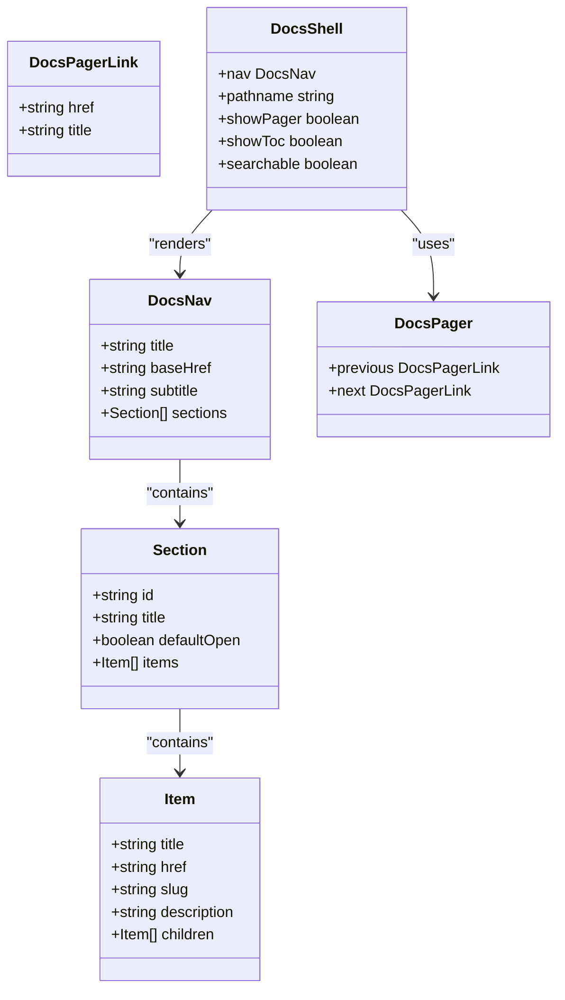
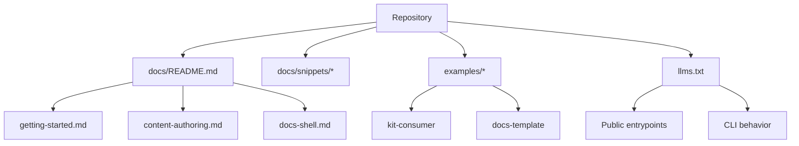
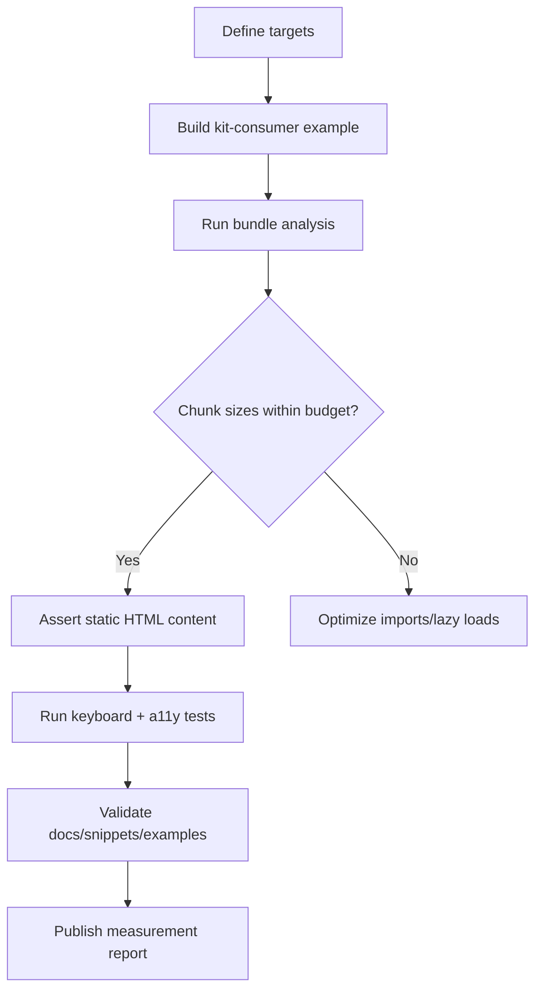

# Quality Bar: Accessibility, Performance, Types & DX

<cite>
**Referenced Files in This Document**
- [packages/docs/src/lib/DocsShell.svelte](file://packages/docs/src/lib/DocsShell.svelte)
- [packages/docs/src/lib/DocsPager.svelte](file://packages/docs/src/lib/DocsPager.svelte)
- [packages/svelte/src/lib/Publication.svelte](file://packages/svelte/src/lib/Publication.svelte)
- [packages/acrolls/package.json](file://packages/acrolls/package.json)
- [examples/kit-consumer/src/routes/+layout.ts](file://examples/kit-consumer/src/routes/+layout.ts)
- [docs/getting-started.md](file://docs/getting-started.md)
- [docs/docs-shell.md](file://docs/docs-shell.md)
- [docs/content-authoring.md](file://docs/content-authoring.md)
- [llms.txt](file://llms.txt)
- [tasks/todo.md](file://tasks/todo.md)
- [DESIGN.md](file://DESIGN.md)
- [examples/docs-template/src/lib/styles/base.css](file://examples/docs-template/src/lib/styles/base.css)
</cite>

## Table of Contents
- Accessibility Bar
- Performance Bar
- Type Safety & API Ergonomics
- Documentation & Examples Bar
- Measurement Plan

## Accessibility Bar
Industry standard for a docs framework is that every generated interactive surface is keyboard-navigable and screen-reader friendly by default, with predictable focus order, ARIA roles/states, and visible focus indicators. For Acrolls, the relevant surfaces are the docs shell (sidebar, breadcrumbs, pager, TOC), the mobile menu, and the article body enhancements (code frames, Mermaid).

What is present in code today:
- DocsShell renders a mobile menu button with aria-expanded and aria-controls wired to the sidebar container, plus a backdrop with an accessible label when open. The sidebar itself is marked data-pagefind-ignore so it is not indexed as prose.
- Pager component wraps previous/next links in a nav element with an aria-label for page navigation.
- TOC aside uses aria-label "Table of contents".
- Breadcrumbs and pager are rendered inside the shell; their markup is consumed from nav utilities.
- Publication enhances code frames and Mermaid after mount; this is client-side only and does not affect SSR HTML.

Observed gaps against an industry-class bar:
- Keyboard navigation for the generated sidebar tree (accordion triggers, nested items, focus trapping on open drawer, Escape behavior) is not evidenced in the reviewed files. The shell opens/closes via state but there is no visible focus management or trap in the inspected components.
- Screen-reader semantics for the accordion groups and active item state are not confirmed in the inspected components; the shell passes props to DocsSidebar but its implementation was not reviewed here.
- Reduced-motion support is not evident in the core packages reviewed; the example template demonstrates a reduced-motion rule at the host level, which is acceptable if hosts own global motion policy, but Acrolls-owned UI should also respect prefers-reduced-motion for any transitions/animations it controls.
- Print behavior is not implemented in the core packages reviewed; the example template includes print rules that hide chrome and reset content width, which is a good pattern for hosts to adopt.

Recommendations to close the gap:
- Add explicit keyboard handling for the sidebar accordion: Enter/Space toggles, ArrowUp/ArrowDown navigates items, Home/End jumps to first/last, Escape closes the mobile drawer, and focus moves into the opened panel.
- Ensure each collapsible group has role="group" or equivalent, with buttons carrying aria-expanded and aria-controls pointing to the panel.
- Add a skip link to the main article and ensure the first focusable element in the article is reachable via Tab.
- Respect prefers-reduced-motion for any JS-driven animations (drawer slide, TOC scroll spy) and provide a no-animation mode.
- Provide a minimal print stylesheet in the docs styles that hides sidebar/TOC/pager chrome and keeps only the article text and headings.

**Section sources**
- [packages/docs/src/lib/DocsShell.svelte:10-36](file://packages/docs/src/lib/DocsShell.svelte#L10-L36)
- [packages/docs/src/lib/DocsShell.svelte:76-145](file://packages/docs/src/lib/DocsShell.svelte#L76-L145)
- [packages/docs/src/lib/DocsPager.svelte:1-30](file://packages/docs/src/lib/DocsPager.svelte#L1-L30)
- [docs/docs-shell.md:297-343](file://docs/docs-shell.md#L297-L343)
- [examples/docs-template/src/lib/styles/base.css:70-84](file://examples/docs-template/src/lib/styles/base.css#L70-L84)

## Performance Bar
An industry-class framework must keep JS payload small, lazy-load heavy features, and guarantee correct SSR/prerender output so search, SEO, and no-JS readers get meaningful HTML.

Current evidence:
- Lazy document loading: The getting-started guide shows resolving articles in route load functions and using eager metadata/facts globs while keeping bodies lazy via import.meta.glob. This avoids shipping all compiled articles up front.
- Search integration is opt-in and post-build: Pagefind indexes prerendered HTML; Acrolls marks the article with data-pagefind-body and chrome with data-pagefind-ignore.
- Example chunk-size budget work is recorded as completed in tasks, indicating named metadata/facts globs were used to clear chunk warnings.
- SSR/prerender correctness is emphasized in docs: resolve the article component in the route load and render directly; awaiting loader() in templates leaves static output empty.
- The public package bundles internal workspace packages and declares peer dependencies for Svelte and optional fractalthemer.

Gaps and risks:
- Code frame copy/wrap and Mermaid enhancement run on mount in Publication, meaning these features are client-only. If hosts need zero-JS fallbacks, they must handle them explicitly.
- No built-in bundle budget enforcement exists in the reviewed files; budgets rely on host tooling and the task acceptance criteria around chunk size.
- Reduced-motion and print behavior are not shown in core packages; missing runtime guards can cause unnecessary work or layout shifts for users who prefer reduced motion.

Recommendations:
- Keep code-frame and Mermaid enhancements strictly client-side and lazy; avoid importing heavy libraries at module scope.
- Expose a configuration to disable client enhancements when SSR-only output is required.
- Add a build-time check or warning when large dependencies are pulled into the client bundle through Acrolls-owned components.
- Ensure all routes that render docs set prerender appropriately and render the resolved component synchronously in load to preserve static output.

**Section sources**
- [docs/getting-started.md:200-235](file://docs/getting-started.md#L200-L235)
- [docs/getting-started.md:313-358](file://docs/getting-started.md#L313-L358)
- [docs/docs-shell.md:297-343](file://docs/docs-shell.md#L297-L343)
- [packages/svelte/src/lib/Publication.svelte:1-42](file://packages/svelte/src/lib/Publication.svelte#L1-L42)
- [tasks/todo.md:1-18](file://tasks/todo.md#L1-L18)
- [packages/acrolls/package.json:72-115](file://packages/acrolls/package.json#L72-L115)
- [examples/kit-consumer/src/routes/+layout.ts:1-1](file://examples/kit-consumer/src/routes/+layout.ts#L1-L1)

## Type Safety & API Ergonomics
A strong type surface reduces integration friction and prevents silent misconfiguration. For Acrolls, the key surfaces are the content collection API, docs config, navigation types, and public entrypoints.

What is present:
- Public entrypoints are declared under acrolls/* in the published package manifest, including mdsvex, svelte, docs, docs/content, content, sveltekit, and styles. Consumers install one package and import through these paths.
- The content API supports Standard Schema validation via a schema option and provides filter to remove documents from every addressable surface.
- Generated docs source exposes typed navigation, entries, and loaders; the getting-started guide shows typed imports for DocsDocumentFacts and DocsMetadata.
- Navigation types are imported by DocsShell and DocsPager, ensuring strongly-typed nav trees and pager links.

Gaps and opportunities:
- Hosts must align their route load signatures with Acrolls’ expected shapes; adding explicit TypeScript examples in snippets would reduce trial-and-error.
- The deprecated createAcrollsDocsSource adapter remains supported; consider surfacing migration diagnostics in validate to nudge hosts toward the modern content API.
- Frontmatter schemas are powerful but optional; providing prebuilt schemas for common docs patterns would improve ergonomics without sacrificing flexibility.

Recommendations:
- Publish minimal TS snippets for the most common host integrations: a typed source file, a typed layout, and a typed catch-all route.
- Add compile-time checks that warn when a host uses deprecated adapters or mismatched prop shapes.
- Surface recommended frontmatter schemas in docs/content with clear error messages for invalid keys.

**Section sources**
- [packages/acrolls/package.json:14-57](file://packages/acrolls/package.json#L14-L57)
- [docs/content-authoring.md:23-67](file://docs/content-authoring.md#L23-L67)
- [docs/getting-started.md:200-235](file://docs/getting-started.md#L200-L235)
- [packages/docs/src/lib/DocsShell.svelte:10-36](file://packages/docs/src/lib/DocsShell.svelte#L10-L36)
- [packages/docs/src/lib/DocsPager.svelte:1-30](file://packages/docs/src/lib/DocsPager.svelte#L1-L30)

## Documentation & Examples Bar
High-quality documentation and examples are essential for developer experience. The bar includes a clear handbook, copy-paste snippets, working examples, and fresh agent-facing index material.

Current state:
- Handbook exists under docs/README.md and links to CLI, getting started, integration, content authoring, styles, release, troubleshooting, and checklist pages.
- Snippets directory contains ready-to-use files for vite.config, docs source, layouts, root page, page load, and document page.
- Working examples include docs-template and kit-consumer, demonstrating generated docs, routes, and server endpoints for llms.txt, sitemap, robots, and OG images.
- llms.txt provides installation contract, activation sequence, public entrypoints, CLI behavior, content defaults, failure boundaries, and documentation index.

Gaps:
- Some tasks remain unchecked, including reconciling stale guidance with the implemented content API and completing browser acceptance for navigation, TOC, pager, persistence, accessibility, and console errors.
- Agent-facing materials should be refreshed whenever public entrypoints or CLI flags change to keep llms.txt accurate.

Recommendations:
- Update tasks/todo.md items to reflect current implementation status and mark completion with evidence from the built example.
- Keep llms.txt synchronized with package exports and CLI commands; add a CI step that diffs llms.txt against package.json exports and CLI help.
- Expand snippets to include a minimal typed host layout and a minimal catch-all route with proper error handling.
- Add a “DX checklist” in the handbook that validates a fresh install, dev server, production build, search indexing, and deployment.

**Section sources**
- [docs/README.md:1-108](file://docs/README.md#L1-L108)
- [docs/getting-started.md:1-424](file://docs/getting-started.md#L1-L424)
- [docs/content-authoring.md:1-319](file://docs/content-authoring.md#L1-L319)
- [docs/docs-shell.md:1-408](file://docs/docs-shell.md#L1-L408)
- [llms.txt:1-114](file://llms.txt#L1-L114)
- [tasks/todo.md:1-18](file://tasks/todo.md#L1-L18)

## Measurement Plan
To judge whether Acrolls meets an industry-class non-functional bar, define measurable targets and automated checks tied to the codebase.

Accessibility metrics:
- Keyboard coverage: All interactive elements in DocsShell, DocsSidebar, DocsPager, and mobile menu must be reachable via Tab and operable with Enter/Space. Measure by running keyboard-only tests against the built example.
- Screen-reader coverage: Each landmark (nav, main, aside) and control (button, link) must have appropriate labels/roles. Validate with a screen reader and automated axe-core scans.
- Reduced motion: Confirm that animations and transitions respect prefers-reduced-motion. Test with OS-level reduced motion enabled.
- Print: Verify that printing hides chrome and preserves readable article content.

Performance metrics:
- Client payload: Measure JavaScript bundle size for a minimal docs site with and without search. Target no single chunk exceeding a defined budget (e.g., 500 kB) and total client JS under a target threshold.
- Lazy loading: Confirm that article bodies are not eagerly loaded; verify via network waterfall that only metadata/facts are fetched upfront.
- SSR/prerender: Confirm that static HTML contains article content without awaiting loader() in templates. Use a headless browser to assert presence of key headings in prerendered output.

Type safety metrics:
- Integration friction: Track time-to-first-working-docs-shell in a new SvelteKit app using only the documented entrypoints.
- Compile-time errors: Ensure invalid frontmatter or nav structures produce actionable TypeScript or validation errors.

Documentation/DX metrics:
- Freshness: Automated diff between llms.txt and package.json exports/CLI help.
- Completeness: Checklist in docs/README.md covers install, dev, build, search, and deploy.
- Examples: Both examples build and pass the same checks as a real host.

How to measure:
- Add a test script that builds the kit-consumer example, runs a bundle analyzer, asserts chunk sizes, and verifies prerendered HTML content.
- Add a browser acceptance suite that exercises keyboard navigation, screen-reader landmarks, reduced motion, and print output.
- Add a lint/check that compares llms.txt against package exports and CLI help.

**Section sources**
- [tasks/todo.md:1-18](file://tasks/todo.md#L1-L18)
- [docs/getting-started.md:200-235](file://docs/getting-started.md#L200-L235)
- [docs/docs-shell.md:297-343](file://docs/docs-shell.md#L297-L343)
- [packages/acrolls/package.json:72-115](file://packages/acrolls/package.json#L72-L115)
- [DESIGN.md:104-122](file://DESIGN.md#L104-L122)
- [examples/docs-template/src/lib/styles/base.css:70-84](file://examples/docs-template/src/lib/styles/base.css#L70-L84)