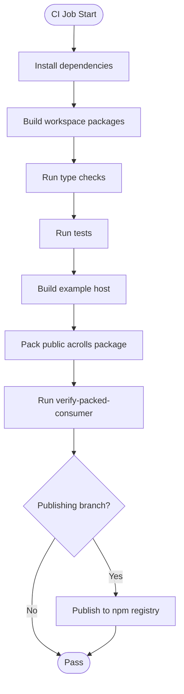
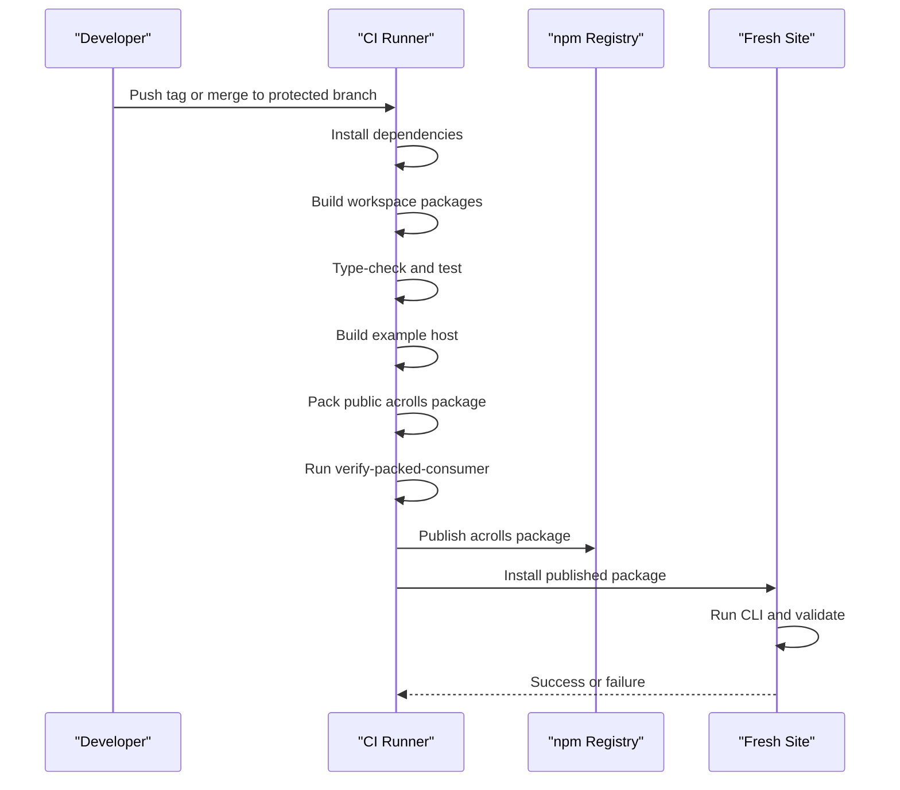
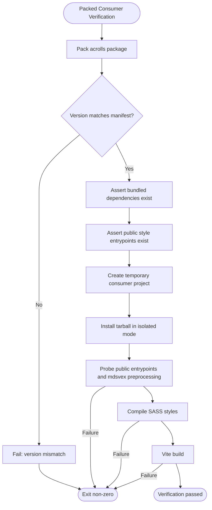
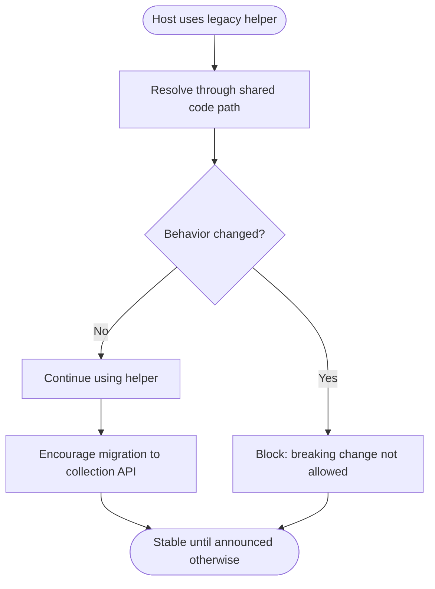
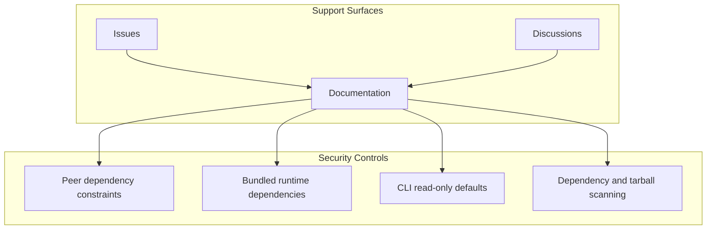

# Release Engineering & Distribution

<cite>
**Referenced Files in This Document**
- [docs/release.md](file://docs/release.md)
- [scripts/verify-packed-consumer.mjs](file://scripts/verify-packed-consumer.mjs)
- [package.json](file://package.json)
- [packages/acrolls/package.json](file://packages/acrolls/package.json)
- [PRODUCT.md](file://PRODUCT.md)
- [tasks/todo.md](file://tasks/todo.md)
- [tasks/plan.md](file://tasks/plan.md)
</cite>

## Version & Changelog Policy
- Single public package: consumers install only `acrolls`. Scoped implementation packages under `@acrolls/*` are bundled into the public tarball and must not be published separately.
- Version source of truth is the version field in the public package manifest; the verification script enforces that the packed tarball version matches the manifest before proceeding.
- The repository documents a release contract, build order, pack inspection, registry publish command, and post-publish consumer smoke test. It also warns against testing obsolete artifacts.
- A changelog artifact is not present in the repository at this time. Until one is added, the recommended practice is to maintain a versioned changelog alongside the package manifest so each published version has an auditable summary of changes.

**Section sources**
- [docs/release.md:10-20](file://docs/release.md#L10-L20)
- [scripts/verify-packed-consumer.mjs:8-11](file://scripts/verify-packed-consumer.mjs#L8-L11)
- [scripts/verify-packed-consumer.mjs:61-63](file://scripts/verify-packed-consumer.mjs#L61-L63)
- [packages/acrolls/package.json:1-9](file://packages/acrolls/package.json#L1-L9)

## CI Gates
The current repository does not include GitHub Actions workflows. The engineering work required to ship credibly at scale is to implement a CI matrix that runs the documented verification steps across operating systems and package managers, with a focus on the packed-consumer gate.

### Recommended CI Matrix
- Operating systems: Linux (GitHub-hosted), macOS (GitHub-hosted), Windows (GitHub-hosted).
- Package managers: pnpm (primary), npm (compatibility), yarn (optional compatibility).
- Node engine: enforce the minimum supported version declared by the project.
- Cache: dependency cache per OS and package manager to keep builds fast.

### Required Gate Steps
1. Install dependencies and build all workspace packages.
2. Run type checks and tests for every package.
3. Build the example SvelteKit host used for acceptance.
4. Pack the public `acrolls` package and run the packed-consumer verification script.
5. Fail the job if any step exits non-zero.

**Diagram sources**
- [package.json:9-22](file://package.json#L9-L22)
- [scripts/verify-packed-consumer.mjs:43-70](file://scripts/verify-packed-consumer.mjs#L43-L70)
- [scripts/verify-packed-consumer.mjs:231-234](file://scripts/verify-packed-consumer.mjs#L231-L234)

**Section sources**
- [package.json:9-22](file://package.json#L9-L22)
- [scripts/verify-packed-consumer.mjs:43-70](file://scripts/verify-packed-consumer.mjs#L43-L70)
- [scripts/verify-packed-consumer.mjs:231-234](file://scripts/verify-packed-consumer.mjs#L231-L234)
- [PRODUCT.md:501-502](file://PRODUCT.md#L501-L502)
- [tasks/todo.md:10-11](file://tasks/todo.md#L10-L11)
- [tasks/plan.md:19-20](file://tasks/plan.md#L19-L20)

## Publish Automation
Automation should follow the documented release contract and use the existing scripts as the single source of truth for commands.

### Current Manual Flow
- Build, check, test, example build, and packed-consumer verification are documented as the pre-publish sequence.
- Packing uses the hoisted node linker filter scoped to the public package.
- Publishing uses the hoisted node linker filter scoped to the public package with public access.
- Post-publish verification installs the published package into a fresh site, runs the CLI, validates content, and builds.

### Automation Targets
- Trigger automation on tags or protected branches according to team policy.
- Reuse the same commands as the manual flow so CI and human releases stay identical.
- Guard publishing behind successful CI gates.
- Record the produced tarball path and version in CI artifacts for auditability.

**Diagram sources**
- [docs/release.md:22-84](file://docs/release.md#L22-L84)
- [package.json:18-22](file://package.json#L18-L22)
- [scripts/verify-packed-consumer.mjs:43-70](file://scripts/verify-packed-consumer.mjs#L43-L70)
- [scripts/verify-packed-consumer.mjs:231-234](file://scripts/verify-packed-consumer.mjs#L231-L234)

**Section sources**
- [docs/release.md:22-84](file://docs/release.md#L22-L84)
- [package.json:18-22](file://package.json#L18-L22)

## Compatibility & Deprecation Contract
This section defines the compatibility boundaries and deprecation policy relevant to shipping at scale.

### Public Consumer Contract
- Consumers install only the public `acrolls` package.
- Consumers import through the supported subpath exports declared in the public package manifest.
- Scoped `@acrolls/*` packages are internal implementation units and must not be installed directly by consumers.
- The CLI binary is exposed via the public package and can be invoked from a host after installation.

### Packed Tarball Audit
The verification script performs a concrete audit of the packed tarball:
- Ensures the tarball exists and its version matches the manifest.
- Asserts bundled runtime dependencies are present.
- Asserts public style entrypoints are present.
- Creates a temporary consumer project that installs the tarball, imports public entrypoints, compiles Markdown through the mdsvex preprocessor, resolves docs source behavior, runs Sass compilation, and builds with Vite.

**Diagram sources**
- [scripts/verify-packed-consumer.mjs:43-70](file://scripts/verify-packed-consumer.mjs#L43-L70)
- [scripts/verify-packed-consumer.mjs:85-106](file://scripts/verify-packed-consumer.mjs#L85-L106)
- [scripts/verify-packed-consumer.mjs:108-179](file://scripts/verify-packed-consumer.mjs#L108-L179)
- [scripts/verify-packed-consumer.mjs:181-228](file://scripts/verify-packed-consumer.mjs#L181-L228)
- [scripts/verify-packed-consumer.mjs:231-234](file://scripts/verify-packed-consumer.mjs#L231-L234)

### Deprecation Policy for Legacy Generated-Source Helper
- The legacy generated-source helper remains supported.
- Its signature, behavior, and error messages are unchanged.
- It emits no runtime deprecation warning.
- It resolves through the same code path as the newer collection API.
- It is documented as deprecated to guide hosts toward the newer surface.
- There is no scheduled removal date.

**Diagram sources**
- [PRODUCT.md:489-492](file://PRODUCT.md#L489-L492)

**Section sources**
- [packages/acrolls/package.json:14-57](file://packages/acrolls/package.json#L14-L57)
- [packages/acrolls/package.json:72-105](file://packages/acrolls/package.json#L72-L105)
- [scripts/verify-packed-consumer.mjs:43-70](file://scripts/verify-packed-consumer.mjs#L43-L70)
- [scripts/verify-packed-consumer.mjs:231-234](file://scripts/verify-packed-consumer.mjs#L231-L234)
- [PRODUCT.md:489-492](file://PRODUCT.md#L489-L492)

## Support Infrastructure
This section specifies the support surfaces and security posture needed to ship credibly at scale.

### Issues and Discussions
- Use the repository’s issue tracker for bugs, regressions, and feature requests.
- Use discussions for integration questions, adoption guidance, and community help.
- Require reproducible steps when filing issues, including Node version, package manager, OS, and whether the failure occurs in development or production builds.

### Contributing Guidance
- Follow the monorepo conventions: pnpm workspaces, Node engine requirements, TypeScript, and package build commands.
- Changes must pass local checks before opening a pull request: install, build, type-check, test, and verify the example host.
- For release-related changes, ensure the packed-consumer verification passes because it exercises the exact consumer experience.

### Security Posture
- The public package declares peer dependencies for Svelte and optional peer dependency metadata for theming. Consumers must supply compatible versions.
- Internal runtime dependencies such as unist utilities are bundled into the public package to reduce consumer surface area and improve reliability.
- The CLI exposes read-only commands by default; only the integrate command mutates host files, and dry-run is the default.
- No telemetry is part of the product scope; avoid adding network calls without explicit opt-in and clear documentation.
- Add vulnerability scanning to CI for both workspace dependencies and the published tarball contents.

**Diagram sources**
- [packages/acrolls/package.json:107-114](file://packages/acrolls/package.json#L107-L114)
- [packages/acrolls/package.json:96-105](file://packages/acrolls/package.json#L96-L105)
- [PRODUCT.md:320-322](file://PRODUCT.md#L320-L322)
- [PRODUCT.md:416-422](file://PRODUCT.md#L416-L422)

**Section sources**
- [packages/acrolls/package.json:107-114](file://packages/acrolls/package.json#L107-L114)
- [packages/acrolls/package.json:96-105](file://packages/acrolls/package.json#L96-L105)
- [PRODUCT.md:320-322](file://PRODUCT.md#L320-L322)
- [PRODUCT.md:416-422](file://PRODUCT.md#L416-L422)
- [tasks/todo.md:10-11](file://tasks/todo.md#L10-L11)
- [tasks/plan.md:19-20](file://tasks/plan.md#L19-L20)