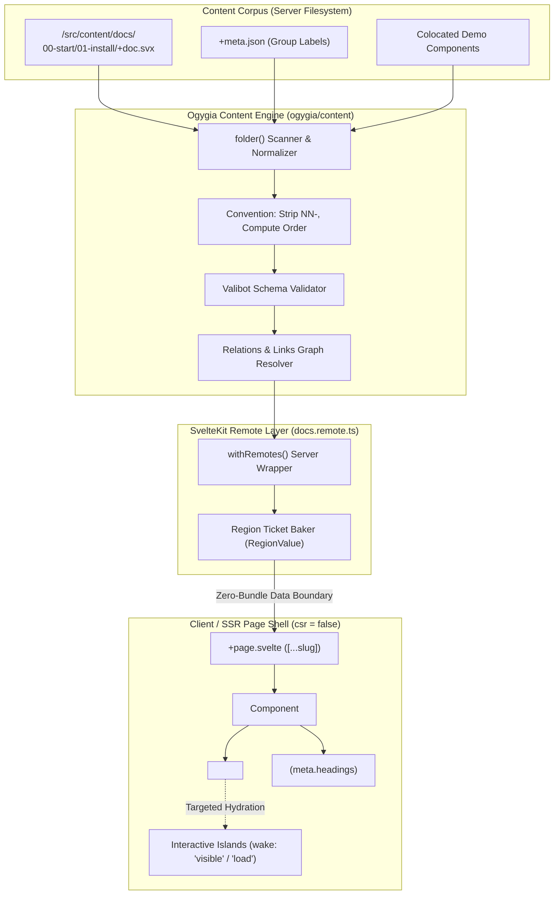

# Ogygia Pharos Content Model & SvelteKit Architecture Study

## Executive Summary

This study analyzes the content and documentation architecture in the `pharos` branch of `PuruVJ/ogygia` (`packages/ogygia/src/content` and `apps/docs`). It synthesizes the core innovations of Ogygia's RF-native (Remote Function native) content collections, shallow-ref versus deep-entry separation, the blessed filesystem folder convention, server-side region baking, and isolated island hydration, mapping out how these patterns directly empower **Fractalsvelte**.

---

## 1. Core Architecture of Ogygia Content Collections

### 1.1 The "Refs vs. Entries" Distinction
A central design invariant of Ogygia's content layer is the strict separation between shallow metadata references and heavy content bodies:

| Concept | Type | Payload | Lifecycle / Usage |
| :--- | :--- | :--- | :--- |
| **Content Ref** | `ContentRef<Data, Meta>` | `id`, `data` (validated frontmatter), `meta` (headings, reading time), `order`, `filePath`, `rel` | Used by navigation sidebars, search indexes, catalog listings, and relation graphs. **Zero body/source payload**. |
| **Content Entry** | `Entry<Data, Meta>` | All `ContentRef` fields + `body` (`RegionValue`), `source` | Loaded strictly on-demand when a specific route/page is rendered. |

> *"Refs are what a corpus admits to having; an entry is what one page pays for."*

### 1.2 The Blessed `folder()` Convention
Rather than requiring manual routing config or monolithic markdown manifests, Ogygia introduces `folder()`:
- **Filesystem structure**: `NN-section/NN-page/+doc.svx` (or `+doc.md` / `index.md`).
- **Deterministic ordering**: Leading `NN-` prefixes (e.g. `00-start/01-install`) dictate sibling order (`order: [0, 1]`) and are stripped from URLs (`/docs/start/install`).
- **Colocated Demos & Assets**: Component demos live directly beside their documentation page without leaking into global bundles.
- **Directory Sidecars (`+meta.json`)**: Optional lightweight metadata decoration providing custom section labels (e.g. `{"label": "Getting Started"}`) or ordering overrides without cluttering frontmatter.

### 1.3 Remote Functions Wire Layer (`.remote.ts` & `withRemotes()`)
In SvelteKit 2.x and Svelte 5:
- `content()` is universal and browser-safe.
- `withRemotes(collection)` in `docs.remote.ts` wraps the collection using SvelteKit's `$app/server` (`query()` and `prerender()`).
- The page component imports **only** the remote function (`docs.page(slug)`), never importing the entire markdown collection or raw parser into the client bundle.
- The server bakes the markdown/svx AST into a `RegionValue` ticket.

---

## 2. Component & Layout Flow Mapping (`fa-flow-mapper`)



---

## 3. SvelteKit Data Flow (`sveltekit-data-flow`)

### 3.1 Server vs. Universal vs. Remote Flow
1. **Build / Prerender Phase (`+page.server.ts`)**:
   ```typescript
   import { docs } from '$lib/docs.server';
   export const prerender = true;
   export const entries: EntryGenerator = async () => {
     const ids = await docs.ids();
     return ids.map((slug) => ({ slug }));
   };
   ```
2. **Data Crossing Boundary (`docs.remote.ts`)**:
   ```typescript
   import { withRemotes } from 'ogygia/content/server';
   import { docsCollection } from './collections';

   const r = withRemotes(docsCollection);
   export const page = r.get({
     map: (entry) => ({
       entry: { id: entry.id, data: entry.data, meta: entry.meta },
       body: entry.body, // Baked region ticket
       headings: entry.meta.headings,
       related: entry.rel?.related
     })
   });
   ```
3. **Consuming View (`+page.svelte`)**:
   ```svelte
   <script lang="ts">
     import * as docs from '$lib/docs.remote';
     import { page } from '$app/state';
     import { Doc, Region } from 'ogygia/content';

     const view = await docs.page(page.params.slug ?? '');
   </script>

   <Doc {view}>
     <Region of={view.body} />
   </Doc>
   ```

---

## 4. Key Learnings & Application for Fractalsvelte

1. **Unification of Docs & Live Components**:
   - Every kit component in Fractalsvelte (`/kit`) can have a colocated `+doc.svx` alongside interactive spec files.
2. **Zero-Bundle Documentation Navigation**:
   - Generating a `nav` tree from `ContentRef[]` allows deep sidebars with zero overhead on initial load.
3. **Ripple Spec Integration**:
   - JSON specs from `src/lib/ripple/` can be directly embedded in markdown regions and compiled on the server into `blocks()`, waking only active widgets.
