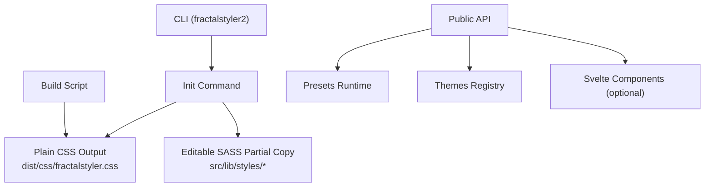
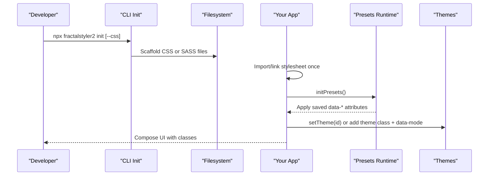

## Introduction

Fractal Styler 2 is a composition-first styling system that ships as either:
- Plain CSS with no build step, or
- Editable SASS partials for advanced tuning.

You compose UI by adding classes to markup; you do not write stylesheets. The system provides a fluid design token engine and a runtime preset system across four axes: layout, shape, color, and motion.

Key highlights:

- Two installation paths: compiled CSS or editable SASS.
- CLI scaffolding via `npx fractalstyler2 init`.
- Four preset axes applied as HTML attributes on the root element.
- A framework-free runtime for themes and presets with zero-flicker support.
- A comprehensive class registry and cookbook for composing UI without custom CSS.

## Project Structure
At a high level:
- CLI tooling lives under `src/lib/cli.ts` and exposes commands like `init`, `mcp`, `mcp:install`, and `mcp:export`.
- Compiled CSS distribution is generated by `scripts/build-css.js` from SASS partials into `dist/css`.
- Public entry points export tokens, presets, themes, and optional Svelte components.
- Documentation under `docs/` explains setup, tokens, dimensions, presets, and recipes.



## Core Components
- CLI initialization:
  - `npx fractalstyler2 init --css` scaffolds compiled CSS into your project.
  - `npx fractalstyler2 init` scaffolds editable SASS partials.
- Preset runtime:
  - Framework-free module exposing `initPresets`, `setPreset`, `cyclePreset`, `getPresetScript`, theme helpers, and axis metadata.
- Themes:
  - 41 built-in palettes exported as metadata; apply via `setTheme(id)` or by adding a theme class paired with `data-mode`.
- Tokens and dimensions:
  - Fluid typography and spacing scales; literal utilities for exact pixel values; responsive `-mob` and `-desk` variants.

Practical outcomes:
- Zero-build path: link the compiled stylesheet once and start composing in markup.
- SASS path: import the SASS entry once globally and optionally tune generators before compile.
- Runtime switching: persist and restore user preferences with zero flicker using the inline head script.

## Architecture Overview
The system separates concerns cleanly:
- Build-time: SASS partials compile to a single CSS distribution used by the plain CSS path.
- Runtime: Presets and themes are applied via attributes and classes on `<html>`, persisted in localStorage, and restored before first paint to avoid flicker.
- Composition: Developers use utility classes and container primitives to build layouts without writing custom CSS.



## Code
A fenced block exercises the Shiki pipeline — token spans carry classes you can style.

```svelte
<script lang="ts">
	let count = $state(0);
</script>

<button onclick={() => count++}>count is {count}</button>
```
