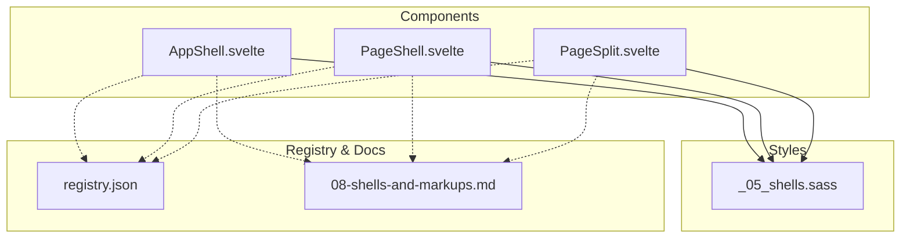

This document explains the shell components that provide application layout structure in Fractal Styler: AppShell, PageShell, and PageSplit. It covers their responsibilities, prop interfaces, slot definitions, responsive behavior, and how they integrate with the preset system. It also provides usage patterns for nesting and composing shells to build consistent layouts across devices.

## Project Structure
The shell components are thin Svelte wrappers around canonical markup classes. They do not add custom styles; instead, they emit the exact class structure required by the stylesheet so that responsive behavior (rails, drawers, TOC folding) works as designed.

